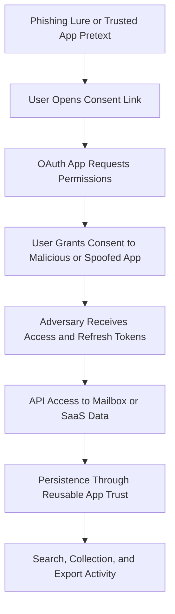

## Executive Summary

Recent phishing campaigns increasingly abuse trusted identity and collaboration workflows rather than relying only on fake credential pages. The most important shift is from credential theft to session and token theft, followed by cloud API misuse for mailbox and SaaS data collection.

For hunting development, behavior-based detection should be prioritized over campaign-specific indicators. Correlated detections across email, identity, endpoint, and cloud telemetry produce higher confidence and stronger resilience against rapid attacker infrastructure rotation.

## Scope and Method

This report synthesizes publicly documented campaigns from 2024 through 2026, with emphasis on:

* Device code phishing
* Adversary-in-the-middle phishing kits
* OAuth consent and client identity abuse
* QR phishing and staged redirect chains
* ClickFix command-paste phishing and fake verification lures
* Teams and phone social engineering with remote support abuse
* Rogue RDP attachment lures

## Campaign Snapshot

| Campaign or Cluster | Timeframe | Primary Targets | Core Technique Pattern | Hunt Priority |
|---|---|---|---|---|
| Storm-2372 device code phishing | 2024 to 2026 | Government, NGO, IT, defense, telecom, health | User lured to legitimate device sign-in flow, token theft and mailbox access | Critical |
| Multi-stage code-of-conduct AiTM campaign | 2026 | Broad enterprise, heavy US targeting | PDF lure, CAPTCHA staging, token interception | Critical |
| Tycoon2FA ecosystem | 2025 to 2026 | Cross-sector | Phishing as a service, session cookie and token theft | Critical |
| OAuth client identity spoof campaigns | 2025 to 2026 | Cloud and SaaS users | Missing app identity, spoofed client IDs, consent abuse | High |
| ClickFix campaigns and kits | 2024 to 2026 | Enterprise users, finance, government, education, general endpoints | Fake verification or troubleshooting prompt drives user-run command execution | Critical |
| Teams vishing with email bombing | 2025 to 2026 | Enterprise service desks and end users | Mail flood, impersonated support, remote control takeover | Critical |
| Rogue RDP lure campaigns | 2024 to 2025 | Government and military sectors | Signed or trusted-looking RDP attachment abuse | High |

## Dominant Attack Vectors

| Vector | What Changed Recently | Why It Matters for Hunting |
|---|---|---|
| Link-first phishing | High volume link delivery now dominates large telemetry sets | URL click correlation is foundational |
| Device code phishing | Legitimate sign-in endpoints used as social engineering anchors | Traditional domain block logic alone under-detects |
| AiTM session hijack | MFA bypass by stealing authenticated session context | Post-auth anomaly hunting is mandatory |
| OAuth abuse | App consent and token trust paths abused for persistence and exfiltration | Cloud app and identity joins become critical |
| QR phishing | Rapid growth with attachment-to-QR lure staging | Attachment and click telemetry correlation needed |
| CAPTCHA-gated pages | Multi-stage anti-analysis and anti-scanning behavior | Redirect-chain and browser telemetry improve fidelity |
| ClickFix command-paste lures | Fake CAPTCHA, fake error dialogs, and human verification trick users into launching native tools | Endpoint process, registry, and script telemetry are high value |
| Teams and phone vishing | Human-operated intrusion paths with remote assist tools | Identity plus endpoint process chains are strong signals |

## TTP Map for Query Engineering

| ATT&CK Technique | ID | Confidence | Evidence Pattern to Hunt |
|---|---|---|---|
| Spearphishing Attachment | T1566.001 | High | PDF, HTML, SVG, DOCX, RDP lures tied to risky follow-on activity |
| Spearphishing Link | T1566.002 | High | Click events leading to staged redirect and suspicious sign-in |
| Voice Phishing | T1566.004 | High | External support impersonation and rapid remote tool usage |
| User Execution | T1204 | High | User-triggered click, code entry, or remote session acceptance |
| Steal Application Access Token | T1528 | High | Device and OAuth token misuse patterns |
| Use Alternate Authentication Material | T1550 | High | Session cookie and token reuse from anomalous contexts |
| Valid Accounts | T1078 | High | Authenticated cloud activity with abnormal context |
| Remote Email Collection | T1114.002 | High | Mail API-heavy access and export behavior |
| Account Manipulation | T1098 | Medium to High | Inbox rules, MFA changes, persistence actions |
| PowerShell | T1059.001 | High | ClickFix and post-phish download chains commonly invoke PowerShell |
| Visual Basic | T1059.005 | Medium to High | ClickFix follow-on stages frequently use VBS loaders and scheduled execution |
| Signed Binary Proxy Execution | T1218 | Medium | mshta, rundll32, msbuild, regasm, and similar LOLBins are common execution pivots |
| Scheduled Task | T1053.005 | Medium to High | Hidden task creation appears in documented ClickFix follow-on chains |
| Exfiltration Over Web Service | T1567 | High | API and cloud channel data export spikes |
| Remote Services RDP | T1021.001 | High | RDP file lure to suspicious endpoint execution |

## Attack Flow Details

### Flow A: Device Code Phishing to Cloud Data Access

<figure class="article-figure">
  
  <figcaption>Device code phishing abuses legitimate authorization flows to gain cloud access.</figcaption>
</figure>

### Flow B: AiTM Credential and Session Interception

<figure class="article-figure">
  
  <figcaption>NovaCookies delivery paths converge on a live Microsoft 365 relay and session replay.</figcaption>
</figure>

### Flow C: Email Bombing and Teams Vishing Intrusion

<figure class="article-figure">
  
  <figcaption>Email bombing creates urgency before a fake support operator requests interactive access.</figcaption>
</figure>

### Flow D: OAuth Consent Abuse to SaaS Data Exfiltration

### Flow E: ClickFix Fake Verification to Endpoint Payload Execution

<figure class="article-figure">
  
  <figcaption>ClickFix coaches the victim to paste attacker-controlled code into a native interpreter.</figcaption>
</figure>

### Flow F: Rogue RDP Attachment to Remote Session

<figure class="article-figure">
  
  <figcaption>A trusted-looking RDP file causes the endpoint to initiate an attacker-directed session.</figcaption>
</figure>

## ClickFix Research Findings

ClickFix is now a distinct phishing-adjacent social engineering technique rather than a niche variation of fake CAPTCHA delivery. The defining behavior is not the lure itself, but the deliberate transfer of execution responsibility to the user. Instead of relying on a browser exploit or direct file open, the adversary manipulates the user into pasting a command into Windows Run, PowerShell, Windows Terminal, or another trusted interface.

Microsoft observed the technique growing sharply from early 2024 through 2025, with campaigns delivering DarkGate, MintsLoader, Lumma Stealer, ScreenConnect, Lampion, and other follow-on payloads. Public reporting also showed state-aligned actors adopting the pattern, which matters because it demonstrates that ClickFix is no longer limited to commodity malware operations.

### ClickFix Attack Characteristics

| Stage | Observed Pattern | Hunting Relevance |
|---|---|---|
| Arrival | Phishing email, malvertising redirect, or compromised website | Email and web telemetry both matter |
| Lure | Fake Cloudflare Turnstile, reCAPTCHA, browser error, Word error, or social platform verification | Browser artifacts and landing-page themes can cluster campaigns |
| User coercion | Clipboard copy plus step-by-step instructions to press Win+R or open Terminal | Human-driven execution leaves distinct registry and process traces |
| Execution | PowerShell, mshta, rundll32, wscript, curl, wget, cmd stacking, encoded commands | Strong command-line and LOLBin hunting surface |
| Follow-on | VBS, HTA, DLL, scheduled task, startup artifact, in-memory loader | Persistence and staged payload correlation improve confidence |
| Payload objective | Infostealer, RAT, loader, remote access tool, rootkit | Maps to credential theft, remote control, and secondary malware risk |

### ClickFix-Specific Signals

| Signal Type | Examples from Research | Defender and Sentinel Relevance |
|---|---|---|
| Clipboard-driven lure language | Fake verification phrases such as human verification, Cloudflare check, or not-a-robot prompts | Useful in HTML attachment, landing page, or user-reported phish analysis |
| Run dialog misuse | Commands executed from explorer.exe with traces in RunMRU | DeviceRegistryEvents and DeviceProcessEvents |
| LOLBin-heavy first stage | PowerShell, mshta, rundll32, wscript, cmd, curl, wget | DeviceProcessEvents and DeviceEvents |
| Obfuscation | Base64, string concatenation, caret escaping, nested cmd and PowerShell chains | Command-line regex and script block analysis |
| Script staging | VBS in temp paths, renamed HTA or media-like extensions, hidden scheduled task creation | DeviceFileEvents, DeviceProcessEvents, DeviceRegistryEvents |
| Network behavior | Direct-IP retrieval, CDN or short-lived domains, suspicious TLDs, code-sharing or shortener use | DeviceNetworkEvents and web session telemetry |

## Observable Signals by Attack Phase

| Phase | Observable Signals | Defender and Sentinel Relevant Tables |
|---|---|---|
| Delivery | Compliance, payroll, invoice, voicemail themes, attachment-heavy lure, QR embedding, ClickFix human-verification pretext, unusual sender local-part patterns | EmailEvents, EmailAttachmentInfo, EmailUrlInfo, MessageEvents, MessageUrlInfo |
| Pre-auth Interaction | URL redirects through cloud hosting, CAPTCHA stages, short-lived domains | UrlClickEvents, EmailUrlInfo, MessageUrlInfo |
| Identity Compromise | Interrupted then successful auth sequence, unusual app identity, anomalous source and user agent | EntraIdSignInEvents, EntraIdSpnSignInEvents, IdentityLogonEvents |
| Session and Token Abuse | Authenticated activity from mismatched device or network context, rapid cloud access after lure click | EntraIdSignInEvents, CloudAppEvents, IdentityInfo |
| Persistence | Inbox rule creation, MFA method changes, account manipulation | CloudAppEvents, IdentityDirectoryEvents, IdentityInfo |
| Collection and Exfiltration | API-heavy mailbox and SaaS export activity bursts | CloudAppEvents, EmailEvents, ExposureGraphEdges |
| Operator-driven Endpoint Actions | Quick Assist or remote tool process chains, suspicious script execution, RunMRU command traces, LOLBin download chains | DeviceProcessEvents, DeviceEvents, DeviceNetworkEvents, DeviceRegistryEvents |
| RDP Lure Execution | RDP attachment delivery followed by suspicious mstsc workflow | EmailAttachmentInfo, DeviceProcessEvents, DeviceFileEvents |

## Hunting Development Framework

### Priority Hypotheses

| Hypothesis ID | Hypothesis Statement | Correlation Logic | Priority |
|---|---|---|---|
| H1 | Device code lure leads to suspicious authenticated access | Url click to device-sign-in pattern joined to risky or unusual sign-in and rapid cloud activity | Critical |
| H2 | AiTM campaign leads to session hijack after successful MFA | Phishing click plus successful sign-in plus anomalous post-auth behavior in cloud apps | Critical |
| H3 | OAuth client spoofing and consent abuse establish durable access | Missing app identity or abnormal client ID patterns plus new consent grants plus API bursts | High |
| H4 | QR phishing campaign drives staged redirect compromise | Attachment type and QR indicators plus click chain plus identity anomaly | High |
| H5 | Vishing chain causes remote support mediated compromise | Email bomb pattern plus external support contact plus endpoint remote tool and script behavior | Critical |
| H6 | Rogue RDP lure initiates endpoint compromise | Inbound RDP attachment plus endpoint RDP execution from suspicious path plus follow-on process anomalies | High |
| H7 | ClickFix lure results in user-executed native command chain | Click or landing event plus explorer.exe initiated RunMRU update plus LOLBin or script execution plus suspicious network retrieval | Critical |

### Query Building Blocks

| Building Block | Detection Intent | Candidate Predicates |
|---|---|---|
| Lure Identification | Detect suspicious phishing delivery | Attachment extensions, sender pattern outliers, lure keyword clusters |
| Click Correlation | Confirm user interaction | Same recipient with click event in short time window |
| Sign-In Anomaly | Surface credential or token misuse | New geolocation, unusual user agent, interrupted then successful sequence |
| Consent and App Abuse | Detect OAuth trust exploitation | New app consent, high privilege scopes, blank app naming, client ID anomalies |
| Post-auth Cloud Abuse | Detect data access misuse | Sudden increase in read, search, export, or report operations |
| User-Executed LOLBin Chain | Detect ClickFix-style execution | explorer.exe parentage, RunMRU writes, PowerShell or mshta with encoded download behavior |
| Endpoint Follow-on | Catch operator activity | Remote assistance tooling plus scripting process lineage |

## Detection Engineering Notes

* Prefer time-window joins across identity, email, endpoint, and cloud telemetry instead of single-table detections
* Treat campaign-specific domains, IPs, and hashes as temporary enrichment only
* Model normal user device and sign-in patterns to improve anomaly precision
* Score detections using weighted evidence from multiple phases rather than binary matches
* Add suppression for known enterprise automations and approved third-party SaaS integrations
* For ClickFix, prioritize user-initiated execution traces such as RunMRU writes, explorer.exe parentage, clipboard-driven command artifacts, and encoded LOLBin execution

## Suggested Content for Hunt Playbooks

| Playbook Section | Recommended Content |
|---|---|
| Trigger Condition | Multi-signal threshold crossed across delivery, identity, and cloud activity |
| Triage Checklist | Confirm lure interaction, validate sign-in context, inspect consent and token behavior |
| Scope Expansion | Search for same sender infrastructure, same client IDs, same user agents, same redirect domains |
| Containment Actions | Revoke sessions and tokens, disable suspicious app consents, reset credentials and MFA factors |
| Recovery Validation | Confirm no recurring anomalous API or mailbox export behavior |

## Source References

* [Microsoft Security Blog: Storm-2372 Device Code Phishing](https://www.microsoft.com/en-us/security/blog/2025/02/13/storm-2372-conducts-device-code-phishing-campaign/)
* [Microsoft Security Blog: AI-Enabled Device Code Campaign](https://www.microsoft.com/en-us/security/blog/2026/04/06/ai-enabled-device-code-phishing-campaign-april-2026/)
* [Microsoft Security Blog: Email Threat Landscape Q1 2026](https://www.microsoft.com/en-us/security/blog/2026/04/30/email-threat-landscape-q1-2026-trends-and-insights/)
* [Microsoft Security Blog: Inside Tycoon2FA](https://www.microsoft.com/en-us/security/blog/2026/03/04/inside-tycoon2fa-how-a-leading-aitm-phishing-kit-operated-at-scale/)
* [Microsoft Security Blog: Multi-Stage Code-of-Conduct Campaign](https://www.microsoft.com/en-us/security/blog/2026/05/04/breaking-the-code-multi-stage-code-of-conduct-phishing-campaign-leads-to-aitm-token-compromise/)
* [Microsoft Security Blog: Teams Threat Disruption](https://www.microsoft.com/en-us/security/blog/2025/10/07/disrupting-threats-targeting-microsoft-teams/)
* [Microsoft Security Blog: Teams Support Call Compromise](https://www.microsoft.com/en-us/security/blog/2026/03/16/help-on-the-line-how-a-microsoft-teams-support-call-led-to-compromise/)
* [Microsoft Security Blog: SaaS OAuth Abuse Defense](https://www.microsoft.com/en-us/security/blog/2026/07/13/defending-saas-based-applications-against-shinyhunters-oauth-abuse/)
* [Microsoft Security Blog: Think Before You Click(Fix)](https://www.microsoft.com/en-us/security/blog/2025/08/21/think-before-you-clickfix-analyzing-the-clickfix-social-engineering-technique/)
* [Proofpoint: Device Code Phishing](https://www.proofpoint.com/us/blog/threat-insight/device-code-phishing-evolution-identity-takeover)
* [Proofpoint: OAuth Client ID Spoofing](https://www.proofpoint.com/us/blog/threat-insight/oauth-client-id-spoofing-why-fake-client-ids-are-gaining-traction-stealthy)
* [Proofpoint: State-Backed ClickFix Activity](https://www.proofpoint.com/us/blog/threat-insight/around-world-90-days-state-sponsored-actors-try-clickfix)
* [Google Threat Intelligence: Rogue RDP Campaign](https://cloud.google.com/blog/topics/threat-intelligence/windows-rogue-remote-desktop-protocol/)
* [Sophos X-Ops: Email Bombing and Teams Vishing](https://www.sophos.com/en-us/blog/sophos-mdr-tracks-two-ransomware-campaigns-using-email-bombing-microsoft-teams-vishing/)
* [Sophos X-Ops: 3AM Ransomware Vishing Pattern](https://www.sophos.com/en-us/blog/a-familiar-playbook-with-a-twist-3am-ransomware-actors-dropped-virtual-machine-with-vishing-and-quick-assist/)
* [MITRE ATT&CK: Phishing Techniques](https://attack.mitre.org/techniques/T1566/)
* [MITRE ATT&CK: MFA Modification](https://attack.mitre.org/techniques/T1556/006/)
* [CrowdStrike: 2024 Global Threat Report Summary](https://www.crowdstrike.com/en-us/blog/crowdstrike-2024-global-threat-report/)
