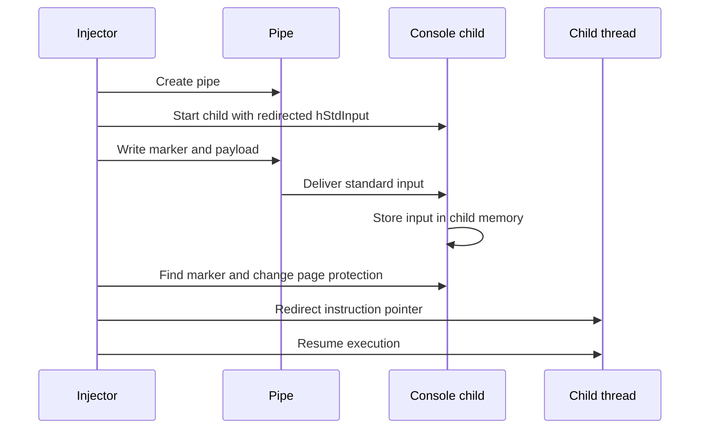

## A New Route Into Another Process

Many process injection detections begin with a familiar sequence: allocate
memory in another process, copy a payload into it, and start or redirect a
thread. On Windows, that often means watching for `VirtualAllocEx` followed by
`WriteProcessMemory`.

A proof of concept published by security researcher Two Seven One Three on
September 26, 2026 shows why defenders cannot treat that API pair as the
definition of process injection.

The technique, called console named-pipe injection, sends payload bytes through
the redirected standard input of an interactive console process. Windows and
the target application perform the write as part of normal input handling. The
injector then finds the payload in the child process, makes the containing
pages executable, and redirects an existing thread to run it.

The result is process injection without `VirtualAllocEx` or
`WriteProcessMemory`.

That does not make the technique invisible. It changes where defenders need to
look.

## How Console Named-Pipe Injection Works

The public `InjectSetConsole` PoC uses console applications such as
`nslookup.exe` and `netsh.exe`. Its execution flow is:

```text
Create an anonymous pipe
  -> Start an interactive console child with redirected standard input
  -> Send a marker and payload through WriteFile
  -> Let the child store those bytes while processing input
  -> Search the child's memory for the marker
  -> Change the existing pages to executable with VirtualProtectEx
  -> Redirect an existing thread to the payload
  -> Resume the thread
```

The key idea is the payload-placement step. The injector does not allocate a
new remote buffer and does not copy bytes with `WriteProcessMemory`. It writes
to the pipe. The child receives that input and stores it in its own address
space.

The PoC prefixes the payload with a recognizable marker. After locating the
marker in the child process, the injector calculates the payload entry point,
changes the page protection, suspends a thread, modifies its instruction
pointer, and resumes execution.



This is not process hollowing. The technique does not unmap or replace the
child image, and the child does not need to be created in a suspended state.
Its closest MITRE ATT&CK mappings are
[T1055 Process Injection](https://attack.mitre.org/techniques/T1055/) and
[T1055.003 Thread Execution
Hijacking](https://attack.mitre.org/techniques/T1055/003/).

## The Console Creates Constraints

Using standard input as a payload channel introduces restrictions. The
researcher identifies three bytes that the console may interpret as control
input:

| Byte | Console meaning |
|------|-----------------|
| `0x0D` | Carriage return |
| `0x0A` | Line feed |
| `0x1A` | Substitute or Ctrl+Z end-of-file behavior |

If these bytes appear in the wrong place, the target may treat the payload as
a command, terminate the input, or alter the buffer. An operator must therefore
use compatible shellcode or an encoding strategy.

The target also has to retain enough redirected input in accessible memory.
Marker scanning can fail if the application transforms, consumes, fragments,
or overwrites the input. Thread redirection can crash the process when the
architecture, stack, register state, or calling convention is incompatible.

Access controls still apply. The injector needs sufficient process and thread
rights to inspect memory, change page protections, suspend a thread, and modify
its context. Integrity boundaries, Protected Process Light, endpoint
prevention, architecture differences, and session isolation can interfere
with the chain.

This is a credible PoC, but it is not a universal injection method for every
Windows process.

## Does It Really Evade EDR

The technique avoids two highly recognizable APIs. That can bypass a detection
that depends on a fixed `VirtualAllocEx` and `WriteProcessMemory` sequence.

The available evidence does not prove broad EDR evasion.

The researcher did not publish personal test results against named endpoint
products. References to testing against four EDR products relate to a separate
SensePost technique called Process Parameter Poisoning. Those results should
not be transferred to `InjectSetConsole`.

Console named-pipe injection still produces potentially suspicious behavior:

* An unusual parent creates an interactive console child with redirected
  standard handles.
* The parent queries or reads memory in the new child.
* `VirtualProtectEx` changes remote writable memory to executable memory.
* An existing thread is suspended and its context is modified.
* Execution begins from private memory rather than a mapped image.
* The console child may perform network, file, registry, credential, or process
  activity that does not match its command line.

These signals may appear in behavioral detections, ETW, Sysmon, specialized
endpoint telemetry, or memory inspection. Native Microsoft Defender XDR
Advanced Hunting does not necessarily expose every API call as a discrete
event, so defenders should verify actual tenant telemetry before building a
rule around assumed fields or action types.

The defensible conclusion is narrower: console named-pipe injection creates a
visibility gap for API-centric detections, not an established blind spot across
all EDR products.

## What Defenders Should Hunt

Single events are likely to be noisy. `nslookup.exe`, `netsh.exe`, pipes, and
console processes are common in legitimate administration. Detection quality
comes from correlating the sequence.

Start with unusual process relationships:

* A rare or unexpected parent launches an interactive console utility.
* The child has little command-line justification for interactive input.
* The parent accesses the child process or its thread soon after creation.
* The child terminates quickly, produces parsing errors, or begins unrelated
  behavior.

Then look for stronger memory and control-flow evidence where the endpoint
platform exposes it:

* Remote writable-to-executable memory protection changes
* Executable private memory in a console process
* Cross-process memory scanning or reads
* Thread suspension followed by context modification
* Execution from a region that is not backed by a loaded image

Finally, correlate post-execution activity. In Microsoft Defender XDR,
`DeviceProcessEvents` can establish the process tree. `DeviceNetworkEvents`,
`DeviceFileEvents`, `DeviceRegistryEvents`, and `DeviceImageLoadEvents` can
show behavior performed by the child after the suspected injection. These
events provide context, not proof of injection on their own.

For environments that collect Sysmon into Microsoft Sentinel, useful adjacent
signals include process creation (Event ID 1), process access (Event ID 10),
pipe creation and connection (Event IDs 17 and 18), and applicable process
tampering telemetry (Event ID 25). The PoC uses an anonymous pipe. Coverage of
that standard-input channel should be verified with the deployed Sysmon
version and configuration rather than assumed.

## The Detection Engineering Lesson

Process injection is a behavior, not an API signature.

`InjectSetConsole` changes the way payload bytes reach another process, but it
does not remove the need to find those bytes, make memory executable, redirect
control flow, and perform the attacker's objective. Those later stages create
opportunities for behavioral detection.

Defenders should model injection as a chain:

```text
Suspicious process relationship
  + cross-process access
  + memory-state change
  + control-flow manipulation
  + anomalous payload behavior
```

No single element has to be conclusive. Together, they are more resilient than
a rule built around one implementation detail.

The same principle applies beyond this PoC. When a new technique removes one
familiar API, the right question is not whether visibility disappeared. The
right question is which required behaviors remain and whether the endpoint
telemetry can connect them.

## Current Assessment

Console named-pipe injection is technically plausible and publicly
demonstrated. It deserves lab validation and detection review because it can
sidestep narrow monitoring for `VirtualAllocEx` and `WriteProcessMemory`.

Public reporting has not established in-the-wild use, a malware family, a
campaign, a victim set, or broad EDR bypass. Treat the technique as emerging
tradecraft and a useful test of behavior-based detection, not as evidence of
an active intrusion by itself.

## References

* Two Seven One Three, [EDR Evasion: Process Injection Without
  WriteProcessMemory](https://www.zerosalarium.com/2026/09/edr-evasion-process-injection-without-WriteProcessMemory.html),
  September 26, 2026
* Two Seven One Three,
  [InjectSetConsole](https://github.com/TwoSevenOneT/InjectSetConsole), public
  C++ proof of concept, accessed September 28, 2026
* Cyber Security News, [New Windows Process Injection Attack Evades EDR
  Monitoring Without
  WriteProcessMemory](https://cybersecuritynews.com/windows-process-injection-evades-edr/),
  September 27, 2026
* Microsoft Learn, [Anonymous Pipe
  Operations](https://learn.microsoft.com/en-us/windows/win32/ipc/anonymous-pipe-operations)
* Microsoft Learn,
  [VirtualProtectEx](https://learn.microsoft.com/en-us/windows/win32/api/memoryapi/nf-memoryapi-virtualprotectex)
* Microsoft Learn,
  [SetThreadContext](https://learn.microsoft.com/en-us/windows/win32/api/processthreadsapi/nf-processthreadsapi-setthreadcontext)
* Microsoft Learn, [Sysmon](https://learn.microsoft.com/en-us/sysinternals/downloads/sysmon)