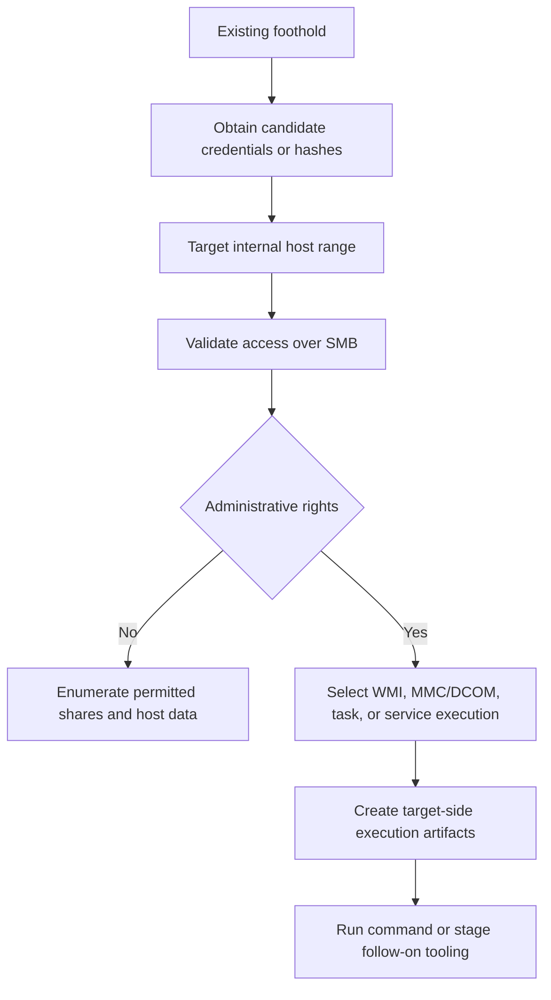
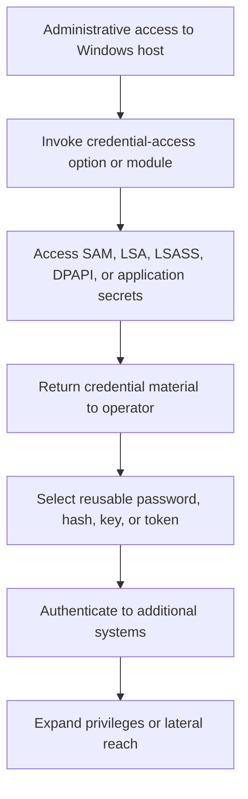
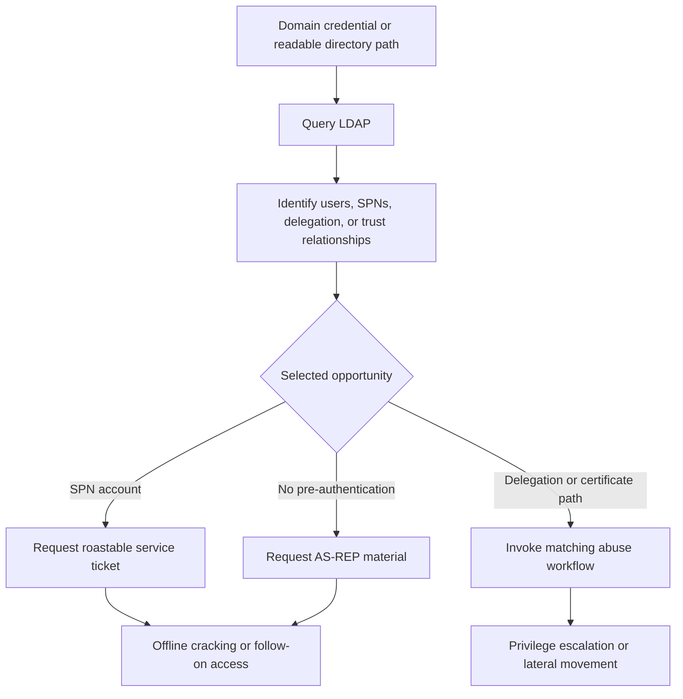
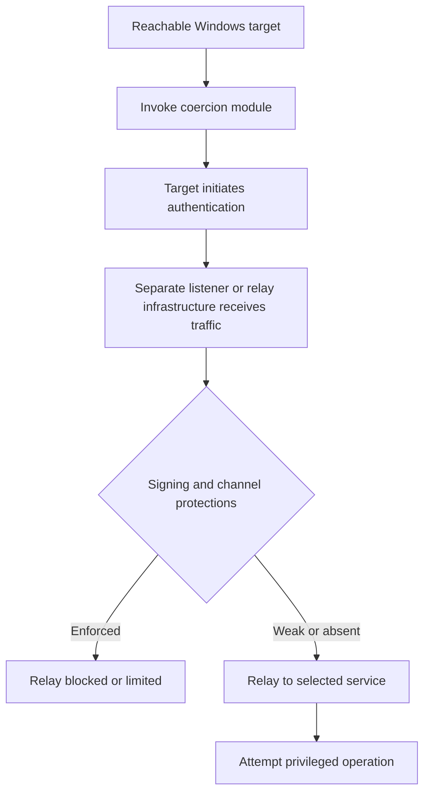

## Executive Summary

NetExec, commonly invoked as `nxc`, is an open-source Python framework for
assessing and operating across network services at scale. Its documented
capabilities include host and service enumeration, authentication testing,
password spraying, Active Directory discovery, remote command execution,
credential dumping, authentication coercion, and file operations. NetExec
supports Windows-focused protocols such as SMB, LDAP, WinRM, WMI, MSSQL, and
RDP, plus SSH, FTP, NFS, and VNC workflows.

NetExec is primarily post-compromise or authorized assessment tooling. Most
high-impact actions require valid credentials, hashes, Kerberos material, local
administrator rights, domain privileges, or a target-side weakness. Finding
NetExec does not establish how initial access occurred or prove that subsequent
data theft, ransomware, persistence, or impact was performed by the tool.

Detection should not depend on `nxc`, `netexec`, or `nxc.exe` names. Operators
can run NetExec from Linux, macOS, Windows, containers, Python environments, or
standalone builds. Endpoint telemetry may therefore exist only on targets, not
on the operator host. Durable coverage correlates authentication fan-out,
unusual service access, administrative logons, directory queries, credential
access, and remote execution effects.

The highest-priority detection themes are:

1. One source or account authenticating to many internal systems over a short
   period.
2. SMB, WinRM, WMI, or MSSQL authentication followed by remote execution.
3. Remote service, scheduled-task, WMI, DCOM, or WinRM process creation.
4. Credential dumping or Active Directory secrets access after administrative
   authentication.
5. LDAP enumeration, Kerberoasting, or coercion from an unusual source.
6. NetExec-like discovery followed by privileged lateral movement or impact.

> [!IMPORTANT]
> NetExec is dual-use security tooling. Confirm authorized testing scope before
> declaring compromise, but do not create permanent broad exclusions for tool
> names, security teams, protocols, or administrative hosts.

## Scope and Method

This report uses the NetExec v1.5.1 release, official project documentation,
and versioned source as capability evidence. Microsoft and The DFIR Report
incident research provide observed-use evidence. Microsoft documentation and
local table schemas define Defender XDR and Microsoft Sentinel telemetry.

The scope is NetExec. Historical CrackMapExec reporting is not treated as proof
of current NetExec behavior or use. MITRE ATT&CK software S0488 identifies
CrackMapExec, not NetExec, so this report does not reuse that software identifier
or its actor associations.

## Tool Context and Provenance

| Context | Evidence-based interpretation | Defensive consequence |
|---|---|---|
| Canonical NetExec | The community-maintained Python project and its `nxc` entry point | Official documentation establishes current capability, not malicious intent |
| Python execution | Installed through a package environment or run from source | Process names can be `python`, `python3`, `nxc`, or a shell wrapper |
| Standalone binary | A packaged Windows or other platform build | Filename, metadata, and hash vary by build and release |
| Container or remote operator host | NetExec runs outside the managed Windows estate | Target-side authentication and execution effects may be the only telemetry |
| Modified build or module | Public source or modules are changed, removed, or extended | Exact strings, temporary names, and command syntax are volatile |
| NetExec-like behavior | Another framework performs the same protocol operations | Detect the behavior without overclaiming tool identity |

NetExec v1.5.1 was released on February 23, 2026. Its versioned project metadata
requires Python 3.10 or later and defines `nxc`, `netexec`, and `NetExec` as
entry points. The release also provides packaged assets. There is no single
stable filename or hash that covers all valid builds and execution forms.

## Prerequisites and Operating Model

NetExec accepts individual hosts, hostnames, address ranges, CIDR blocks, target
files, or combinations of these formats. This design makes one-to-many activity
a normal capability, but target volume alone does not distinguish assessment
from malicious operation.

Credential inputs can include usernames and passwords, NTLM hashes, stored
credential database identifiers, Kerberos tickets or keys, and certificates
where a protocol supports them. Authentication can use local or domain context.
The project also supports username and credential files, paired credential
testing, spraying, jitter, and continuing after a successful authentication.

Privileges depend on the action:

* Enumeration and authentication checks can work with low-privilege or anonymous
  access when the target configuration permits it.
* SMB remote command execution requires administrative credentials according to
  official documentation.
* SAM, LSA, LSASS, DPAPI, and other host credential-access operations usually
  require local administrator or equivalent rights.
* NTDS access requires domain-controller access and sufficient directory or
  backup privileges for the selected method.
* LDAP modifications, delegation abuse, and certificate operations require the
  corresponding directory rights or vulnerable configuration.
* Authentication coercion requires a reachable coercion path and a separate
  relay or capture workflow to turn coerced authentication into access.

## Capability Overview

| Capability family | Direct behavior | Prerequisite or qualification |
|---|---|---|
| Targeting and concurrency | Operates across hosts, ranges, CIDRs, and target files | Broad fan-out is expected functionality; thresholds require baselining |
| Authentication validation | Tests passwords, hashes, Kerberos material, stored credentials, or certificates | Success depends on protocol support and valid material |
| Password spraying | Tests one or a small set of passwords across many accounts; NetExec can separately validate credentials across many targets | Spraying can generate failures and lockouts; one account across many hosts is not T1110.003 |
| SMB enumeration | Identifies hosts, shares, sessions, users, groups, policies, signing state, and other Windows details | Output depends on target access and service configuration |
| LDAP and AD discovery | Queries users, groups, organizational units, trusts, delegation, policy, and configuration | Requires directory reachability and sufficient read rights |
| SMB execution | Uses WMI, MMC/DCOM, scheduled tasks, or temporary services for command execution | Official documentation requires administrator credentials; method-specific network and target artifacts differ |
| WinRM execution | Executes commands or PowerShell through Windows Remote Management | Requires WinRM reachability and authorized credentials |
| WMI execution | Executes commands through WMI and can recover output | Requires WMI/DCOM access and sufficient rights |
| MSSQL operation | Authenticates, enumerates, runs SQL, and can use `xp_cmdshell` or linked servers | Depends on database privileges and server configuration |
| Credential dumping | Retrieves SAM, LSA, NTDS, LSASS, DPAPI, and application secrets through options or modules | Privilege and protection requirements differ by target and method |
| Kerberos operations | Uses Kerberos authentication and supports roasting and ticket-related workflows | Requires domain context, suitable accounts, or credential material |
| Authentication coercion | Modules can trigger target authentication through documented coercion methods | Coercion alone is not credential capture or relay success |
| File operations | Lists, downloads, uploads, or spiders files through supported protocols | Depends on share, file, database, or service permissions |
| Secondary protocols | Supports SSH, FTP, RDP, NFS, and VNC authentication or service-specific actions | Telemetry and privilege models differ substantially by protocol |

The capability surface changes between releases. Module availability and
behavior should be verified against the deployed version before building an
exact command or artifact rule.

## Direct and Downstream Behavior

### Direct NetExec Behavior

When supported by process, command-line, protocol, authentication, or target
artifact evidence, NetExec can directly perform:

* Multi-host service discovery and authentication checks
* Password, hash, Kerberos, certificate, or stored-credential authentication
* SMB share, session, user, group, policy, and host enumeration
* LDAP and Active Directory queries
* Password spraying and paired credential testing
* Remote command or PowerShell execution through supported services
* Scheduled-task, service, WMI, DCOM, WinRM, or database-mediated execution
* SAM, LSA, NTDS, LSASS, DPAPI, and application credential access
* Kerberoasting, AS-REP roasting, and authentication coercion workflows
* File listing, transfer, share spidering, and result storage

### Downstream Behavior

The following requires separate evidence even when NetExec enabled access:

* Initial access or exploitation that established the operator foothold
* Offline cracking of extracted password or ticket material
* Credential capture or relay after authentication coercion
* Persistence through new accounts, services, tasks, or remote management tools
* Data staging, archive creation, exfiltration, or cloud upload
* Security-control tampering or log clearing
* Ransomware, wipers, destructive actions, or backup deletion
* Actor or campaign attribution

## ATT&CK Mapping

MITRE ATT&CK does not identify NetExec with a dedicated software entry at this
research cutoff. The mappings below are analytical mappings from official
capabilities or directly observed NetExec use. They must be applied to the
evidenced behavior, not to the tool name alone.

| Technique | ID | NetExec relationship | Confidence or qualification |
|---|---|---|---|
| Network Service Discovery | T1046 | Scans targets and identifies reachable services | High as documented and observed capability |
| Remote System Discovery | T1018 | Enumerates hosts across ranges or target lists | High |
| Network Share Discovery | T1135 | Enumerates SMB shares and access | High |
| Account Discovery: Domain Account | T1087.002 | Enumerates domain users through SMB or LDAP | High |
| Permission Groups Discovery: Domain Groups | T1069.002 | Enumerates domain groups and memberships | High |
| Domain Trust Discovery | T1482 | Enumerates domain trusts through LDAP | High |
| Password Spraying | T1110.003 | Tests one or a small set of passwords across many accounts | High as documented capability; the reviewed incident commands do not independently confirm this technique |
| Valid Accounts: Domain Accounts | T1078.002 | Uses valid domain credentials for access | High as capability; account origin is separate |
| Pass the Hash | T1550.002 | Authenticates with NTLM hashes where supported | High |
| SMB/Windows Admin Shares | T1021.002 | Accesses SMB shares, including administrative shares, and can support SMB/RPC remote administration | High when share access or lateral-movement behavior is evidenced; do not map from SMB scanning or authentication alone |
| Windows Remote Management | T1021.006 | Executes through WinRM | High as capability |
| Windows Management Instrumentation | T1047 | Uses WMI for remote execution | High as capability |
| Distributed Component Object Model | T1021.003 | WMI or MMC-based execution can use DCOM | Method-dependent |
| Service Execution | T1569.002 | SMB execution can create a temporary service | High for `smbexec` behavior |
| Scheduled Task/Job: Scheduled Task | T1053.005 | SMB execution can create a scheduled task | High for `atexec` behavior |
| OS Credential Dumping: Security Account Manager | T1003.002 | Dumps local SAM secrets | High as documented capability |
| OS Credential Dumping: NTDS | T1003.003 | Dumps directory secrets through supported NTDS methods | High as documented and observed capability |
| OS Credential Dumping: LSA Secrets | T1003.004 | Dumps LSA secrets | High as documented capability |
| Kerberoasting | T1558.003 | Requests service-ticket material for offline cracking | High as documented capability |
| Forced Authentication | T1187 | Coercion modules trigger authentication from a target | High for documented and observed coercion attempts |
| Adversary-in-the-Middle | T1557 | NetExec can participate in a relay chain | Map only when separate relay evidence exists |

## Representative Attack Flows

### Flow 1: Credential Validation to SMB Execution

NetExec directly performs target selection, authentication, enumeration, and
the selected execution method. Credential acquisition and follow-on tooling are
separate activities.

### Flow 2: Credential Dumping to Reuse

NetExec can initiate the dump and store results. Successful reuse and lateral
movement require separate authentication and target-side evidence.

### Flow 3: LDAP Discovery to Kerberos Abuse

Directory discovery and ticket requests can be direct NetExec behavior. Offline
cracking and resulting access remain downstream.

### Flow 4: Coercion to Relay Attempt

NetExec can initiate coercion. Capture, relay, and privileged action depend on
separate infrastructure, target protections, and permissions.

## Documented Threat Use

### Storm-2570 Ransomware Affiliate Activity

Microsoft Threat Intelligence reported in September 2026 that Storm-2570 used
NetExec with PsExec, Impacket, RDP scripts, and administrative shares across
multiple intrusions. Microsoft described the tools as reaching additional
systems, remotely executing commands, staging tooling, supporting credential
theft and reconnaissance, and preparing environments for ransomware deployment.

This evidence supports malicious NetExec use in a repeated ransomware-affiliate
workflow. It does not mean every Storm-2570 action or ransomware deployment was
performed by NetExec.

### Linux-to-Windows Coercion Attempt

Microsoft documented a May 2026 intrusion that moved from a compromised edge
appliance to Linux and then Windows infrastructure. Initial attempts with
`netexec` and `nxc` were unsuccessful. After credentials were recovered from an
internal Confluence server, the actor ran an `nxc smb` command with the
`coerce_plus` module to trigger authentication as part of a broader relay chain.

This case shows the value of Linux process and shell telemetry, cross-platform
identity correlation, and authentication-coercion detections. It also shows why
tool presence or attempted commands must not be described as successful access
without corroborating evidence.

### Lynx Ransomware Intrusion

The DFIR Report observed a threat actor download and execute `nxc.exe` during a
Lynx ransomware intrusion. The command targeted a CIDR range over SMB with a
username and password. The binary connected to multiple systems on TCP 445 for
roughly two minutes. Investigators recovered `.nxc` configuration and protocol
database artifacts, plus a manually created `nxc.txt` file.

The report states that the NetExec activity enumerated hosts with domain
administrator credentials. Later collection, exfiltration, RDP movement, backup
deletion, and ransomware deployment were separate actions and should not be
attributed to NetExec.

### The Gentlemen Ransomware Intrusion

The DFIR Report documented 2026 NetExec commands using `--ntds`, paired
credential files with `--no-bruteforce --continue-on-success`, and the `lsassy`
module during an intrusion that progressed to The Gentlemen ransomware.
Researchers placed the commands in credential access and lateral-movement
context alongside RDP, SMB, WinRM, Mimikatz, LSASS access, and broad directory
reconnaissance.

The command evidence supports specific NetExec capabilities in that intrusion.
Rclone exfiltration, defense evasion, Group Policy deployment, and ransomware
impact were performed through other tools or mechanisms.

## Obfuscation, Variability, and Detection Avoidance

NetExec does not require a Windows binary or a target-side agent. This creates
several detection challenges:

* Python, a packaged executable, a container, or a renamed launcher can host the
  operator process.
* Linux or unmanaged operator hosts can fall outside endpoint visibility.
* Jitter and authentication limits can reduce obvious spraying rates.
* Kerberos can replace NTLM for supported workflows.
* Randomized temporary files, registry values, services, or tasks can weaken
  exact-name detections.
* Best-effort cleanup can remove short-lived target artifacts.
* Modules can add behavior not represented by the core command set.
* Normal administrative protocols make isolated network connections ambiguous.

No single process name, port, event, or path is sufficient attribution. Combine
operator-side evidence when available with source, identity, destination,
privilege, temporal, and target-side execution context.

## Durable Hunting Pivots

Higher-value pivots survive filename and build changes:

* A rare source contacting many internal systems on the same administrative
  protocol.
* One identity producing successes or failures across many target devices.
* Authentication fan-out followed by service, task, WMI, DCOM, WinRM, or
  database-mediated execution.
* Administrative SMB access followed by sensitive registry, process, or
  directory database access.
* LDAP queries for users, groups, trusts, delegation, SPNs, or certificate
  configuration from an unusual device.
* Coercion behavior followed by inbound authentication to an unexpected host.
* Newly observed credentials succeeding across systems after a dump or roast.
* Cross-platform sequences from Linux shell activity to Windows logons and
  target-side process creation.

Volatile indicators remain useful for enrichment:

* `nxc`, `netexec`, `nxc.exe`, or NetExec console strings
* `.nxc`, `nxc.conf`, workspace directories, protocol databases, and logs
* `nxc smb`, `--ntds`, `--sam`, `--lsa`, `-M lsassy`, or `-M coerce_plus`
* A hash tied to a reported sample
* Default or randomized temporary artifacts from one release

Treat these as leads. Validate signer, prevalence, path, owner, source, command
context, and surrounding behavior before assigning malicious intent.

## Observable Signals by Data Category

### Process and Command Activity

Operator-side evidence can include Python or packaged NetExec execution,
credential or target files, protocol arguments, module names, hashes, and shell
history. Target-side effects depend on the method and can include:

* `wmiprvse.exe` spawning a command interpreter or payload
* `wsmprovhost.exe` or WinRM-related processes spawning commands
* Service Control Manager execution and a short-lived service
* Task Scheduler registration followed by task-hosted execution
* Command shells or PowerShell with unusual remote-administration ancestry
* SQL Server spawning a command through `xp_cmdshell`

Parent process and command-line evidence can be incomplete. Use account,
network, event, file, and timing context rather than requiring one exact chain.

### Authentication and Identity

Relevant patterns include:

* Repeated failures for one password across many accounts
* One account authenticating to many systems over SMB, WinRM, WMI, MSSQL, or SSH
* NTLM or Kerberos use from a source with no administrative baseline
* Success shortly after broad failures or after credential-access activity
* Administrative network logons followed by remote execution
* Authentication from Linux, appliances, or application servers to privileged
  Windows systems

Distributed spraying, shared jump hosts, service accounts, scanners, and
automation can produce similar shapes. Baselining must include source ownership,
change windows, account role, and target scope.

### Directory and Kerberos

LDAP telemetry can expose unusual queries for accounts, groups, trusts,
delegation, SPNs, certificate services, or other high-value configuration.
Kerberos security events can support roasting or credential-reuse hypotheses
when domain-controller auditing is enabled and collected.

Directory reads are often legitimate. Risk increases when rare queries come
from non-administrative sources, enumerate broad high-value objects, or precede
ticket requests and privileged access.

### Files, Registry, Services, and Tasks

Potential artifacts include NetExec workspaces on the operator endpoint,
protocol databases, logs, output files, temporary remote-output files, registry
values, services, and scheduled tasks. Many are temporary or randomized.

Windows event collection can add process creation, service installation,
scheduled-task registration, share access, and authentication detail. Event
availability depends on audit policy, product onboarding, connector selection,
retention, and parser behavior.

### Network

High-signal network patterns depend on sequence and cardinality rather than one
port. Relevant services include SMB, WinRM, RPC/DCOM, LDAP or LDAPS, Kerberos,
MSSQL, RDP, SSH, FTP, NFS, and VNC. Destination ports can be changed, tunneled,
proxied, or hidden behind service negotiation.

Look for source-to-many fan-out, protocol transitions, authentication results,
and target-side effects. Port 445 alone proves neither authentication nor
NetExec.

## Defender XDR and Microsoft Sentinel Data

| Data source | Relevant fields or events | Defensive use | Limitation |
|---|---|---|---|
| `DeviceProcessEvents` | `FileName`, `FolderPath`, `ProcessCommandLine`, `AccountName`, initiating-process fields, hashes | Find operator execution and target-side process ancestry | Operator host can be unmanaged; command lines can be absent |
| `DeviceNetworkEvents` | `RemoteIP`, `RemotePort`, `LocalIP`, `LocalPort`, `Protocol`, initiating-process fields | Measure fan-out and associate connections with a process | Connection does not prove authentication or action |
| `DeviceLogonEvents` | `ActionType`, `LogonType`, `AccountName`, `Protocol`, `RemoteIP`, `RemoteDeviceName`, `IsLocalAdmin`, `FailureReason` | Correlate endpoint logons, failures, and administrative context | Coverage and remote-source attribution vary by event |
| `IdentityLogonEvents` | `Application`, `LogonType`, `Protocol`, account, source and destination fields, `FailureReason` | Detect identity fan-out and unusual authentication | Depends on Defender for Identity and supported event generation |
| `IdentityQueryEvents` | `QueryType`, `QueryTarget`, `Query`, `Protocol`, account, source and destination fields | Hunt unusual LDAP and directory discovery | Not every directory read or tool implementation is represented |
| `DeviceFileEvents` | `FileName`, `FolderPath`, hashes, initiating-process fields | Find `.nxc`, protocol databases, logs, and temporary artifacts | Artifacts can remain only on an unmanaged operator host |
| `DeviceRegistryEvents` | `RegistryKey`, `RegistryValueName`, `RegistryValueData`, initiating-process fields | Investigate WMI output or module-related registry artifacts | Names can be randomized and cleanup can remove evidence |
| `SecurityEvent` | `EventID`, `EventData`, `Account`, `IpAddress`, `LogonTypeName`, process, service, and command fields | Use collected Windows events with flattened fields where available | Field population differs by event ID and connector |
| `WindowsEvent` | `EventID`, dynamic `EventData`, `Computer`, `TimeGenerated` | Parse raw event payloads for authentication, process, task, service, and share evidence | Requires event-specific parsing and configured collection |

Useful Windows events can include 4624 and 4625 for logons, 4688 for process
creation, 4698 for scheduled-task creation, 4768 and 4769 for Kerberos requests,
4771 for Kerberos pre-authentication failures, 5140 or 5145 for share access,
and 7045 for service installation. Confirm event versions, field availability,
audit policy, and connector parsing before relying on them.

## Priority Hunting Hypotheses

| ID | Hypothesis | Core evidence | Priority |
|---|---|---|---|
| H1 | A rare process or unmanaged source contacts many internal SMB targets | Process or source identity, destination cardinality, port or protocol, baseline | Critical |
| H2 | One account produces authentication fan-out across many devices | Logon outcomes, account, source, destination count, time window | Critical |
| H3 | SMB authentication is followed by service, task, or WMI execution | Source and account correlation, target logon, process or event sequence | Critical |
| H4 | WinRM or WMI authentication is followed by suspicious child processes | Remote logon, `wsmprovhost.exe` or `wmiprvse.exe` ancestry, command line | High |
| H5 | Administrative access is followed by SAM, LSA, LSASS, DPAPI, or NTDS activity | Privileged logon, sensitive access, file or process evidence | Critical |
| H6 | A rare device performs broad LDAP discovery of privileged objects | Identity queries, target classes, source rarity, account role | High |
| H7 | Password spraying produces broad failures and one or more successes | Failure cardinality, password-spray shape, later success, source | High |
| H8 | NTLM hash authentication or credential reuse reaches multiple systems | Authentication protocol, source, account, target spread, prior credential access | High |
| H9 | Authentication coercion is followed by unexpected inbound authentication | Coercion evidence, target-to-listener connection, relay destination, timing | Critical |
| H10 | NetExec workspace or command artifacts appear on an endpoint | File path, name, hash, command line, owner, surrounding network activity | Medium |
| H11 | Kerberoasting or AS-REP roasting originates from an unusual source | LDAP discovery, 4768/4769 properties, account and source baseline | High |
| H12 | NetExec-like discovery rapidly precedes privileged lateral movement or impact | Fan-out, credential use, remote execution, target criticality, downstream actions | Critical |

## Hypothesis Validation and Tuning

### H1 and H2: Network and Authentication Fan-Out

Count distinct internal destinations by source process, source device, account,
and protocol over environment-specific windows. Compare with at least several
weeks of baseline data. Suppress only approved source, operator, protocol,
window, and target combinations.

Expected benign sources include vulnerability scanners, inventory systems,
backup products, software deployment, orchestration, monitoring, and authorized
assessment infrastructure. A source that is rare for the account or target tier
is more important than a globally high connection count.

### H3 and H4: Remote Execution

Correlate source authentication to target-side process creation. Favor
`wmiprvse.exe`, `wsmprovhost.exe`, service, task, or SQL ancestry combined with
unusual commands, accounts, or destination tiers. Parent process alone is not
malicious because legitimate administration uses the same services.

Disconfirm the hypothesis when the activity matches approved management tools,
known scripts, expected accounts, and a valid change window across the exact
targets involved.

### H5: Credential Access

Start with administrative logons, then search for sensitive process access,
registry or hive operations, directory database access, shadow-copy activity,
credential-dumping alerts, or known module artifacts. Separate local host
secrets from domain-controller NTDS access because privileges and impact differ.

Backup, recovery, identity-management, endpoint security, and incident-response
tools can access the same resources. Validate process identity, signer, service
ownership, user intent, and target role.

### H6 and H11: Directory and Kerberos Discovery

Baseline query origin, account, object types, query volume, and domain-controller
ticket activity. Prioritize sources that do not normally administer identity,
queries that target privileged or roastable accounts, and sequences followed by
ticket requests or access.

Do not assume all LDAP queries are visible or that absence of a domain-controller
event proves a forged ticket. Collection and parser gaps must remain explicit.

### H7 and H8: Credential Testing and Reuse

Model both broad-fast and low-slow patterns. Group by source, normalized account,
protocol, destination, and result. A successful authentication after repeated
failures or after credential access should raise priority.

Shared jump hosts and service accounts can produce wide legitimate access.
Require source ownership and role baselines before scheduling analytics.

### H9: Coercion and Relay

Correlate an initiating command, module artifact, or coercion alert with outbound
authentication from the coerced system to an unexpected listener. Then look for
near-term authentication to a second service and privileged effects.

Coercion can fail because of signing, channel binding, Extended Protection for
Authentication, network controls, or permissions. Do not report relay success
from the coercion command alone.

### H10 and H12: Artifact and Impact Sequences

Use `.nxc`, configuration, protocol database, log, command, and sample-hash
evidence as high-value enrichment. Require behavioral context because authorized
testing and research hosts can contain identical artifacts.

For impact sequences, preserve causality boundaries. NetExec-like activity can
enable access without performing exfiltration, security tampering, backup
deletion, or ransomware execution.

## Query-Building Blocks

Build production hunts from small, independently validated components:

1. Define internal destination ranges and sensitive device tiers.
2. Normalize device, IP address, account, domain, and protocol keys.
3. Establish approved scanners, management hosts, service accounts, and test
   windows.
4. Measure source-to-destination and account-to-device cardinality.
5. Correlate network activity with authentication success or failure.
6. Correlate successful administrative access with target-side process, service,
   task, file, registry, or identity-query evidence.
7. Add target criticality, account privilege, source rarity, and downstream
   behavior as confidence features.
8. Preserve raw timestamps, device identifiers, report identifiers, and command
   lines for triage.

Do not hard-code universal thresholds. Validate action types and populated
fields in the target tenant before converting a hunt into an analytic rule.

## Detection Engineering Guidance

Layer coverage by confidence:

1. Detect explicit NetExec process, command, module, workspace, or sample
   evidence as a high-confidence lead, not final attribution.
2. Detect source-to-many administrative-protocol activity from rare processes or
   systems.
3. Detect one-to-many authentication patterns and spray-to-success transitions.
4. Detect target-side remote execution through services, tasks, WMI, WinRM,
   DCOM, or databases.
5. Detect privileged credential access and directory-secrets operations.
6. Correlate discovery and access with critical assets or near-term impact.

Allowlist with bounded tuples such as tool owner, source device, operator
identity, protocol, approved target group, and change window. A global exclusion
for Python, SMB, a red-team account, or a management subnet removes coverage for
stolen credentials and compromised administrative infrastructure.

## Defensive Control Context

Preventive controls reduce NetExec opportunities even when they do not identify
the tool:

* Restrict administrative protocols to managed jump hosts and required network
  paths.
* Enforce SMB signing, LDAP signing and channel binding, and Extended Protection
  for Authentication where supported.
* Reduce or disable NTLM where operationally possible.
* Use separate privileged identities and prevent privileged credential reuse on
  lower-trust systems.
* Apply local administrator password management and minimize shared local
  credentials.
* Restrict WinRM, WMI, RPC, RDP, database administration, and remote service
  control by role and source.
* Protect LSASS and credential material with supported platform controls.
* Monitor and limit directory replication, backup, and domain-controller access.
* Evaluate the Defender attack surface reduction rule that blocks process
  creation from PsExec and WMI commands for compatible systems.
* Onboard Linux administration and application servers to endpoint monitoring
  where they can reach Windows identity infrastructure.

Controls can have compatibility effects. Test them against legitimate
administration and recovery workflows before broad enforcement.

## Triage and Containment Guidance

When NetExec or NetExec-like behavior is suspected:

1. Confirm whether the source, operator, account, targets, protocol, and time
   window match an authorized assessment or administrative change.
2. Preserve process, network, authentication, directory-query, service, task,
   file, registry, and Windows event evidence from source and targets.
3. Determine whether credentials, hashes, tickets, certificates, or stored
   secrets were supplied or recovered.
4. Identify every destination reached by the source and every system accessed by
   the involved accounts.
5. Check for credential dumping, coercion, relay, remote execution, and newly
   established administrative access.
6. Search for downstream staging, remote management tools, exfiltration,
   security tampering, backup changes, and impact activity.
7. Contain compromised identities and endpoints according to incident scope;
   rotate affected secrets after preserving evidence and understanding reuse.
8. Review signing, channel binding, EPA, segmentation, privilege, and logging
   gaps that allowed or obscured the activity.

Do not delete operator artifacts before collecting them. Protocol databases,
configuration, logs, shell history, and target lists can define the full scope.

## Coverage Gaps and Confidence Limits

This research has the following limits:

* Capabilities and modules can change after NetExec v1.5.1.
* The official wiki can describe behavior from different project versions.
* No dedicated MITRE ATT&CK NetExec software entry was used at the cutoff.
* Public malicious-use reporting is smaller than the broader history of related
  network administration frameworks.
* Operator execution can occur on Linux, macOS, containers, or unmanaged hosts.
* Encrypted, relayed, proxied, or Kerberos-authenticated traffic can reduce
  protocol visibility.
* Temporary services, tasks, files, and registry values can be randomized or
  cleaned up.
* Defender tables and Windows events depend on product onboarding, audit policy,
  connector configuration, retention, and event version.
* Normal administration can reproduce every major protocol behavior.
* The proposed hypotheses were not executed or performance-tested in a tenant.

Absence of `nxc`, `.nxc`, port 445 fan-out, or a known hash does not exclude
NetExec. Presence of any one indicator does not prove malicious use.

## Historical Indicators and Pivots

The following indicators come from specific reports and should not be promoted
to permanent global blocks:

| Indicator | Context | Use |
|---|---|---|
| `6285d32a9491a0084da85a384a11e15e203badf67b1deed54155f02b7338b108` | SHA-256 reported for `nxc.exe` in the Lynx intrusion | Search historical endpoint and file telemetry, then validate context |
| `.nxc` and `nxc.conf` | NetExec workspace artifacts observed in the Lynx intrusion | Identify operator-side workspaces and pivot to databases and logs |
| `nxc.txt` | Manually created output-review file in the Lynx intrusion | Incident-specific lead only |
| `--ntds` and `-M lsassy` | Commands observed in The Gentlemen intrusion | Hunt for explicit credential-access command evidence |
| `-M coerce_plus` | Command observed in the Microsoft Linux-to-Windows intrusion | Correlate with coercion and relay evidence |

Reputation, prevalence, ownership, path, signer, and incident timing must be
checked before response action.

## Sources

| # | Title | Publisher | Date | URL | Accessed |
|---|---|---|---|---|---|
| 1 | NetExec Welcome | NetExec | Living documentation | <https://www.netexec.wiki/> | 2026-10-05 |
| 2 | NetExec Source Repository | NetExec contributors | Living repository | <https://github.com/Pennyw0rth/NetExec> | 2026-10-05 |
| 3 | NetExec v1.5.1 | NetExec contributors | 2026-02-23 | <https://github.com/Pennyw0rth/NetExec/releases/tag/v1.5.1> | 2026-10-05 |
| 4 | Target Formats | NetExec | Living documentation | <https://www.netexec.wiki/getting-started/target-formats> | 2026-10-05 |
| 5 | Using Credentials | NetExec | Living documentation | <https://www.netexec.wiki/getting-started/using-credentials/> | 2026-10-05 |
| 6 | Using Kerberos | NetExec | Living documentation | <https://www.netexec.wiki/getting-started/using-kerberos> | 2026-10-05 |
| 7 | Executing Remote Commands | NetExec | Living documentation | <https://www.netexec.wiki/smb-protocol/command-execution/execute-remote-command> | 2026-10-05 |
| 8 | Obtaining Credentials | NetExec | Living documentation | <https://www.netexec.wiki/smb-protocol/obtaining-credentials> | 2026-10-05 |
| 9 | LDAP Protocol Documentation | NetExec | Living documentation | <https://www.netexec.wiki/ldap-protocol/authentication> | 2026-10-05 |
| 10 | Beyond the ransomware: Tracking Storm-2570's consistent tradecraft across deployments | Microsoft Threat Intelligence | 2026-09-24 | <https://www.microsoft.com/en-us/security/blog/2026/09/24/beyond-ransomware-tracking-storm-2570-consistent-tradecraft-across-deployments/> | 2026-10-05 |
| 11 | From edge appliance to enterprise compromise: Multi-stage Linux intrusion via F5 and Confluence | Microsoft Defender Security Research Team | 2026-05-22 | <https://www.microsoft.com/en-us/security/blog/2026/05/22/from-edge-appliance-to-enterprise-compromise-multi-stage-linux-intrusion-via-f5-and-confluence/> | 2026-10-05 |
| 12 | Cat's Got Your Files: Lynx Ransomware | The DFIR Report | 2025-12-17 | <https://thedfirreport.com/2025/12/17/cats-got-your-files-lynx-ransomware/> | 2026-10-05 |
| 13 | Flash Alert: EtherRat and TukTuk C2 End in The Gentleman Ransomware | The DFIR Report | 2026-05-11 | <https://thedfirreport.com/2026/05/11/flash-alert-etherrat-and-tuktuk-c2-end-in-the-gentleman-ransomware/> | 2026-10-05 |
| 14 | Enterprise techniques | MITRE ATT&CK | Living reference | <https://attack.mitre.org/techniques/enterprise/> | 2026-10-05 |
| 15 | Attack surface reduction rules reference | Microsoft | Living reference | <https://learn.microsoft.com/defender-endpoint/attack-surface-reduction-rules-reference> | 2026-10-05 |
| 16 | Advanced hunting schema tables | Microsoft | Living reference | <https://learn.microsoft.com/defender-xdr/advanced-hunting-schema-tables> | 2026-10-05 |
