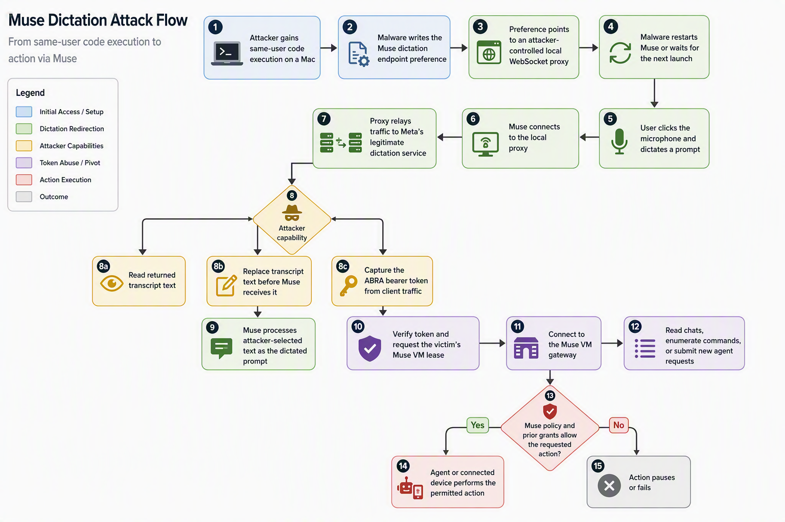

## Executive summary

Security researcher Patrick Wardle published `not-a-mused`, a proof of concept
for a local vulnerability in Meta's Muse client for macOS. The weakness is an
undocumented, user-writable preference named
`endo_voyager_dictation_endpoint`. Muse trusts this setting to choose the
WebSocket endpoint for voice dictation. Malware already running as the signed-in
macOS user can redirect that connection through a local proxy without
administrator privileges.

The proxy can observe transcripts returned by Meta, replace transcript text
before Muse receives it, and capture an `ABRA` bearer token sent by the client.
The proof of concept then demonstrates how that token can be used to communicate
with the victim's Muse cloud environment, read chat history, enumerate exposed
device commands, submit a new prompt, and request selected device actions.

This is not remote code execution against a clean Mac, and the vulnerability is
not the attacker's initial foothold. It is an access-amplification flaw: malware
that already has user-level execution can pivot through a more trusted agent and
its connected cloud and device capabilities. Claims that the flaw directly
"injects malware" overstate the public proof of concept. The code demonstrates
prompt replacement and a file-write request, subject to Muse permissions and
approval controls, but does not demonstrate delivery or execution of a malware
binary.

As of September 22, 2026, no matching CVE, GitHub Security Advisory, confirmed
affected-version range, Meta patch notice, or evidence of exploitation in the
wild was identified in the sources reviewed for this report. The public Muse
download page offered `Muse-2.1.dmg` when checked, but that does not establish
that version 2.1 is vulnerable or fixed.

## What Muse is and why this matters

Muse is Meta's personal AI agent. Its clients include macOS, mobile, web, and
WhatsApp interfaces, while a persistent per-user virtual machine performs agent
work in Meta's cloud. Muse can connect to email, calendars, social applications,
websites, files, local devices, and other services. That broad reach is useful,
but it also makes the agent a valuable post-compromise target.

Meta's published design places the agent runtime in an isolated Linux container
inside a dedicated Muse Secure VM. Separate services hold credentials, enforce
connector permissions, inspect model traffic, and govern network egress. Meta
states that the agent sees surrogate tokens rather than underlying third-party
credentials and that sensitive actions can require approval through a channel
separate from the conversation.

`not-a-mused` does not show a breakout from that VM architecture. It targets the
trust relationship between the local macOS client and Meta's services. In other
words, the flaw attacks an authenticated client channel before the cloud-side
controls can determine whether the submitted instruction came from the user or
from malware acting through the user's client and token.

## Vulnerability status

| Field                    | Assessment as of September 22, 2026                                                               |
|--------------------------|----------------------------------------------------------------------------------------------------|
| Researcher               | Patrick Wardle, Objective-See                                                                      |
| Proof of concept         | Public `pwardle/not-a-mused` GitHub repository                                                     |
| Attack class             | Local traffic redirection, interception, transcript manipulation, and bearer-token theft           |
| Prerequisite             | Code execution as the signed-in macOS user and an installed, authenticated Muse client             |
| Privilege required       | No administrator or root privilege for the demonstrated preference change                          |
| User interaction         | Dictation must be triggered for the proxy to observe the demonstrated client traffic                |
| Affected versions        | Not publicly established; the product page offered Muse 2.1 when reviewed                           |
| CVE or GHSA              | None identified                                                                                    |
| Vendor response          | No response specific to Wardle's finding identified                                                 |
| Patch status             | No verified fixed version or patch notice identified                                                |
| In-the-wild exploitation | None reported in the reviewed sources                                                              |
| Remote code execution    | Not demonstrated; an attacker needs an existing local foothold                                      |
| Malware injection        | Not demonstrated as a binary delivery and execution chain; prompt replacement and file write exist |

## The bug

The root problem is that Muse's macOS client honors a security-sensitive service
endpoint from a preference domain writable by an ordinary process running as the
same user. The proof of concept sets the value with the equivalent of:

```bash
defaults write com.meta.endo endo_voyager_dictation_endpoint \
  -string ws://127.0.0.1:8080/asr/duplex
```

It then restarts Muse. When the user invokes dictation, Muse connects to the
attacker's loopback WebSocket proxy. The proxy preserves the original
authentication headers and WebSocket subprotocol information while relaying the
connection to Meta's legitimate upstream service at
`wss://shortwave.facebook.com/voyager/v1/asr/duplex`.

This is a local adversary-in-the-middle position created by configuration
redirection. TLS still protects the proxy's connection to Meta, but it does not
protect the application from a local endpoint that Muse was explicitly told to
trust. The proxy can therefore inspect application-layer messages on both sides.

The PoC looks for an `authorization.accessToken` value beginning with `ABRA` in
client traffic. It also parses transcript messages returned by Meta. With an
optional replacement string, it swaps the transcript field and forwards the
modified message to Muse. The agent consequently receives attacker-selected text
through a channel that normally represents the user's spoken instruction.

After capturing the bearer token, the PoC calls Meta account APIs to verify the
token and obtain a lease for the user's existing Muse VM. It then connects to the
VM gateway, completes the expected Noise protocol handshake, and can perform
operations exposed by that account. This second stage is important: stealing the
client token is what turns dictation interception into broader account and agent
access.

## Exploitation path



### Step 1: Establish a local foothold

The attacker must first execute code in the victim's macOS user context. The
research does not provide that foothold. It could result from an unrelated
malware infection or social engineering, but those paths are outside the
vulnerability itself.

### Step 2: Redirect the dictation endpoint

The local process changes the `com.meta.endo` preference for
`endo_voyager_dictation_endpoint` to a loopback or attacker-controlled WebSocket
endpoint. The PoC confirms that this operation does not need elevated privilege.

### Step 3: Restart and wait for dictation

The proof of concept stops and relaunches Muse so the new endpoint takes effect.
The user must then activate dictation. This interaction is a meaningful
constraint: the demonstrated interception path is not triggered merely because
Muse is installed.

### Step 4: Proxy the trusted channel

The attacker's listener accepts Muse's connection and creates a second TLS
connection to Meta. Relaying legitimate traffic keeps dictation functional while
placing the attacker between the client and service at the application layer.

### Step 5: Observe or replace instructions

The PoC can print the transcript produced by Meta and optionally replace its
text before passing it to Muse. This is direct instruction-channel manipulation,
not a conventional indirect prompt injection hidden in a webpage or document.

### Step 6: Capture the Muse bearer token

The client's WebSocket message includes an `ABRA` access token. The proxy extracts
it from the authorization object. A bearer token grants its holder access without
proving possession of a separate device-bound key, so interception enables the
next stage.

### Step 7: Pivot into the cloud agent

Using the token, the PoC verifies the account, retrieves a lease and authentication
material for the existing Muse VM, and connects to the VM gateway. It implements
the same Noise-based encrypted transport expected by the service. This gives the
attacker an authenticated path into the victim's agent environment.

### Step 8: Exercise delegated capabilities

The published code supports listing more than 50 advertised command schemas,
dumping chat history, submitting a side-chat prompt, requesting environment
details, taking a camera photo, sending a notification, and writing text to a
file. Some actions require the relevant device permission or a Muse approval.
The PoC explicitly reports denial or uncertainty rather than bypassing those
controls.

## What is proven and what is not

| Claim                                           | Evidence assessment                                                                       |
|-------------------------------------------------|-------------------------------------------------------------------------------------------|
| Same-user endpoint modification                 | Demonstrated directly in the PoC with the macOS `defaults` command                        |
| Dictation interception                          | Implemented by the WebSocket relay                                                        |
| Transcript capture and replacement              | Implemented by JSON parsing and replacement in the relay                                  |
| Muse bearer-token capture                       | Implemented for `ABRA` tokens found in authorization messages                             |
| Access to a standard Muse VM                    | Implemented through token verification, VM leasing, and a Noise handshake                 |
| Chat and command access                         | Implemented by the PoC                                                                    |
| Access to a Muse Confidential VM                | Not demonstrated; the PoC stops when recovery credentials are required                    |
| Bypass of every approval or permission          | Not demonstrated                                                                          |
| Theft of raw third-party passwords or API keys  | Not demonstrated; Meta says real credentials remain isolated from the agent               |
| Remote compromise of a clean Mac                | Not demonstrated                                                                          |
| Malware binary delivery and execution via Muse  | Not demonstrated                                                                          |
| Persistence after removing the endpoint setting | Not demonstrated by the vulnerability itself                                              |
| Active exploitation in the wild                 | Not reported in the reviewed sources                                                      |

## Security impact

The highest-confidence impacts are loss of confidentiality and integrity for the
dictation channel and theft of an application access token. Chat history and
agent context may contain sensitive personal or business information. Transcript
replacement can make Muse act on an instruction the user did not speak.

The larger risk depends on what the user previously connected and authorized.
Read access to email or calendars, device integrations, local file access, and
standing connector permissions enlarge the blast radius. Meta's Sentinel,
credential isolation, approval prompts, and scoped connector policies can block
or constrain sensitive actions, so possession of the Muse token should not be
equated with unrestricted access to every connected credential or service.

The flaw also complicates attribution. Requests arrive through Meta's expected
client and cloud pathways, which can make attacker activity resemble legitimate
user or agent behavior. Defenders need endpoint configuration telemetry and agent
audit records together to reconstruct the chain.

## Detection opportunities

Security teams can hunt for the prerequisite and the redirection rather than
trying to infer malicious intent from every agent action.

* Monitor writes or deletes involving the preference domain `com.meta.endo` and
  key `endo_voyager_dictation_endpoint`
* Alert when Muse connects to loopback, cleartext `ws://`, or an unexpected host
  for dictation traffic
* Detect unusual use of `/usr/bin/defaults` targeting Muse settings
* Correlate Muse termination and relaunch with a preceding preference change
* Investigate unexpected listeners on loopback ports used immediately before Muse
  dictation activity
* Review Muse's audit trail for new side chats, chat-history access, device
  enumeration, camera requests, notifications, or file writes that the user does
  not recognize
* Treat suspected `ABRA` token exposure as an account-session compromise and
  revoke active sessions through supported Meta controls

The published research provides no campaign infrastructure, hashes, malicious
domains, or other threat-actor indicators. The configuration key and Meta service
URLs are behavioral artifacts, not malicious IOCs by themselves.

## Mitigation and response

Until Meta publishes a verified fix, users and administrators should reduce both
the chance of interception and the authority available after interception.

1. Pause or remove the Muse macOS client on systems where the risk is unacceptable.
2. Verify that `endo_voyager_dictation_endpoint` is absent. An unexpected value,
   especially a loopback or non-Meta endpoint, warrants investigation.
3. If compromise is suspected, stop Muse, preserve the preference and process
   evidence, remove the override, stop the proxy process, and reopen Muse only
   after containment.
4. Revoke Muse sessions and rotate relevant authentication material through
   supported account workflows. Rotate third-party credentials only when evidence
   indicates exposure; the PoC does not prove theft of raw connector secrets.
5. Remove unnecessary connectors and standing permissions. Prefer one-time,
   session-scoped, or task-scoped grants over perpetual grants.
6. Require user approval for consequential connector and device actions wherever
   Muse offers that control.
7. On managed Macs, restrict unapproved agents and monitor preference changes,
   local proxy listeners, and unusual Muse child or peer processes.
8. Update Muse when Meta publishes a release that explicitly addresses the issue.
   Do not assume that the latest available build contains a fix without a vendor
   advisory or verified regression test.

A durable vendor fix should stop treating a same-user-writable preference as
authority for a security-sensitive endpoint. Reasonable controls include removing
the override from production builds, restricting it to signed development
configurations, enforcing an allowlist and TLS, and binding application tokens to
an authenticated client or device so a relaying process cannot reuse them.

## MITRE ATT&CK mapping

These mappings describe behavior demonstrated by the PoC, not an observed threat
campaign.

| ID        | Technique                                | Confidence | Rationale                                                                  |
|-----------|------------------------------------------|------------|----------------------------------------------------------------------------|
| T1557     | Adversary-in-the-Middle                  | High       | A local proxy relays and modifies the Muse dictation WebSocket traffic     |
| T1528     | Steal Application Access Token           | High       | The proxy extracts the `ABRA` bearer token from an authorization message   |
| T1082     | System Information Discovery             | Medium     | The optional `environment.describe` request retrieves device environment data |
| T1005     | Data from Local System                   | Medium     | The optional file and environment capabilities can retrieve authorized data |
| T1114     | Email Collection                         | Low        | Possible only if email is connected and policy permits access; not shown by the PoC |

No initial-access technique can be assigned from the vulnerability alone because
the research begins after same-user code execution. Prompt injection is an AI
security failure mode, not a standalone Enterprise ATT&CK technique. Malware
execution, persistence, credential-store extraction, and unrestricted remote
device control are not mapped because the available evidence does not establish
them.

## Timeline

| Date       | Event                                                                                   |
|------------|-----------------------------------------------------------------------------------------|
| 2026-09-08 | Meta launched Muse and published its security architecture and public bug bounty       |
| 2026-09-21 | The public PoC identifies itself as dictation diagnostics dated September 21, 2026     |
| 2026-09-21 | Secondary reporting and indexed repository history indicate public disclosure began   |
| 2026-09-22 | Cyber Security News published the supplied article                                    |
| 2026-09-22 | No matching CVE, GHSA, affected-version statement, or verified patch was identified    |

The public sources do not establish when Wardle first reported the issue to Meta,
whether it was submitted through the bug bounty, or whether Meta had a remediation
deadline before publication.

## Assessment

`not-a-mused` exposes a boundary problem that is specific to high-authority AI
agents: compromise of a thin client can become compromise of a much broader
delegated identity. The initial vulnerability is technically simple, but the
agent makes the potential consequences contextual. Every connected service,
remembered conversation, device command, and standing approval becomes part of
the risk calculation.

The right description is therefore not "a Muse bug remotely infects Macs." It is
"malware already running as a Mac user can redirect Muse's dictation channel,
steal an application token, and attempt to reuse the trust and access delegated
to the agent." That distinction matters for triage, detection, and honest risk
communication.

## Sources

* [Patrick Wardle's `not-a-mused` proof of concept](https://github.com/pwardle/not-a-mused), accessed September 22, 2026. Primary evidence for the writable endpoint, local prerequisite, token capture, transcript replacement, VM gateway access, implemented commands, and constraints.
* [Meta, How We Built Safety Into Muse](https://research.meta.ai/blog/security-and-safety-for-ai-agents-our-approach-with-muse/), September 8, 2026. Primary source for the Secure VM, Sentinel, credential isolation, approval model, connector controls, and bug bounty.
* [Meta Muse product page](https://ai.meta.com/muse/), accessed September 22, 2026. Primary source for supported clients, connected services, agent capabilities, user approvals, and the macOS download offered at review time.
* [Cyber Security News, Meta's Muse AI Agent 0-Day Vulnerability Allows Attackers to Hijack the Tool and Inject Malware](https://cybersecuritynews.com/metas-muse-ai-agent-0-day-vulnerability/), September 22, 2026. Secondary report supplied for analysis.
* [GitHub Advisory Database search for `not-a-mused`](https://github.com/advisories?query=%22not-a-mused%22), accessed September 22, 2026. No matching advisory was returned when reviewed.
* [NIST National Vulnerability Database](https://nvd.nist.gov/vuln/search), accessed September 22, 2026. No exact matching CVE was identified when reviewed.

> [!NOTE]
> This assessment is time-bound. Patch status, affected versions, CVE assignment,
> and vendor guidance may change after publication. Validate those fields against
> Meta's current security notices before republishing or acting on the report.
