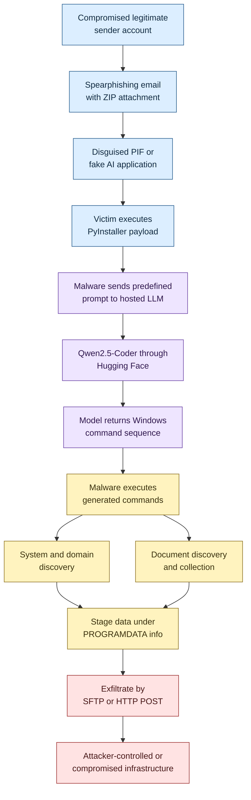

## Executive Summary

PromptSteal is Google Threat Intelligence Group's tracking name for malware
originally disclosed by Ukraine's Computer Emergency Response Team (CERT-UA) as
`LAMEHUG`. CERT-UA associated the malware with `UAC-0001`, commonly known as
APT28. Microsoft tracks substantially overlapping actor activity as Forest
Blizzard, while Google uses FROZENLAKE. Public naming systems can differ at
their boundaries, so these aliases should not be treated as proof that every
vendor tracks an identical activity set.

The malware is a Python-based information-stealing capability packaged for
Windows with PyInstaller. Its defining behavior is runtime interaction with the
`Qwen2.5-Coder-32B-Instruct` large language model through Hugging Face
infrastructure. PromptSteal sends predefined natural-language tasks to the
model, receives Windows command sequences, and executes those commands to
collect system information and documents.

PromptSteal represents a meaningful development in operational AI abuse, but
it is not autonomous malware. The observed samples did not select targets,
establish strategy, or independently plan an intrusion. The attackers supplied
the objectives through static prompts. No reviewed evidence establishes that
Qwen or Hugging Face was compromised, or that the activity involved prompt
injection, model poisoning, model theft, or another attack against an AI
system.

The strongest public evidence supports targeted phishing against Ukrainian
government-related recipients, user execution of disguised Windows files,
LLM-assisted command generation, local discovery, document collection, staging
under `%PROGRAMDATA%\info\`, and exfiltration through SFTP or HTTP POST. No
PromptSteal-specific persistence mechanism was verified.

> [!IMPORTANT]
> Hugging Face and Qwen are legitimate services and technologies. Their domains
> and model names are contextual observables, not malicious indicators by
> themselves. Detection should correlate process ancestry, model-service
> access, command execution, file collection, staging, and outbound transfer.

## Naming and Attribution

| Name | Defensible interpretation |
| --- | --- |
| PromptSteal or PROMPTSTEAL | Google Threat Intelligence tracking name for the malware related to CERT-UA's LAMEHUG reporting |
| LAMEHUG | Original malware-family name used by CERT-UA in July 2025 |
| UAC-0001 | CERT-UA activity-cluster identifier associated with APT28 |
| APT28 or Fancy Bear | Widely used industry name for the Russian state-linked espionage actor |
| Forest Blizzard | Microsoft's current name for the actor formerly tracked as STRONTIUM |
| FROZENLAKE | Google's tracking name for the actor |
| Sednit or Sofacy | Other industry names associated with substantially overlapping actor activity |

Some secondary sources attribute the PromptSteal name to ESET. The strongest
public provenance identified during this research is Google Threat Intelligence
Group, while CERT-UA used LAMEHUG. ESET's PromptLock and PromptSpy names refer
to separate AI-related malware and should not be merged with PromptSteal.
PromptFlux is also a separate Google-tracked malware family.

The safest case-management label is:

> PromptSteal (Google), originally reported as LAMEHUG by CERT-UA and associated
> by CERT-UA with UAC-0001/APT28.

Attribution to APT28 is strong as a source-backed assessment. Attribution to a
specific Russian organizational unit remains an intelligence judgment rather
than a fact established solely by the malware's code.

## Timeline

| Date | Event | Evidence characterization |
| --- | --- | --- |
| June to July 2025 | PromptSteal or LAMEHUG reportedly operated against Ukrainian targets | Reported campaign period |
| July 10, 2025 | CERT-UA reportedly began receiving information about the malicious email campaign | CERT-UA-derived reporting |
| July 17, 2025 | CERT-UA publicly disclosed LAMEHUG activity associated with UAC-0001/APT28 | Primary government disclosure |
| November 2025 | Google Threat Intelligence discussed the malware as PROMPTSTEAL and highlighted runtime LLM use | Primary vendor reporting |
| 2026 | MITRE ATT&CK published LAMEHUG as software entry `S9035` | Framework catalog entry |
| Through October 7, 2026 | No reviewed evidence established widespread commodity-stealer activity or a material change in attribution | Intelligence gap, not evidence of inactivity |

Publication dates should not be treated as first-execution dates. The malicious
activity necessarily preceded or coincided with incident investigation.

## Targeting and Delivery

The documented campaign targeted Ukrainian government-related recipients,
including security and defense interests. The observed operation was consistent
with state-directed intelligence collection rather than indiscriminate
consumer credential theft.

The reported delivery sequence was:

1. Attackers sent phishing emails from a compromised legitimate account.
2. The messages impersonated representatives of Ukrainian ministries.
3. A ZIP archive, including the reported lure `Додаток.pdf.zip`, was attached.
4. The archive contained a disguised `.pif` executable.
5. Python malware packaged with PyInstaller launched after user execution.

Additional variants masqueraded as uncensored AI image generators. Those
samples used a provocative application lure while collection and exfiltration
ran in the background.

The following victimology details remain unknown:

* Definitive victim and infection counts
* A complete targeted-sector list
* Confirmed widespread deployment outside Ukraine
* The method used to compromise the legitimate sender account

## Technical Analysis

### Runtime LLM interaction

PromptSteal contains predefined, base64-encoded descriptions of the operator's
desired actions. It sends those descriptions to the
`Qwen2.5-Coder-32B-Instruct` model through Hugging Face inference
infrastructure. The reported command-generation endpoint was:

```text
router[.]huggingface[.]co/hyperbolic/v1/chat/completions
```

The malware asked the model to return commands without Markdown formatting.
Documented objectives included:

* Create `%PROGRAMDATA%\info\`.
* Collect computer, hardware, process, service, network, and Active Directory
  domain information.
* Append discovery output to `%PROGRAMDATA%\info\info.txt`.
* Recursively copy Office, PDF, and text documents from the user's Desktop,
  Documents, and Downloads directories.

The model returned Windows command sequences that the malware executed on the
affected host. The malware therefore used the model as a command generator, not
as an autonomous intrusion operator.

### Discovery and collection

Reported discovery behavior covered:

* Computer and operating-system information
* Hardware information
* Running processes
* Windows services
* Network configuration and connections
* Active Directory domain information
* Files and directories

Reported collection focused on local documents in common user directories.
Public evidence reviewed for this report does not establish that these samples
stole browser passwords, cryptocurrency wallets, authentication tokens, or
other credential stores.

### Staging and exfiltration

Observed or reported host artifacts included:

```text
%PROGRAMDATA%\info\
%PROGRAMDATA%\info\info.txt
%PROGRAMDATA%\Додаток.pdf
```

Variants used at least two exfiltration mechanisms:

* SFTP to attacker-controlled infrastructure
* HTTP POST to a compromised web server

The Hugging Face connection generated commands. It should not be assumed to be
the stolen-data destination or the complete operator command-and-control
channel.

### Persistence

No PromptSteal-specific scheduled task, service, Run key, startup-folder entry,
or other persistence mechanism was verified in the reviewed reporting. This
does not prove that every variant lacks persistence.

## Operational Significance of AI Use

PromptSteal moved generative AI from malware development into the execution
workflow. Potential operator benefits include:

* Changing discovery and collection tasks by editing natural-language prompts
* Reducing explicit command strings embedded in the executable
* Producing syntactic variation in command sequences
* Reusing legitimate model-hosting infrastructure
* Extending objectives without implementing every platform command manually

The observed implementation also had limitations:

* Objectives remained attacker-authored and predefined.
* Model output could be malformed, unsafe, or inconsistent.
* The model call created an additional network dependency and detection surface.
* Blocking model access could interrupt command generation if no fallback was
  implemented.
* Phishing, process creation, staging, document access, and exfiltration
  remained observable.

Public reporting describes PromptSteal as the first known malware to use an LLM
during live operations. That is a visibility-dependent claim. It does not prove
that no earlier undisclosed activity existed.

## Attack Flow



The order among individual discovery commands is not established. The flow
models their shared position between execution and staging rather than claiming
a precise sequence.

## Indicators of Compromise

The indicators below were published in technical analysis of the reported
samples. They are historical investigation pivots, not permanent block entries.
Validate current ownership, prevalence, and source context before taking
enforcement action.

### File indicators

| SHA-256 | Filename | Context |
| --- | --- | --- |
| `766c356d6a4b00078a0293460c5967764fcd788da8c1cd1df708695f3a15b777` | `Додаток.pif` | Disguised executable delivered in the reported campaign |
| `d6af1c9f5ce407e53ec73c8e7187ed804fb4f80cf8dbd6722fc69e15e135db2e` | `AI_generator_uncensored_Canvas_PRO_v0.9.exe` | Fake AI image-generator variant |
| `bdb33bbb4ea11884b15f67e5c974136e6294aa87459cdc276ac2eea85b1deaa3` | `AI_image_generator_v0.95.exe` | Fake AI image-generator variant |
| `384e8f3d300205546fb8c9b9224011b3b3cb71adc994180ff55e1e6416f65715` | `Image.py` | Reported Python sample |

### Network and delivery indicators

| Indicator | Reported role | Handling guidance |
| --- | --- | --- |
| `144[.]126[.]202[.]227` | SFTP exfiltration server | Validate current ownership before blocking |
| `stayathomeclasses[.]com/slpw/up[.]php` | HTTP POST exfiltration endpoint on compromised infrastructure | Treat as a historical path-specific indicator |
| `192[.]36[.]27[.]37` | Email-sending infrastructure reportedly accessed through LeVPN | Correlate with message headers and campaign timing |
| `boroda70@meta[.]ua` | Compromised sender account | Preserve as historical delivery context |
| `router[.]huggingface[.]co/hyperbolic/v1/chat/completions` | Legitimate model inference endpoint used for command generation | Contextual observable; do not classify the service as malicious |
| `router[.]huggingface[.]co/nebius/v1/images/generations` | Legitimate image-generation endpoint used by lure variants | Contextual observable; expect legitimate traffic |

## MITRE ATT&CK Mapping

| ATT&CK ID | Technique | Confidence | Evidence |
| --- | --- | --- | --- |
| `T1586.002` | Compromise Accounts: Email Accounts | Medium | A compromised legitimate sender account reportedly delivered phishing messages |
| `T1566.001` | Phishing: Spearphishing Attachment | High | ZIP and executable attachments were used |
| `T1204.002` | User Execution: Malicious File | High | The recipient had to launch the payload |
| `T1036` | Masquerading | High | `.pif` and fake AI-generator lures concealed malicious execution |
| `T1059.003` | Command and Scripting Interpreter: Windows Command Shell | High | Generated Windows command sequences were executed |
| `T1059.001` | Command and Scripting Interpreter: PowerShell | Medium | PowerShell-oriented execution is reported, but complete command sets vary |
| `T1082` | System Information Discovery | High | System and hardware information was collected |
| `T1057` | Process Discovery | High | Running processes were enumerated |
| `T1007` | System Service Discovery | High | Windows services were enumerated |
| `T1016` | System Network Configuration Discovery | High | Network information was collected |
| `T1083` | File and Directory Discovery | High | User documents and directories were searched |
| `T1482` | Domain Trust Discovery | Medium | Active Directory domain information was requested |
| `T1005` | Data from Local System | High | Local documents were collected |
| `T1074.001` | Data Staged: Local Data Staging | High | Data was staged under `%PROGRAMDATA%\info\` |
| `T1102` | Web Service | Medium | A legitimate model-hosting service supplied generated commands |
| `T1041` | Exfiltration Over C2 Channel | Medium | Data was transferred through HTTP or SFTP, but the complete channel architecture is unresolved |

No Persistence tactic is mapped because no persistence behavior was verified.
No credential-access, privilege-escalation, lateral-movement, archive,
compression, deletion, or impact technique is assigned without supporting
evidence.

### High-value behavioral sequence

The strongest hypothesis correlates:

> Executable email attachment -> execution from a user-writable directory ->
> Hugging Face API access -> shell-based discovery -> document access ->
> `%PROGRAMDATA%\info` staging -> SFTP or HTTP upload.

Additional investigation pivots include:

* Find `.pif` files delivered by email.
* Correlate email attachment hashes with `DeviceFileEvents`,
  `DeviceProcessEvents`, and `DeviceNetworkEvents`.
* Hunt for creation of `%PROGRAMDATA%\info\info.txt`.
* Review PowerShell Script Block Logging, including Windows event ID 4104.
* Baseline approved AI and Hugging Face API clients.
* Inspect unknown PyInstaller executables that access model APIs.
* Search historical proxy and network telemetry for the reported exfiltration
  endpoint and IP address.
* Preserve prompt bodies and model responses during incident response when
  technically and legally possible.


## Sources

* [CERT-UA official LAMEHUG and UAC-0001 disclosure](https://cert.gov.ua/article/6284730),
  published July 2025.
* [Google Threat Intelligence Group AI Threat Tracker](https://cloud.google.com/blog/topics/threat-intelligence/threat-actor-usage-of-ai-tools/),
  published November 2025.
* [MITRE ATT&CK LAMEHUG software entry S9035](https://attack.mitre.org/software/S9035/),
  accessed October 7, 2026.
* [Cato CTRL threat research analyzing LAMEHUG](https://www.catonetworks.com/blog/cato-ctrl-threat-research-analyzing-lamehug/),
  including reverse engineering, prompts, infrastructure, and file indicators.
* [Splunk analysis of LAMEHUG and LLM-assisted intrusion](https://www.splunk.com/en_us/blog/security/lamehug-ai-driven-malware-llm-cyber-intrusion-analysis.html).
* [BleepingComputer coverage of the CERT-UA disclosure](https://www.bleepingcomputer.com/news/security/russian-hackers-use-ai-powered-malware-in-ukraine-attacks/),
  published July 18, 2025.
