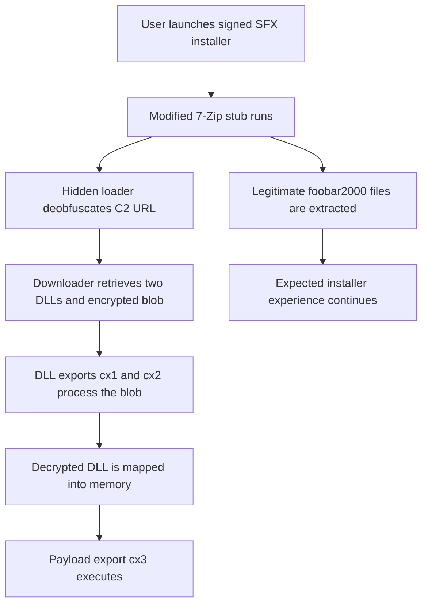

## Executive Summary

Threat actors associated with the OpenSUpdater malware family are hiding a
reflective loader inside recompiled 7-Zip self-extracting (SFX) installers.
Instead of placing the initial loader in the archive's visible files, the
operators modified the open-source code responsible for extracting those
files. The malicious function sits in the middle of an otherwise recognizable
extraction routine, where analysts and automated tools may not expect
application-specific behavior.

The analyzed installers contained a genuine foobar2000 installer named
`setup.exe`. Running the package produced the expected installation experience
while the modified extraction stub contacted command-and-control (C2)
infrastructure, downloaded additional components, decrypted an encrypted
payload, and loaded it directly into memory.

The installers were also validly signed, reportedly by Animated Productions,
LLC. The signer's apparent business did not align with the bundled audio
software, and the certificate contained unusual padding that may have been
intended to generate different file hashes without invalidating the signature.

> [!IMPORTANT]
> The available evidence does not indicate that the official 7-Zip project,
> website, update infrastructure, or official installers were compromised.
> The attackers recompiled publicly available 7-Zip SFX source code and
> distributed their own weaponized packages.

## Research Scope and Analytical Guardrails

This report covers public information available through October 1, 2026. The
primary technical source is G DATA's September 2026 analysis, supplemented by
Google Threat Analysis Group's historical OpenSUpdater research, official
7-Zip information, and MITRE ATT&CK definitions.

## What Researchers Discovered

G DATA researcher Karsten Hahn analyzed suspicious installers detected as
OpenSUpdater by ESET and Snackarcin by Microsoft. Each malicious sample was
constructed as a 7-Zip self-extracting archive.

An SFX archive combines three principal components:

1. A decompression stub that extracts the archive
2. A text configuration that defines what the installer displays and executes
3. An archive overlay containing the embedded files

In an ordinary investigation, the archive configuration and designated
entry-point file receive most of the attention. If the configuration specifies
`RunProgram="setup.exe"`, an analyst will usually inspect `setup.exe` first.
The attackers took advantage of that workflow.

The visible `setup.exe` in the analyzed packages was a genuine foobar2000
installer. The malicious functionality was compiled into the decompression
stub itself.

### Where the malicious code was hidden

According to G DATA, the inserted loader call appeared inside the
`ExtractArchive` function, immediately before the installer initialized its
progress bar. In one sample, the relevant function was located at virtual
address `0x421400`.

This placement had several defensive advantages:

* It was not at the program's entry point
* The surrounding code resembled legitimate 7-Zip source code
* Expected imports and strings dominated superficial analysis
* The configuration pointed to a legitimate executable
* The installer performed its advertised function

The package could therefore appear ordinary unless an analyst compared the
extraction stub with known-good source or examined its runtime behavior.

## Infection and Execution Chain

G DATA's analysis supports the following execution flow:

1. The user launches the weaponized SFX installer.
2. The modified 7-Zip stub begins extracting the embedded archive.
3. A concealed loader executes from inside the extraction routine.
4. The loader deobfuscates a C2 URL.
5. It registers with the server using a distinctive magic byte sequence.
6. Statically linked cURL functionality downloads two DLLs and an encrypted
   data blob.
7. The loader calls an export named `cx1` from the first DLL.
8. It calls `cx2` from the second DLL to decrypt the downloaded blob.
9. The decrypted DLL is mapped directly into memory.
10. The loader calls the payload's `cx3` export.
11. The legitimate foobar2000 installation continues and provides cover for
    the malicious activity.

The researcher could not retrieve the final DLLs from the C2 server during
analysis. The final payload's purpose and capabilities therefore remain
unknown. Claims that the samples deployed ransomware, an infostealer, a
remote-access trojan, or another specific payload would be speculative.

## Why the Technique Is Effective

### Analysts naturally prioritize archive contents

Self-extracting archives often contain many files. Investigators commonly
focus on the configured entry-point executable and other extracted components
rather than reverse-engineering a familiar decompression stub. In this case,
that prioritization leads directly to a genuine installer.

### The malicious code resembles legitimate software

Because the attackers started with genuine 7-Zip source code, most of the
executable remains recognizable. A small malicious addition can be difficult
to spot among legitimate extraction and interface logic.

### The installer does what the victim expects

The embedded foobar2000 installer runs normally. A successful installation
reduces the likelihood that the victim will investigate unexpected behavior
or report the package.

### A valid signature can create misplaced trust

The malicious installers were validly signed. An Authenticode signature
establishes that the file has not changed since it was signed and identifies
the certificate holder presented by the signature. It does not prove that the
software is benign or that the signer is the legitimate publisher of the
bundled application.

The mismatch between a purported game developer and a foobar2000 installer
was an important warning sign.

### The final payload executes in memory

After decryption, the loader maps the payload DLL into memory instead of
relying on a conventional executable written to disk. This reduces file-based
artifacts and can complicate detection based primarily on dropped payloads.

## Certificate Padding Adds Uncertainty

G DATA found that the certificate data was padded with repeating `0xB8` and
`0x84` bytes. The padding represented about 2.6% of the file, making simple
file-size inflation an unlikely explanation.

The researcher proposed that the padding might alter the hash of each build
without breaking the signature. This could frustrate hash-only blocklists by
allowing otherwise similar installers to receive distinct cryptographic
hashes. That explanation is an informed hypothesis, not a confirmed statement
about the operator's intent.

The behavior differs from OpenSUpdater's previously documented certificate
manipulation. In 2021, Google Threat Analysis Group reported OpenSUpdater
samples with deliberately malformed certificate encoding that Windows
accepted but some OpenSSL-based security products rejected. Both activities
involve certificate-related evasion, but their mechanisms are different.

## The Pattern Extends Beyond 7-Zip

G DATA also identified a related sample built with the Nullsoft Scriptable
Install System (NSIS). That variant modified the open-source `EmbedHtml`
plug-in and inserted its loader inside `EmbedHtml::GetUrl()`. The malicious
behavior activated when the function received an empty string. Its C2 address
was stored in a compressed blob within the NSIS script.

The common pattern is broader than one archive format or vendor:

* Recompile a trusted open-source installer component
* Place a loader inside an unexpected internal function
* Include a genuine installer for free software
* Apply a valid but suspicious signature
* Retrieve and execute the actual payload at runtime

Defenders should treat this as an installer-component tampering pattern rather
than a problem limited to 7-Zip.

## Is 7-Zip Vulnerable

The available evidence does not show exploitation of a 7-Zip vulnerability.
7-Zip is open-source software and supports self-extracting archives. Attackers
can obtain the source, modify it, and compile their own binaries as they can
with many other open-source projects.

The research did not establish:

* Compromise of `7-zip.org`
* Compromise of the official 7-Zip GitHub repository
* Modification of official 7-Zip releases
* Abuse of the 7-Zip update mechanism
* A vulnerability requiring a 7-Zip security patch
* Distribution through official 7-Zip channels

Organizations should obtain 7-Zip from its official website or verified
repository. Uninstalling legitimate 7-Zip installations would not address
this campaign.

## Indicators of Compromise

The following indicators were published by G DATA. Hashes identify the
analyzed files but should be combined with behavioral and provenance-based
detection because certificate padding may enable frequent hash changes.

| Type | Indicator | Context |
|------|-----------|---------|
| SHA-256 | `a7666e5aa3c6ecae0295caa7c3f49714eb561d6e1be6807cf1020b79f1902cd0` | Malicious 7-Zip SFX sample |
| SHA-256 | `e99a053b9d6a414256177e1529417f85867d6ed355f6009300d626f63429753c` | Malicious 7-Zip SFX sample |
| SHA-256 | `ba38916e82c47cff6de71791f179ce762e640e2975e40d6a1803d16ff591b752` | Related NSIS-based sample |
| Domain | `codeonicinc[.]com` | Infrastructure associated with the 7-Zip SFX samples |
| Domain | `setupsoftwarecenter[.]com` | Infrastructure associated with the NSIS sample |
| Signer | `Animated Productions, LLC` | Signer observed on analyzed SFX samples |
| DLL export | `cx1` | Export invoked in the first downloaded DLL |
| DLL export | `cx2` | Export associated with decrypting the payload blob |
| DLL export | `cx3` | Export invoked in the reflectively loaded payload |

These indicators are investigative leads rather than universal identifiers
for every OpenSUpdater variant.

## MITRE ATT&CK Mapping

| Technique | ID | Evidence | Confidence |
|-----------|----|----------|------------|
| User Execution: Malicious File | [T1204.002](https://attack.mitre.org/techniques/T1204/002/) | The installer requires execution to activate the modified extraction stub. The original distribution lure was not documented. | Medium |
| Masquerading | [T1036](https://attack.mitre.org/techniques/T1036/) | The package presents a genuine application installer while concealing unrelated malicious behavior. | High |
| Obfuscated Files or Information | [T1027](https://attack.mitre.org/techniques/T1027/) | The loader obfuscates its C2 URL and downloads an encrypted payload blob. | High |
| Ingress Tool Transfer | [T1105](https://attack.mitre.org/techniques/T1105/) | The loader downloads two DLLs and an encrypted blob from remote infrastructure. | High |
| Deobfuscate/Decode Files or Information | [T1140](https://attack.mitre.org/techniques/T1140/) | Downloaded components decrypt the encrypted payload blob before execution. | High |
| Reflective Code Loading | [T1620](https://attack.mitre.org/techniques/T1620/) | The decrypted DLL is mapped into memory and executed through an exported function. | High |

A phishing or drive-by compromise technique cannot be mapped confidently
because G DATA did not establish how the samples reached victims.

## Detection and Hunting Recommendations

### Inspect the installer and its payload

Security pipelines that unpack SFX or NSIS installers should retain and
analyze the extraction stub as an executable in its own right. Scanning should
not be restricted to files recovered from the archive overlay.

Where practical, compare decompression stubs with known-good builds or identify
unexpected code regions and control-flow changes.

### Correlate installer execution with network activity

A self-extracting installer that initiates outbound traffic before or during
installation deserves scrutiny, particularly when it:

* Contacts a newly registered or low-reputation domain
* Downloads DLLs or opaque binary data
* Uses statically linked networking libraries
* Contacts infrastructure unrelated to the advertised publisher
* Generates network traffic before launching the visible installer

### Monitor memory-backed DLL execution

Endpoint detections should look for executable memory allocations followed by
manual PE mapping or execution that is not backed by a normally loaded file.
Useful signals include:

* PE headers appearing in private executable memory
* Calls to exported functions from manually mapped images
* Memory protection changing from writable to executable
* Installer processes executing code from unbacked memory
* Network retrieval followed by immediate in-memory execution

### Validate signer-to-product relationships

Code signing should be treated as one trust signal, not a binary allow
decision. Flag cases where:

* The signer does not match the displayed product
* The signer's business appears unrelated to the bundled application
* Version fields contain nonsensical or randomly selected words
* A signed outer installer embeds another vendor's installer
* Certificate structures contain unusual padding
* Differently hashed packages share nearly identical executable code

### Use provenance controls

Organizations can reduce exposure by:

* Allowing software only from approved repositories
* Verifying download URLs and publisher identities
* Blocking unapproved self-extracting installers
* Applying application control policies to user-writable directories
* Restricting outbound traffic from installer processes
* Sandboxing suspicious installers with memory and network telemetry enabled

These recommendations are detection hypotheses. They require validation
against local schemas, products, baselines, and acceptable false-positive
rates before production deployment.

## Guidance for Users

Users should download applications directly from the software publisher or an
approved enterprise portal. Before running an installer:

1. Confirm that the download domain belongs to the expected vendor.
2. Inspect the digital signature and verify that the signer matches the
   product.
3. Avoid crack, cheat, mod, and untrusted third-party download portals.
4. Treat an installer within another installer as suspicious when the
   publishers do not match.
5. Submit unexpected packages to the security team instead of testing them on
   a production device.

A valid signature is not equivalent to a safe file.

## Intelligence Gaps

The following questions remained unanswered at publication time:

* How the malicious installers were distributed
* How many systems executed them
* Whether the identified infrastructure remained operational
* What the final payload did
* Whether the campaign delivered unwanted software or more damaging malware
* Who operated the infrastructure
* Whether the observed certificate was stolen, fraudulently obtained, or
  issued to the operator
* Whether certificate padding was intended for hash diversification

The absence of the final-stage payload materially limits impact assessment and
actor attribution.

## Conclusion

The OpenSUpdater activity demonstrates how attackers can exploit assumptions
about familiar software components without exploiting the software itself.
The attackers needed publicly available source code, a legitimate application
to embed, a signing certificate, and enough understanding of analyst workflows
to hide the loader where investigators might not initially look.

The central defensive lesson is to inspect how an installer performs its work,
not only what it claims to install. Trusted source code can be modified. Valid
signatures can authenticate malicious files. Legitimate applications can
provide camouflage. Detection programs that combine provenance, signer
context, network behavior, and memory telemetry are better positioned to
identify this class of attack than controls built around hashes or archive
contents alone.

## Sources

1. G DATA, [OpenSUpdater Hides in Recompiled 7zip SFX, Evading
   Analysts](https://blog.gdatasoftware.com/2026/09/38490-opensupdater-evades-with-recompiled-7zip-sfx),
   September 2026.
2. Google Threat Analysis Group,
   [Financially Motivated Actor Breaks Certificate Parsing to Avoid
   Detection](https://blog.google/threat-analysis-group/financially-motivated-actor-breaks-certificate-parsing-avoid-detection/),
   December 2021.
3. 7-Zip, [Official Website](https://www.7-zip.org/) and
   [License Information](https://www.7-zip.org/license.txt).
4. Cyber Security News,
   [Hackers Hide Malware Inside 7-Zip Installers Using a New Evasion
   Technique](https://cybersecuritynews.com/malware-inside-7-zip-installers/),
   September 2026.
5. MITRE ATT&CK, [Enterprise Techniques](https://attack.mitre.org/techniques/).
