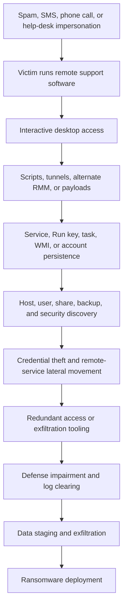
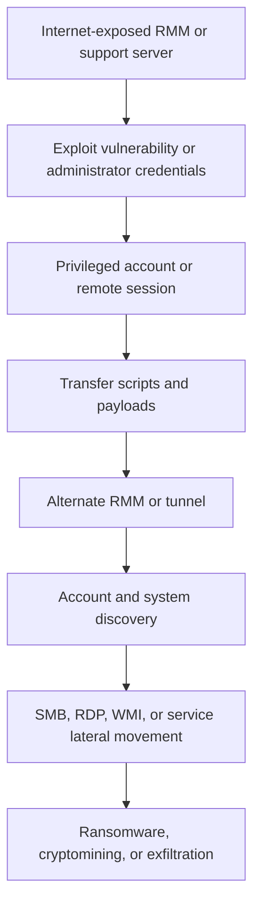

## Executive summary

Attackers abuse legitimate remote monitoring and management (RMM) and remote
support software because it provides interactive control, file transfer, command
execution, persistence, and outbound communications while blending into routine
IT activity.

The strongest detection surface is not a product name by itself. It is the
combination of:

* New or unapproved remote-access software installation
* Execution from user-writable or unusual directories
* Service, scheduled-task, registry, or WMI persistence
* New outbound connections from RMM processes
* Remote sessions involving unusual accounts, hosts, or geographies
* RMM execution followed by discovery, credential access, defense impairment,
  lateral movement, exfiltration, or ransomware
* Multiple remote-access products installed on one host within a short period

> [!IMPORTANT]
> A legitimate RMM binary is not evidence of compromise by itself. Conversely,
> a valid signature, vendor-owned destination, or expected product name does not
> establish that an installation or session was authorized.

MITRE ATT&CK categorizes this activity primarily under
[T1219 Remote Access Tools](https://attack.mitre.org/techniques/T1219/) and
[T1219.002 Remote Desktop Software](https://attack.mitre.org/techniques/T1219/002/).

## Research method and scope

### Product categories

| Category                           | Examples                                          | Role in this research                                                     |
|------------------------------------|---------------------------------------------------|---------------------------------------------------------------------------|
| Full RMM platforms                 | Atera, NinjaOne, Level.io, SimpleHelp, Syncro     | Monitoring, scripting, deployment, persistence, and remote control        |
| Remote desktop and support tools   | AnyDesk, TeamViewer, ScreenConnect, Splashtop     | Interactive control, support, file transfer, and remote command execution |
| Adjacent endpoint-management tools | PDQ Deploy, PDQ Inventory                         | Inventory, software distribution, and lateral payload deployment          |
| Built-in or general support tools  | Quick Assist, Chrome Remote Desktop, SSH, and RDP | Important adjacent paths, but not part of the primary ten-tool set         |

### Evidence and attribution standards

This research uses the following distinctions:

* Observed means directly reported in victim telemetry or incident response.
* Implemented means present in analyzed product or campaign code.
* Advertised means claimed by an operator but not independently confirmed.
* Inferred means a hunting hypothesis that requires validation.
* Capability means supported by the product, but not proof of malicious use in
  a specific case.

Tool use does not establish attribution. Shared RMM products, leaked credentials,
initial-access brokers, ransomware affiliates, and copied scripts can produce
overlapping tradecraft.

## Prominent tools and documented abuse

### AnyDesk

AnyDesk provides remote desktop access, technical support, unattended access,
and file transfer.

Microsoft Incident Response documented BlackByte operators installing AnyDesk as
a service for persistence and lateral movement. Reported paths included
`C:\systemtest\anydesk\AnyDesk.exe`,
`C:\Program Files (x86)\AnyDesk\AnyDesk.exe`, and
`C:\Scripts\AnyDesk.exe`. The DFIR Report documented AnyDesk installation before
Conti deployment in a 2021 BazarLoader intrusion. ATT&CK procedure examples also
associate AnyDesk with Akira, INC Ransom, Medusa, Storm-0501, Storm-1811, and
Scattered Spider. Rapid7 reported a 2024 social-engineering campaign associated
with Black Basta operators in which victims were persuaded to install AnyDesk or
use Quick Assist.

Durable evidence includes AnyDesk service creation, `ad_svc.trace`, execution
from temporary or user-writable paths, outbound sessions on high-value servers,
and follow-on execution of PowerShell, `cmd.exe`, `net.exe`, `nltest.exe`, archive
tools, or ransomware. Relevant ATT&CK techniques include T1219.002, T1543.003,
T1105, T1021, T1078, T1059.001, T1059.003, and T1562.001.

Defenders should inventory approved AnyDesk deployments and tenants, alert on
first-seen execution on servers, preserve connection logs, and correlate service
installation with new accounts, Defender exclusions, and remote logons.

### ScreenConnect and ConnectWise Control

ScreenConnect provides technician sessions, unattended remote desktop access,
file transfer, and remote command execution.

CVE-2024-1708 and CVE-2024-1709 were rapidly exploited in February 2024.
Huntress documented ransomware, cryptominers, Cobalt Strike, new accounts,
Defender exclusions, event-log clearing, WMI persistence, SSH tunnels,
SimpleHelp, and Chrome Remote Desktop after compromise. Rapid7 observed
ScreenConnect as additional persistence in activity associated with Black Basta
operators. ATT&CK also records use by GOLD SOUTHFIELD, MuddyWater, ShinyHunters,
Storm-1811, and Scattered Spider.

Durable evidence includes ScreenConnect application and transfer logs, client
services under `Program Files (x86)`, new administrative users, unexpected client
versions, and sessions followed by PowerShell, `certutil`, `curl`, `msiexec`,
`rundll32`, or `schtasks`. Relevant techniques include T1190, T1219.002, T1136,
T1053, T1546.003, T1562.001, T1070.001, T1572, and T1486.

Defenders should inventory and patch every exposed server, restrict management
interfaces, monitor application logs and account creation, and hunt for alternate
RMM products after remediation. A compromised ScreenConnect server should be
treated as a potential enterprise-wide incident.

### TeamViewer

TeamViewer supports remote desktop, unattended support, and file transfer.
ATT&CK records use by Cobalt Group, Kimsuky, Mustang Panda, RTM, EVILNUM, and
Scattered Spider. Cobalt Group used TeamViewer and Ammyy Admin as alternate
access, Kimsuky used a modified TeamViewer client as a command-and-control
channel, and EVILNUM used a legitimate TeamViewer application through a malware
component.

Useful evidence includes TeamViewer service and client execution, connection
logs, installation from user-writable paths, access to servers outside the
support estate, and new unattended-access settings. Relevant techniques include
T1219.002, T1071.001, T1078, T1105, and T1021.

Require centrally managed accounts and MFA, disable unattended access where it
is unnecessary, and preserve TeamViewer connection logs during investigations.

### Atera

Atera is a cloud RMM platform for monitoring, patching, scripting, deployment,
remote control, and IT administration. ATT&CK records FIN7 using Atera to
download malware. Reporting also associates Atera with MuddyWater follow-on
operations and Medusa ransomware activity.

Durable evidence includes the Atera agent service, cloud registration, agent-
launched PowerShell or command shells, software deployment records, and agents
outside the authorized management scope. Relevant techniques include T1219,
T1219.002, T1105, T1059.001, T1059.003, T1543.003, and T1021.

Inventory approved tenants and administrators. Monitor agent-created processes
and scripts instead of treating a signed agent as inherently trusted.

### NinjaOne

NinjaOne provides RMM, patching, deployment, monitoring, scripting, and remote
support. Microsoft reported Storm-0501 deploying NinjaOne, AnyDesk, and Level.io
after entering victim networks.

Durable evidence includes agent services, agent-created PowerShell or command
shells, new device registration, installation shortly after suspicious
administrative access, and broad software deployment. Relevant techniques include
T1219, T1105, T1059.001, T1059.003, T1543.003, T1078, and T1562.001.

Restrict agent creation and script deployment, separate RMM identities from
ordinary domain accounts, and correlate activity with security-control changes,
credential access, and mass file operations.

### Level.io

Level.io is a cloud RMM platform for monitoring, remote access, scripting,
patching, and device management. Microsoft observed Storm-0501 deploying it with
AnyDesk and NinjaOne for persistent, cloud-mediated access.

Useful evidence includes the agent service, scripts and child processes, new
device registration, and repeated outbound agent traffic from servers. Relevant
techniques include T1219, T1105, T1059.001, T1059.003, T1543.003, and T1078.

Baseline approved agents by device, tenant, and administrator. Investigate the
arrival of multiple RMM products as possible redundant persistence.

### SimpleHelp

SimpleHelp provides remote graphical access, terminal access, file transfer, and
service-based device management. Group-IB reported MuddyWater using an official,
validly signed client as intended and running it as a system service. Symantec
documented SimpleHelp in Medusa ransomware attacks alongside AnyDesk and PDQ
Deploy. Huntress observed it after ScreenConnect exploitation in February 2024.

Durable artifacts include `SimpleService.exe`, `JWrapper-Remote Access`
directories, `serviceconfig.xml`, automatic service startup, terminal-mode
sessions, and system-privileged child processes. Relevant techniques include
T1219, T1219.002, T1543.003, T1105, T1059.001, T1059.003, and T1078.

Alert on service installation outside approved support teams and on system
services executing from user profile or temporary paths. Inspect
`serviceconfig.xml` during triage.

### Splashtop

Splashtop provides remote desktop, unattended access, and remote endpoint
administration. ATT&CK records Qilin ransomware using Splashtop's
`SRManager.exe` to execute a Linux ransomware binary directly on Windows.
ATT&CK also lists Splashtop among tools used by Medusa.

Durable evidence includes `SRManager.exe`, Splashtop services, remote-session
events, agent-launched unusual binaries, and deployment outside the approved
support estate. Relevant techniques include T1219.002, T1105, T1021, T1059, and,
when followed by ransomware, T1486.

Monitor agent-launched processes and correlate new deployment with mass file
changes, security-control modification, or service creation.

### Syncro

Syncro combines cloud RMM and professional-services automation for monitoring,
scripting, patching, remote access, and ticketing. Group-IB reported MuddyWater
using Syncro alongside ScreenConnect, Remote Utilities, and SimpleHelp. The
software was obtained from legitimate sources and used through intended
features, making binary-only detection ineffective.

Useful evidence includes agent services, scripts and deployment records, tenant
association, and agent-created PowerShell or command-shell activity. Relevant
techniques include T1219, T1105, T1059.001, T1059.003, T1543.003, and T1078.

Monitor agent enrollment and administrator changes, require script approvals,
and correlate activity with account creation, lateral authentication, and
security-product changes.

### NetSupport Manager

NetSupport Manager provides remote desktop support, file transfer, and remote
control. Rapid7 reported NetSupport and ScreenConnect deployment in a 2024
social-engineering campaign associated with Black Basta operators and recovered
a `Client32.ini` file containing gateway domains. ATT&CK records Storm-1811
abusing NetSupport Manager, ScreenConnect, and AnyDesk.

Durable artifacts include `Client32.ini`, client executables and services,
controller configuration, execution from temporary or user-writable paths, and
installation following a help-desk call. Relevant techniques include T1219.002,
T1071.001, T1572, T1105, T1543.003, and T1059.

Search for unexpected configuration files, require sessions to originate from
approved support systems, and inspect controller destinations and session history
before blocking infrastructure.

## Adjacent tools

### PDQ Deploy and PDQ Inventory

PDQ is not a conventional interactive RMM platform, but it can inventory hosts
and distribute software or scripts. Symantec reported PDQ Deploy and PDQ
Inventory as consistent parts of Medusa attack chains. In one case, PDQ Inventory
enumerated endpoints while PDQ Deploy distributed security-impairment tools and
ransomware. A reported runner path was:

```text
C:\Windows\AdminArsenal\PDQDeployRunner\Service-1\exec
```

Relevant techniques include T1018, T1047, T1105, T1021, and T1486.

### Quick Assist and Chrome Remote Desktop

Microsoft linked Storm-1811 to social engineering through Quick Assist before
Black Basta ransomware activity. Rapid7 observed Quick Assist or AnyDesk as the
initial remote-access mechanism in a May 2024 campaign. Huntress documented
Chrome Remote Desktop installation after ScreenConnect compromise as a fallback
or persistence path.

## Attack flows

### Social engineering to ransomware



Rapid7 observed spam flooding, telephone impersonation, AnyDesk or Quick Assist,
batch scripts, SSH reverse tunnels, Run-key persistence, credential harvesting,
NetSupport, ScreenConnect, and attempted Cobalt Strike deployment. The DFIR
Report documented initial malware access, Cobalt Strike, discovery, RDP, AnyDesk,
LSASS access attempts, and Conti deployment.

Public reports do not always establish whether the RMM product provided initial
access or was installed after another foothold. A ransomware attribution may
refer to an affiliate or access broker rather than the ransomware developer.

### Exploited RMM infrastructure



Huntress's ScreenConnect research provides a documented example. Optional paths
include retaining only the original RMM, deploying a cryptominer without
ransomware, or using remote support as fallback access after malware C2 is lost.

## Actor-to-tool matrix

| Actor or campaign                | AnyDesk | ScreenConnect | TeamViewer | Atera | NinjaOne | Level.io | SimpleHelp | Splashtop | Syncro | NetSupport |
|----------------------------------|---------|---------------|------------|-------|----------|----------|------------|-----------|--------|------------|
| Storm-0501                       | Yes     |               |            |       | Yes      | Yes      |            |           |        |            |
| Storm-1811                       | Yes     | Yes           |            |       |          |          |            |           |        | Yes        |
| Scattered Spider and UNC3944     | Yes     | Yes           | Yes        |       |          |          |            |           |        |            |
| MuddyWater                       |         | Yes           |            |       |          |          | Yes        |           | Yes    |            |
| Medusa and Spearwing             | Yes     |               |            | Yes   |          |          | Yes        | Yes       |        |            |
| BlackByte                        | Yes     |               |            |       |          |          |            |           |        |            |
| Black Basta-associated activity  | Yes     | Yes           |            |       |          |          |            |           |        | Yes        |
| Akira                            | Yes     |               |            |       |          |          |            |           |        |            |
| Qilin                            |         |               |            |       |          |          |            | Yes       |        |            |
| FIN7                             |         |               |            | Yes   |          |          |            |           |        |            |

Blank cells mean the reviewed sources did not provide sufficiently direct
evidence. They do not prove that the actor never used the tool.

## Tool-to-technique matrix

| Tool or class          | Primary ATT&CK mappings                           | Common associated behaviors                                  |
|------------------------|---------------------------------------------------|--------------------------------------------------------------|
| AnyDesk                | T1219.002, T1543.003, T1105, T1021                | Interactive access, service persistence, and file transfer   |
| ScreenConnect          | T1190, T1219.002, T1136, T1053, T1546.003         | Exploitation, account creation, and remote execution          |
| TeamViewer             | T1219.002, T1078, T1105                           | Fallback access, valid accounts, and file transfer            |
| Atera                  | T1219, T1059, T1105, T1543.003                    | Agent scripting, deployment, and cloud management             |
| NinjaOne               | T1219, T1059, T1105                               | Agent enrollment, software deployment, and scripting          |
| Level.io               | T1219, T1059, T1105                               | Agent-based access and remote scripting                       |
| SimpleHelp             | T1219.002, T1543.003, T1059, T1105                | System service, terminal access, and file transfer            |
| Splashtop              | T1219.002, T1105, T1486                           | Remote execution and ransomware deployment                   |
| Syncro                 | T1219, T1059, T1105, T1543.003                    | Agent persistence and scripting                              |
| NetSupport             | T1219.002, T1071.001, T1572, T1105                | Remote control, gateway communication, and tunneling          |
| PDQ Deploy or Inventory| T1018, T1047, T1105, T1021                        | Inventory, software deployment, and lateral movement          |
| Quick Assist           | T1219.002, T1566.004, T1078                       | Social engineering and user-authorized remote support         |

## Threat-hunting hypotheses

### Newly installed RMM provides unauthorized persistence

Falsifiable prediction: a host with a first-seen RMM agent will show a service,
scheduled task, registry autorun, or startup artifact and outbound communication
shortly after installation.

Required telemetry includes `DeviceProcessEvents`, `DeviceFileEvents`,
`DeviceEvents`, `DeviceRegistryEvents`, `DeviceNetworkEvents`, Windows service
creation events such as Security 4697 or System 7045, and RMM vendor audit logs.

Baseline products, paths, publishers, tenants, and administrators. Alert when a
first-seen RMM binary runs from `Users`, `Public`, `Temp`, `Downloads`,
`Documents`, or `Videos`. Join first execution to persistence and outbound
traffic within 30 minutes, with higher severity on identity, backup, and file
servers.

### RMM access is followed by hands-on-keyboard discovery

Falsifiable prediction: shortly after an RMM process or session begins, the same
device or account executes commands from several discovery categories, such as
`whoami`, `systeminfo`, `net`, `nltest`, `ipconfig`, `tasklist`, `quser`, or
`arp`.

Help-desk troubleshooting, onboarding, software deployment, and authorized
assessment can produce similar activity. Require multiple discovery categories
or a high-value target. Suppress an approved support account only when device,
time, ticket, source network, and product also match.

### Multiple RMM products provide redundant persistence

Falsifiable prediction: a compromised host acquires two or more remote-access
products within 24 hours, often after initial access or vulnerability
exploitation.

Build an inventory covering the primary products plus Quick Assist, Chrome
Remote Desktop, and remote-shell tools. Correlate a second installation with new
services, accounts, outbound destinations, or Defender exclusions. Removing one
RMM product does not establish containment.

### RMM activity impairs security controls

Falsifiable prediction: an RMM process or session is temporally associated with
PowerShell or command-shell activity that changes Defender, firewall, event-log,
service, or Group Policy settings.

High-value command patterns include `Set-MpPreference`, `Add-MpPreference`,
`netsh advfirewall`, `wevtutil cl`, service deletion, security-product uninstall,
and policy changes affecting endpoint protection.

### RMM activity precedes lateral movement and impact

Falsifiable prediction: after RMM execution, the same account or device accesses
multiple systems through SMB, RDP, WMI, WinRM, PsExec, or remote services,
followed by staging or mass file modification.

Join process or session telemetry to `DeviceLogonEvents`, remote IPs, SMB
activity, and file modifications. Prioritize fan-out involving privileged
accounts, backup systems, or domain controllers.

## Microsoft Defender XDR hunting queries

These queries use common Defender XDR tables. Product file names, fields, and
action values vary by version and tenant. They are unvalidated hunting starting
points and require local baselining.

### RMM execution from unusual locations

```kusto
let RmmNames = dynamic([
    "anydesk.exe",
    "teamviewer.exe",
    "screenconnect.clientservice.exe",
    "simpleservice.exe",
    "srmanager.exe",
    "client32.exe",
    "ninjarmmagent.exe",
    "ateraagent.exe"
]);
DeviceProcessEvents
| where Timestamp > ago(30d)
| where tolower(FileName) in~ (RmmNames)
| extend IsUserWritablePath = FolderPath has_any (
    @"\Users\",
    @"\ProgramData\",
    @"\Windows\Temp\",
    @"\Downloads\",
    @"\Documents\",
    @"\Videos\"
)
| project Timestamp, DeviceName, AccountName, FileName, FolderPath,
    ProcessCommandLine, InitiatingProcessFileName, IsUserWritablePath
| order by Timestamp desc
```

Populate the file list from local software inventory. `ProgramData` is common for
legitimate agents, so it should increase context rather than determine severity.

### Suspicious processes launched by RMM software

```kusto
let RmmParents = dynamic([
    "anydesk.exe",
    "teamviewer.exe",
    "screenconnect.clientservice.exe",
    "simpleservice.exe",
    "srmanager.exe",
    "client32.exe"
]);
DeviceProcessEvents
| where Timestamp > ago(30d)
| where tolower(InitiatingProcessFileName) in~ (RmmParents)
| where tolower(FileName) in~ (
    "powershell.exe", "pwsh.exe", "cmd.exe", "wscript.exe",
    "cscript.exe", "rundll32.exe", "regsvr32.exe", "mshta.exe",
    "wmic.exe", "psexec.exe", "net.exe", "nltest.exe", "wevtutil.exe"
)
| project Timestamp, DeviceName, AccountName, InitiatingProcessFileName,
    InitiatingProcessCommandLine, FileName, ProcessCommandLine
| order by Timestamp desc
```

### RMM process network activity

```kusto
let RmmNames = dynamic([
    "anydesk.exe",
    "teamviewer.exe",
    "screenconnect.clientservice.exe",
    "simpleservice.exe",
    "srmanager.exe",
    "client32.exe"
]);
DeviceNetworkEvents
| where Timestamp > ago(30d)
| where tolower(InitiatingProcessFileName) in~ (RmmNames)
| project Timestamp, DeviceName, InitiatingProcessFileName,
    InitiatingProcessFolderPath, RemoteUrl, RemoteIP, RemotePort,
    Protocol, ActionType
| order by Timestamp desc
```

Evaluate destinations against approved vendor domains, tenant ownership,
installation records, and session logs. A vendor-owned destination is not
automatically benign.

### Autorun changes associated with remote access

```kusto
DeviceRegistryEvents
| where Timestamp > ago(30d)
| where ActionType == "RegistryValueSet"
| where RegistryKey has_any (
    @"\CurrentVersion\Run",
    @"\CurrentVersion\RunOnce"
)
| project Timestamp, DeviceName, RegistryKey, RegistryValueName,
    RegistryValueData, InitiatingProcessFileName,
    InitiatingProcessCommandLine
| order by Timestamp desc
```

`RegistryValueData` and initiating-process fields require Defender for Endpoint
registry telemetry. Validate coverage for all relevant autorun locations.

## Detection strategy

### Telemetry prerequisites

Collect and retain:

* Endpoint process, file, registry, network, logon, and service events
* RMM console authentication, administrator, enrollment, script, transfer, and
  session audit logs
* Identity-provider authentication and MFA changes
* Email, collaboration, help-desk, VPN, proxy, DNS, and firewall logs
* Software inventory with product owner, tenant, approved path, and business use

### Correlation priorities

Prioritize these behavior chains:

1. New RMM installation plus service creation and outbound communication
2. RMM session plus multi-category discovery commands
3. RMM activity plus a new local or domain account
4. RMM activity plus Defender, firewall, logging, or service changes
5. RMM activity plus remote fan-out through SMB, RDP, WMI, or PsExec
6. RMM activity plus archive creation, cloud upload, or mass file modification
7. One RMM product followed by another on the same host

### False positives and tuning

Expected sources include help-desk support, managed service providers, endpoint
onboarding, emergency administration, vulnerability testing, and software
deployment. Tune on the full authorization context: product, tenant, device,
administrator, source network, time, support ticket, and expected child process.
Do not globally suppress signed software or vendor infrastructure.

### Evasion considerations

Attackers may rename binaries, use portable versions, install official packages,
reuse an authorized tenant, compromise an RMM administrator, use an existing
agent, or move to built-in tools such as Quick Assist and RDP. Product-name
detections therefore need service, signer, network, management-plane, and
behavioral correlation.

## Historical indicators

### Handling guidance

Product names, binary names, and vendor domains are not inherently malicious.
Hashes can change with each build. Domains and IPs may be shared, reassigned, or
hosted on commodity infrastructure.

> [!WARNING]
> Validate file hashes against publisher, signature, version, path, prevalence,
> and execution context before blocking. Validate domains and IP addresses with
> current ownership, passive DNS, certificate history, hosting, and recent
> observations. Prefer behavior-based detections over permanent global blocks.

### Network indicators

| Indicator              | Tool or campaign                            | Confidence | Source date | Observation window                         |
|------------------------|---------------------------------------------|------------|-------------|--------------------------------------------|
| `91.92.240[.]71`       | SimpleHelp after ScreenConnect compromise   | Medium     | 2024-02-23  | Cited investigation; current status unknown|
| `51.255.19[.]178`      | MuddyWater SimpleHelp infrastructure        | Medium     | 2023-04-18  | Historical infrastructure                  |
| `51.255.19[.]179`      | MuddyWater SimpleHelp infrastructure        | Medium     | 2023-04-18  | Historical infrastructure                  |
| `51.254.25[.]36`       | MuddyWater-linked SimpleHelp infrastructure | Medium     | 2023-04-18  | Historical infrastructure                  |
| `rewilivak13[.]com`    | NetSupport gateway                          | Medium     | 2024-05-10  | Campaign-specific                          |
| `greekpool[.]com`      | NetSupport gateway                          | Medium     | 2024-05-10  | Campaign-specific                          |
| `15.235.218[.]150`     | AnyDesk-related infrastructure              | Medium     | 2024-05-10  | Campaign-specific                          |
| `77.246.101[.]135`     | AnyDesk connection                          | Medium     | 2024-05-10  | Campaign-specific                          |
| `109.206.243[.]59`     | BlackByte Cobalt Strike C2                  | High       | 2023-07-06  | Case-specific                              |
| `159.65.130[.]146:4444`| Post-ScreenConnect payload delivery         | Medium     | 2024-02-23  | Case-specific                              |
| `23.26.137[.]225:8084` | Post-ScreenConnect MSI delivery             | Medium     | 2024-02-23  | Case-specific                              |

### Domain and URL indicators

| Indicator                       | Campaign context                       | Confidence | Source date | Observation window |
|---------------------------------|----------------------------------------|------------|-------------|--------------------|
| `myvisit[.]alteksecurity[.]org` | BlackByte backdoor C2                  | High       | 2023-07-06  | Case-specific      |
| `temp[.]sh/szAyn/sys.exe`       | BlackByte Beacon delivery              | High       | 2023-07-06  | Case-specific      |
| `minish[.]wiki[.]gd/c[.]pdf`    | Post-ScreenConnect Cobalt Strike delivery| Medium   | 2024-02-23  | Case-specific      |

### File indicators

| Hash                                                               | Context                                  | Confidence and caveat       |
|--------------------------------------------------------------------|------------------------------------------|-----------------------------|
| `53ce7a2850e27465f3aae3cc2fae1a3ec1b6a640`                         | Signed SimpleHelp file linked to MuddyWater infrastructure | Medium; SHA-1 and campaign-specific |
| `55e4ce3fe726043070ecd7de5a74b2459ea8bed19ef2a36ce7884b2ab0863047` | AnyDesk file in a Medusa case            | High for cited case only    |
| `7f2f3e90863de8f753169fdc107df72c0ba95826de848a2d5f753f9f58a35fb4` | SimpleHelp-related file in a Medusa case | High for cited case only    |
| `e8c48250cf7293c95d9af1fb830bb8a5aaf9cfb192d8697d2da729867935c793` | SimpleHelp-related file after ScreenConnect exploitation | High for cited case only |
| `8f09c538fc587b882eecd9cfb869c363581c2c646d8c32a2f7c1ff3763dcb4e7` | AnyDesk file in BazarLoader-to-Conti intrusion | High for cited case only |

## Prioritized recommendations

1. Establish an authoritative inventory containing product, version, executable,
   service, path, device owner, business purpose, tenant, administrator, expected
   destinations, and unattended-access policy.
2. Protect the management plane with phishing-resistant MFA, privileged access
   workstations, separate administrative identities, restricted console access,
   and alerts for agent enrollment and mass script deployment.
3. Use WDAC, AppLocker, or equivalent controls to prevent unapproved RMM
   software. Begin in audit mode and avoid broad publisher exclusions.
4. Elevate scrutiny on domain controllers, identity synchronization systems,
   backup servers, file servers, hypervisors, security-management systems, and
   public-facing application servers.
5. Correlate RMM activity with persistence, discovery, account changes, defense
   impairment, remote fan-out, exfiltration, and file impact.
6. Patch and restrict exposed remote-access infrastructure. Review historical
   authentication, account creation, file transfer, and administrator changes
   after any vulnerability disclosure.

## Investigation playbooks

### Unapproved RMM discovery

1. Identify the product, binary, version, publisher, path, service, and tenant.
2. Determine first execution and installation time.
3. Review preceding email, browser, help-desk, VPN, RDP, and identity events.
4. Identify local and cloud accounts used to install or administer the product.
5. Review child processes, files, scripts, transfers, and outbound connections.
6. Search for persistence, Defender exclusions, firewall changes, and log clearing.
7. Search for the same product and account throughout the environment.
8. Preserve vendor logs and configuration before removal.
9. Disable unauthorized management-plane access and revoke affected credentials.
10. Investigate adjacent hosts and alternate remote-access products.

### ScreenConnect compromise

1. Confirm version and internet-exposure history.
2. Review application logs for sessions, account changes, and file transfers.
3. Enumerate newly created local and domain accounts.
4. Hunt for AnyDesk, SimpleHelp, Chrome Remote Desktop, NetSupport, SSH, and
   Cobalt Strike.
5. Search for `certutil`, PowerShell downloads, `msiexec`, `rundll32`, and
   `schtasks`.
6. Find WMI event subscriptions, Run keys, Defender exclusions, service changes,
   and event-log clearing.
7. Rotate credentials used by the management server and investigate pivots.

### Social-engineering remote support

1. Interview the user and help desk separately.
2. Preserve phone, SMS, email, collaboration, and ticket evidence.
3. Identify the software, session time, operator, and unattended-access state.
4. Review session actions and search for credential prompts, tunnels, alternate
   RMM tools, and payloads.
5. Revoke tokens and rotate credentials entered during the session.
6. Check for new MFA registrations, browser sessions, accounts, and persistence.
7. Hunt for other users targeted by the same lure or call.

### RMM activity preceding ransomware

1. Isolate the initial RMM host while preserving volatile evidence.
2. Identify every system contacted by the process, session, or account.
3. Search for PDQ, PsExec, WMI, SMB, RDP, and scheduled-task fan-out.
4. Review credential dumping, shadow-copy, backup, and security-product activity.
5. Search for staging, archive, and cloud-exfiltration tools.
6. Protect backups and revoke RMM, domain, local administrator, service-account,
   and cloud credentials.
7. Hunt for alternate persistence before restoration.
8. Validate recovery from clean, offline, or immutable backups.

## Assessment and evidence gaps

Public evidence strongly supports repeated abuse of legitimate RMM and remote
support tools for persistence, interactive access, lateral movement, payload
deployment, and ransomware operations.

The evidence does not support treating a vendor as malicious, inferring an actor
from a tool alone, assuming every RMM installation is unauthorized, blocking
vendor infrastructure without business validation, or assuming a historical
indicator remains active.

The main operational gap is often management-plane visibility. Endpoint process
telemetry without tenant audit logs, session metadata, agent enrollment,
administrator identity, file-transfer history, and software ownership leaves the
most important authorization questions unanswered.

No query in this report was executed or validated against a live tenant.

## Sources

| Publisher                    | Title                                                                 | Date       | Claim supported |
|------------------------------|-----------------------------------------------------------------------|------------|-----------------|
| MITRE ATT&CK                 | [Remote Access Tools, T1219](https://attack.mitre.org/techniques/T1219/) | 2026-05-12 | General RMM procedures, mitigations, and detection strategy |
| MITRE ATT&CK                 | [Remote Desktop Software, T1219.002](https://attack.mitre.org/techniques/T1219/002/) | 2026-05-12 | Tool and actor procedure examples |
| Microsoft Threat Intelligence| [Storm-0501: Ransomware attacks expanding to hybrid cloud environments](https://www.microsoft.com/en-us/security/blog/2024/09/26/storm-0501-ransomware-attacks-expanding-to-hybrid-cloud-environments/) | 2024-09-26 | Level.io, AnyDesk, NinjaOne, and hybrid-cloud ransomware |
| Microsoft Incident Response  | [The five-day job: A BlackByte ransomware intrusion case study](https://www.microsoft.com/en-us/security/blog/2023/07/06/the-five-day-job-a-blackbyte-ransomware-intrusion-case-study/) | 2023-07-06 | AnyDesk persistence, lateral movement, and BlackByte indicators |
| Huntress                     | [SlashAndGrab: ScreenConnect Post-Exploitation in the Wild](https://www.huntress.com/blog/slashandgrab-screen-connect-post-exploitation-in-the-wild-cve-2024-1709-cve-2024-1708) | 2024-02-23 | ScreenConnect exploitation, alternate RMM, and post-exploitation indicators |
| Rapid7                       | [Ongoing Social Engineering Campaign Linked to Black Basta Ransomware Operators](https://www.rapid7.com/blog/post/2024/05/10/ongoing-social-engineering-campaign-linked-to-black-basta-ransomware-operators) | 2024-05-10 | AnyDesk, Quick Assist, ScreenConnect, NetSupport, and campaign indicators |
| Group-IB                     | [SimpleHarm: Tracking MuddyWater's infrastructure](https://www.group-ib.com/blog/muddywater-infrastructure/) | 2023-04-18 | MuddyWater use of legitimate SimpleHelp and associated infrastructure |
| Symantec and Broadcom        | [Medusa Ransomware Activity Continues to Increase](https://www.security.com/threat-intelligence/medusa-ransomware-attacks) | 2025-03-06 | Medusa use of SimpleHelp, AnyDesk, PDQ, and Splashtop |
| The DFIR Report              | [CONTInuing the Bazar Ransomware Story](https://thedfirreport.com/2021/11/29/continuing-the-bazar-ransomware-story/) | 2021-11-29 | AnyDesk deployment before Conti and associated intrusion evidence |
| Microsoft Threat Intelligence| [Threat actors misusing Quick Assist in social engineering attacks leading to ransomware](https://www.microsoft.com/en-us/security/blog/2024/05/15/threat-actors-misusing-quick-assist-in-social-engineering-attacks-leading-to-ransomware/) | 2024-05-15 | Storm-1811, Quick Assist, and Black Basta-associated activity |
| Google Threat Intelligence   | [Defending Against UNC3944: Cybercrime Hardening Guidance from the Frontlines](https://cloud.google.com/blog/topics/threat-intelligence/unc3944-proactive-hardening-recommendations) | 2025-05-07 | UNC3944 identity, help-desk social engineering, and management-tool abuse |
| CISA                         | [Guide to Securing Remote Access Software](https://www.cisa.gov/sites/default/files/2023-06/Guide%20to%20Securing%20Remote%20Access%20Software_clean%20Final_508c.pdf) | 2023 | Government guidance for remote-access controls and monitoring |