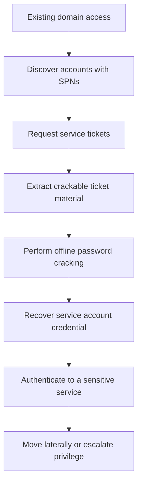
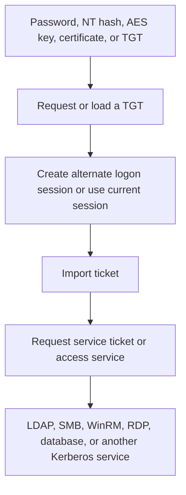
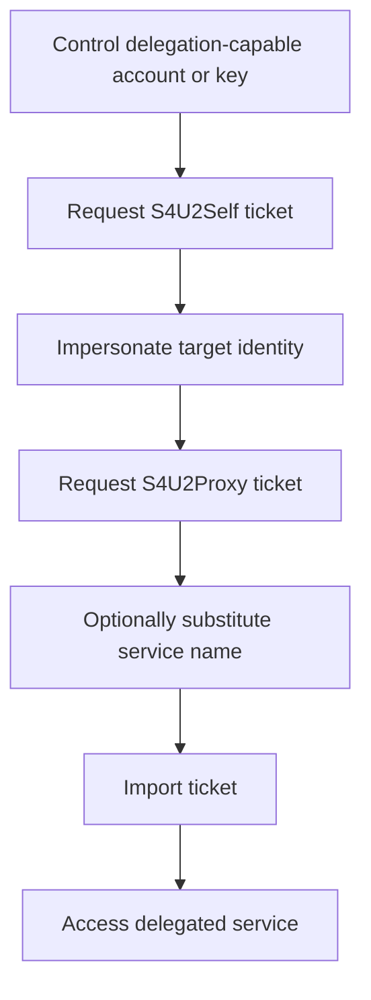
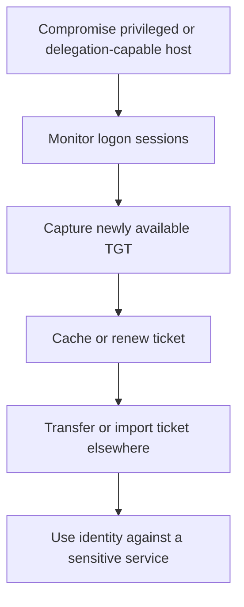
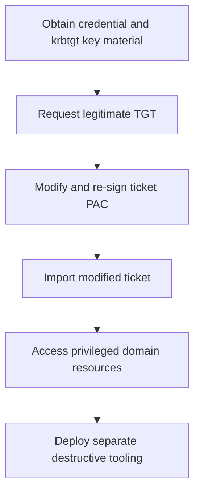

## Executive Summary

Rubeus is an open-source C# toolset for raw Kerberos interaction and abuse on
Windows. It is heavily adapted from Kekeo and related Kerberos research. Its
capabilities include requesting, renewing, extracting, monitoring, importing,
and manipulating tickets; Kerberoasting and AS-REP roasting; constrained
delegation abuse; password spraying; PKINIT authentication; and golden, silver,
and diamond ticket construction.

Rubeus is primarily post-exploitation tooling. An operator normally needs an
existing foothold, credential material, a ticket, a certificate, a suitable
delegation relationship, or a compromised Kerberos key. Rubeus presence does not
establish initial access, persistence, lateral movement, ransomware deployment,
exfiltration, or actor identity.

Rubeus is also not limited to `Rubeus.exe`. Public source, recompilation,
library builds, assembly merging, reflective .NET loading, PowerShell wrappers,
C2-hosted execution, and modified implementations make filename, hash, and
string detections fragile. Durable coverage correlates unusual Kerberos activity
with process context, account and device baselines, ticket properties, delegation
configuration, and subsequent access to sensitive services.

The highest-priority detection themes are:

1. Kerberos requests from an unusual process or endpoint context.
2. Kerberoasting or AS-REP roasting from a rare source.
3. Over-pass-the-hash or certificate-based TGT acquisition followed by access.
4. S4U delegation abuse involving a privileged identity or sensitive service.
5. Ticket reuse or forgery followed by privileged resource access.
6. Kerberos abuse followed by rapid multi-host or sensitive-tier expansion.

> [!IMPORTANT]
> Rubeus is dual-use security tooling. Confirm authorized testing scope before
> declaring compromise, but do not create permanent broad exclusions for its
> filenames, users, hosts, or Kerberos behaviors.

## Scope and Method

This report prioritizes the GhostPack project documentation for capability
evidence, MITRE ATT&CK for procedure mappings, Microsoft documentation for
Windows and Defender telemetry, and incident reporting for observed malicious
use. A documented command proves capability, not that every Rubeus deployment
used it.

Historical hashes, filenames, paths, and strings are enrichment only. They
require current prevalence, ownership, signer, reputation, and incident-context
validation before blocking or attribution.

## Tool Context and Provenance

| Context | Evidence-based interpretation | Defensive consequence |
|---|---|---|
| Canonical Rubeus | GhostPack's public C# project, identified by ATT&CK as S1071 | Project documentation can establish capability but not observed execution |
| Recompiled build | Public source compiled with different framework, metadata, strings, or changes | Static hashes and exact metadata cover only individual builds |
| Embedded build | Rubeus built as a library or merged into another .NET assembly | The host process or assembly can have no Rubeus filename |
| In-memory execution | Assembly loaded through PowerShell, reflection, C2, or unmanaged assembly execution | Disk telemetry can be absent; correlate .NET and Kerberos behavior |
| Modified implementation | Forked code with changed commands, protocol details, or features | Preserve behavioral wording unless source-level provenance is established |
| Rubeus-like behavior | Another tool implements the same Kerberos operations | Detect the operation without overclaiming tool identity |

The project does not publish a single canonical current executable and documents
building Rubeus as a library. A `Rubeus.exe` filename, public YARA match, console
banner, or isolated string is therefore insufficient to prove an authentic or
current GhostPack build.

## Capability Overview

| Capability family | Direct behavior | Prerequisite or qualification |
|---|---|---|
| `asktgt` | Builds AS-REQ traffic and requests a TGT from a password, NT hash, AES or DES key, or certificate | Requires usable credential or certificate material |
| `asktgs` | Requests service tickets using a supplied TGT or the local Kerberos authentication package | Depends on a valid TGT or current session and target SPN |
| `renew` | Renews an existing renewable ticket | Ticket must remain within its `RenewTill` period |
| `ptt` | Imports a KRB-CRED ticket into the current or selected logon session | Another LUID requires elevation; current-session import does not necessarily |
| `createnetonly` | Creates a logon type 9 process for alternate outbound credentials | Produces a process and LUID that can support correlation |
| `triage`, `klist`, `dump` | Enumerates or extracts cached Kerberos tickets | Cross-session and usable TGT extraction depend on privilege and protection state |
| `tgtdeleg` | Uses Kerberos GSS-API delegation behavior to obtain a usable current-user TGT | Does not require elevation in the documented workflow; host and service conditions still apply |
| `monitor`, `harvest` | Watches for new TGTs, caches them, and can renew harvested tickets | Requires elevation according to project documentation |
| `kerberoast` | Requests service tickets and formats material for offline cracking | Requires target SPNs and suitable domain or ticket access |
| `asreproast` | Requests AS-REPs for accounts without Kerberos pre-authentication | Target accounts must have pre-authentication disabled |
| `brute`, `spray` | Performs Kerberos password guessing or spraying | Generates authentication failures and can trigger lockouts |
| `preauthscan` | Tests accounts for missing Kerberos pre-authentication | Requires a candidate username list |
| `s4u` | Performs S4U2Self and S4U2Proxy operations | Requires a suitable delegation configuration and controlled account key or TGT |
| `golden` | Constructs a forged TGT | Requires a usable `krbtgt` key and domain or PAC information |
| `silver` | Constructs a forged service ticket | Requires a target service key and suitable ticket information |
| `diamond` | Requests and then modifies a legitimate TGT | Requires a valid request path plus a key that can decrypt and re-sign the ticket |
| `tgssub` | Substitutes a service name in a ticket | Access still depends on how the destination validates the ticket |
| PKINIT | Requests a TGT with a certificate and private key | Requires a certificate accepted for authentication and access to its private key |
| `changepw` | Uses Kerberos password-change traffic | Requires a suitable TGT or password-change service ticket and authorization |
| KDC proxy | Routes supported Kerberos requests through MS-KKDCP | Requires an accessible compatible proxy and can defeat simple port 88 assumptions |

## Direct and Downstream Behavior

### Direct Rubeus Behavior

When supported by process, memory, command-line, API, or protocol evidence,
Rubeus can directly perform:

* Raw AS-REQ and TGS-REQ construction
* TGT and service-ticket requests and renewal
* Ticket enumeration, extraction, import, purge, and manipulation
* Kerberoasting and AS-REP roasting
* Kerberos password spraying and pre-authentication scanning
* S4U2Self and S4U2Proxy requests
* Golden, silver, and diamond ticket construction
* PKINIT and KDC proxy requests
* LDAP and SYSVOL access used to populate ticket and PAC data
* Kerberos password-change requests

### Downstream Behavior

The following usually uses authentication material produced or handled by
Rubeus but requires separate evidence:

* SMB, RDP, WinRM, WMI, DCOM, service, or scheduled-task lateral movement
* Broad domain or network discovery by adjacent tooling
* Cobalt Strike or another C2 channel
* Data collection, staging, and exfiltration
* Group Policy or software-deployment abuse
* Ransomware, wipers, or other impact activity
* Cloud identity abuse
* Initial access

## ATT&CK Mapping

MITRE ATT&CK identifies Rubeus as software S1071 on Windows. ATT&CK version 19
lists four direct technique relationships. Additional Rubeus capabilities below
are mapped only when the corresponding behavior is independently evidenced.

| Technique | ID | Rubeus relationship | Confidence or qualification |
|---|---|---|---|
| Domain Trust Discovery | T1482 | Can gather domain-trust information | High for ATT&CK-mapped capability |
| Golden Ticket | T1558.001 | `golden` constructs a forged TGT | High as capability |
| Silver Ticket | T1558.002 | `silver` constructs a forged service ticket | High as capability |
| Kerberoasting | T1558.003 | `kerberoast` requests service tickets for offline cracking | High |
| AS-REP Roasting | T1558.004 | `asreproast` requests AS-REPs for accounts without pre-authentication | High |
| Pass the Ticket | T1550.003 | `ptt` imports TGTs or service tickets | High as capability; not listed on the S1071 page at cutoff |
| Steal Web Session Cookie or certificate abuse | Not generic | PKINIT can use a stolen certificate, but the credential-acquisition technique depends on how it was obtained | Map only the observed acquisition mechanism |
| Valid Accounts | T1078 | Ticket or credential reuse can enable authenticated access | Downstream consequence, not tool identity |
| Token Manipulation | T1134 | Alternate logon sessions can support credential-context manipulation | Map only with token or session evidence |

Traditional NTLM pass-the-hash is distinct from Rubeus over-pass-the-hash.
Rubeus can turn an NT hash or AES key into a Kerberos TGT. Do not infer NTLM
authentication solely from an `asktgt` workflow.

## Representative Attack Flows

### Flow 1: Kerberoasting to Credential Reuse

Rubeus directly performs discovery support, ticket requests, and output
formatting. Password cracking, credential reuse, and lateral movement are
separate actions.

### Flow 2: Key Material to Pass-the-Ticket

A valid TGT request can resemble ordinary Kerberos. Source-device rarity,
process context, encryption negotiation, account affinity, and downstream
resource access provide the discriminating context.

### Flow 3: Constrained Delegation Abuse

The flow depends on delegation configuration, account control, target service,
domain conditions, and ticket properties. Rubeus does not create the original
delegation relationship unless separate directory-change behavior is observed.

### Flow 4: Ticket Harvesting on a Delegation Host

The durable analytic connects anomalous ticket access on the source host to a
new source-device relationship for the harvested identity.

### Flow 5: Diamond Ticket to Destructive Operations

ATT&CK reports diamond-ticket use during the 2025 Poland wiper attacks. This
does not make destructive behavior a Rubeus capability. The final deployment
and impact stages require independent evidence.

## Documented Threat Use

### Wizard Spider, FIN12, and Ryuk Operations

ATT&CK links Wizard Spider to Rubeus through Mandiant and DFIR reporting. The
DFIR Report documented Rubeus in specific Ryuk intrusions, including
Kerberoasting and reconnaissance before credential expansion, Cobalt Strike,
lateral movement, data theft, and ransomware.

These cases support Rubeus use in those intrusions. They do not establish that
Rubeus performed C2, lateral execution, exfiltration, or encryption, or that
every Wizard Spider or FIN12 operation used it.

### MirrorFace and Operation AkaiRyū

ATT&CK lists MirrorFace as a group that uses Rubeus and identifies Rubeus use
during Operation AkaiRyū. The procedure relationship is source-linked to Trend
Micro and ESET reporting. It should not be generalized to every MirrorFace or
ANEL-related intrusion.

### 2025 Poland Wiper Attacks

ATT&CK states that adversaries used Rubeus to forge a diamond ticket during the
2025 Poland wiper attacks. CERT Polska and ESET are the cited sources. ESET also
reported an attempted early-stage download to
`C:\Users\<USERNAME>\Downloads\rubeus.exe` and separately observed attempted
LSASS dumping, proxy activity, and destructive malware deployment.

The ESET evidence supports an attempted download and exact-sample pivot. It does
not, by itself, prove successful Rubeus execution or ticket forgery. ATT&CK's
campaign procedure provides the diamond-ticket association. ESET attributes the
DynoWiper component to Sandworm with medium confidence and explicitly states
that it lacked visibility into initial access.

| Actor or operation | Reported relationship | Confidence and caveat |
|---|---|---|
| Wizard Spider | ATT&CK-listed Rubeus use | High for cited procedures, not every operation |
| FIN12 | Mandiant reporting linked through ATT&CK references | Source-linked; preserve report scope |
| Ryuk intrusions | Kerberoasting and reconnaissance in DFIR cases | High for cited cases; downstream ransomware was separate |
| MirrorFace | ATT&CK-listed Rubeus use | High at procedure level |
| Operation AkaiRyū | MirrorFace used Rubeus | High for cited operation |
| 2025 Poland wiper attacks | Rubeus used to forge a diamond ticket | ATT&CK-supported campaign procedure |
| DynoWiper incident | Attempted Rubeus download and historical sample hash | High for attempted download; insufficient alone for successful execution |

## Obfuscation and Detection Avoidance

| Method | Evidence-based interpretation | Detection implication |
|---|---|---|
| Renaming and recompilation | Public source permits changed names, strings, metadata, and hashes | Treat static artifacts as enrichment |
| Library or merged assembly | Rubeus can be invoked through another .NET project | Attribute the Kerberos behavior before naming the tool |
| PowerShell reflection | The project documents loading an encoded assembly into memory | Correlate PowerShell, AMSI, .NET, and Kerberos evidence |
| C2 assembly execution | A framework can load Rubeus inside a sacrificial or non-.NET process | Look for CLR loading, injection, unusual ancestry, and ticket behavior |
| `/opsec` request shaping | Some commands alter request construction to resemble normal clients | Do not require one packet shape or ticket option |
| AES support | Operators can avoid RC4-only heuristics | RC4 is useful context, not a mandatory signature |
| Delay and jitter | Roasting requests can be paced and randomized | Use longer baselines and targeted-account context |
| Existing-ticket use | Service tickets can be requested from supplied or cached TGTs | A new password or TGT event might not exist |
| LSASS-backed `asktgs` | Service-ticket requests can be made through the local authentication package | Raw port 88 traffic from an unusual process is not universal |
| KDC proxy | Supported requests can travel through HTTPS | Do not require endpoint port 88 visibility |
| Ticket-only operation | Tickets can be supplied as Base64 rather than files | Absence of `.kirbi` files does not exclude abuse |

Rubeus does not need to read or write LSASS memory for its core design. The
project uses LSA authentication-package APIs for ticket operations, and elevated
cross-session enumeration can register a logon process. This differs from
Mimikatz-style memory parsing but can still be anomalous. LSASS ASR telemetry is
therefore useful adjacent context, not complete Rubeus coverage.

## Durable Hunting Pivots

| Signal | Hunting value | Limitation |
|---|---|---|
| Kerberos traffic from a non-`lsass.exe` process | Strong context for raw Rubeus-style requests | Legitimate Kerberos libraries and custom applications exist |
| Rare process contacting a domain controller on Kerberos and LDAP | Connects execution to ticket and directory behavior | KDC proxy and LSASS-backed modes can remove this pattern |
| Burst or targeted series of 4769 events | Supports Kerberoasting investigation | Applications can request many service tickets |
| 4768 with pre-authentication type 0 | Supports AS-REP roasting investigation | Accounts explicitly configured without pre-authentication generate this legitimately |
| RC4 where account, service, client, and domain normally use AES | Supports downgrade or NT-hash-based request investigation | Legacy systems, trusts, and stale keys create false positives |
| Logon type 9 followed by unusual network access | Supports `createnetonly` or alternate credential context | `runas /netonly` and administration tools are legitimate |
| S4U-related transited services | Supports delegation-abuse investigation | Requires complete 4769 collection and delegation inventory |
| Identity used from a novel source after ticket-access activity | Connects theft or import to consequence | Jump hosts and shared operations require baselines |
| PAC signature failure or missing signature | Supports ticket-forgery investigation | Patching, stale tickets, and third-party Kerberos can also cause events |

### Volatile Indicators

Use these only for triage, retrospective search, or enrichment:

* `Rubeus.exe` and `rubeus.exe`
* `.kirbi` files or Base64 KRB-CRED output
* `asktgt`, `asktgs`, `kerberoast`, `asreproast`, `tgtdeleg`, `ptt`, `s4u`,
  `golden`, `silver`, `diamond`, and `tgssub`
* GhostPack banners, PDB paths, assembly metadata, and public YARA rules
* Exact historical sample hashes and download paths

## Observable Signals by Data Category

### Process and Memory

* A rare or unsigned .NET process contacts a domain controller on ports 88, 389,
  636, 445, or 464.
* PowerShell or a C2-hosted process loads a .NET assembly and is followed by
  Kerberos or LDAP activity.
* CLR modules appear in a process that does not normally host .NET, followed by
  identity or ticket behavior.
* A hidden or unusual process is created with a corresponding NewCredentials
  logon and later accesses network resources.
* A process invokes sensitive LSA authentication APIs outside an established
  baseline.

### Files and Registry

* A file named `Rubeus.exe`, a renamed low-prevalence .NET assembly, or a script
  wrapper is downloaded and executed.
* `.kirbi`, roast output, console redirection, or Base64 ticket material is
  created in a temporary, user-writable, or staging path.
* Repeated ticket-monitor output is stored below an unusual HKLM software path.
* Ticket or roast output is archived or transferred shortly after creation.

### Identity and Kerberos

* One source requests service tickets for many distinct service accounts or SPNs.
* A rare source requests AS-REPs for multiple accounts with pre-authentication
  type 0 or produces enumeration failures.
* An account normally using AES requests RC4 from a new source device.
* A delegation-capable account performs unusual S4U activity involving a
  privileged identity or sensitive SPN.
* A privileged identity accesses a service from a device with no established
  account-device relationship.
* Service authentication occurs without an expected KDC request chain, after
  collection completeness and trust paths are considered.
* A certificate-based TGT request uses an unfamiliar thumbprint, issuer, source,
  or account relationship.

### Network and Remote Access

* A non-`lsass.exe` process opens direct Kerberos connections to a domain
  controller.
* Kerberos is followed by LDAP, SYSVOL, SMB, WinRM, RDP, database, or remote
  management access.
* A workstation or unusual server generates Kerberos and LDAP fan-out against
  domain controllers.
* HTTPS traffic to an MS-KKDCP endpoint appears from an unexpected process or
  device.

## Defender XDR and Sentinel Data

Candidate Defender XDR sources include:

| Table | Potential use |
|---|---|
| `DeviceProcessEvents` | Process, command line, ancestry, user, and prevalence |
| `DeviceFileEvents` | Downloads, renamed assemblies, `.kirbi` files, roast output, and staging |
| `DeviceNetworkEvents` | Direct Kerberos, LDAP, LDAPS, SMB, password-change, and KDC proxy connections |
| `DeviceEvents` | ASR, AMSI, behavioral, and security-control events where exposed |
| `DeviceImageLoadEvents` | CLR and module-loading context |
| `DeviceRegistryEvents` | Registry-backed ticket-monitor output and adjacent changes |
| `DeviceLogonEvents` | Logon type, account, source, destination, and remote access correlation |
| `IdentityLogonEvents` | Identity, protocol, source-device, and authentication anomalies |
| `IdentityDirectoryEvents` | Delegation and directory changes where available |
| `IdentityQueryEvents` | Directory and account enumeration where available |
| `AlertInfo`, `AlertEvidence` | Existing detections and entity context |

Candidate Microsoft Sentinel sources include domain-controller Security events
4624, 4648, 4768, 4769, and 4771; PowerShell events 4103 and 4104; Sysmon process,
network, image-load, and registry events; Defender for Identity alerts; Defender
XDR connector data; and DNS, proxy, firewall, certificate, and network-flow
telemetry.

Windows Server 2016 and later domain controllers expose updated versions of
events 4768 and 4769 after the January 14, 2025 or later cumulative update. New
fields include advertised encryption types, available keys, session-key
encryption, and request or response ticket hashes. Do not assume these fields
exist or are parsed by every connector.

## Priority Hunting Hypotheses

| ID | Hypothesis | Correlation logic | Priority |
|---|---|---|---|
| H1 | Rubeus-like Kerberos traffic originates from an unusual process | Rare process, parent, signer, path, or user connects to a DC and is followed by ticket or LDAP activity | P0 |
| H2 | Kerberoasting targets multiple or high-value service accounts | 4769 burst or paced series, unusual source, distinct SPNs, service-account concentration, and encryption context | P0 |
| H3 | AS-REP roasting enumerates accounts without pre-authentication | Multiple 4768 events with pre-authentication type 0 or related failures from a rare source | P0 |
| H4 | Over-pass-the-hash or supplied key obtains a TGT | New or rare source requests a TGT with anomalous encryption negotiation, then accesses services | P0 |
| H5 | Imported or harvested ticket enables privileged access | Ticket-access evidence or novel identity source precedes SMB, LDAP, WinRM, RDP, or database access | P0 |
| H6 | Constrained delegation is abused to impersonate a privileged user | S4U or transited-services evidence, delegation-capable account, privileged identity, and sensitive target | P0 |
| H7 | Ticket harvesting occurs on a delegation-capable server | Repeated ticket enumeration or access followed by the identity appearing from a new source | P1 |
| H8 | A forged ticket is used without a consistent KDC chain | Sensitive service authentication plus anomalous PAC, lifecycle, account, or KDC-chain context | P1 research analytic |
| H9 | Rubeus is reflectively or C2-hosted in memory | PowerShell, AMSI, CLR, reflection, injection, or anomalous host process followed by Kerberos behavior | P1 |
| H10 | PKINIT uses a stolen or unexpected certificate | 4768 certificate fields, rare issuer or thumbprint, new source, privileged account, and follow-on access | P1 |
| H11 | Kerberos password spray or pre-auth scan targets many users | 4768 and 4771 breadth, repeated source, failure-code pattern, and later success | P1 |
| H12 | Kerberos abuse precedes destructive or ransomware deployment | Ticket abuse followed by remote execution, GPO changes, payload staging, or impact tooling | P0 |

## Hypothesis Validation and Tuning

### H1: Unusual Process-Originated Kerberos

Correlate `DeviceNetworkEvents` with `DeviceProcessEvents` for domain-controller
connections. Prioritize non-`lsass.exe` processes that are unsigned,
low-prevalence, recently downloaded, user-writable, remotely launched, or hosted
by PowerShell or a C2 process.

Legitimate Java, .NET, database, identity, and security applications can
implement Kerberos directly. Validate process, signer, path, device role, and
destination history. LSASS-backed and KDC proxy modes are explicit blind spots.

### H2: Kerberoasting

Group event 4769 by source address, requesting account, service name, and a
bounded time window. Score distinct SPNs, service-account sensitivity, source
novelty, password age, encryption negotiation, and follow-on cracking or
credential-reuse evidence.

Do not require RC4. Rubeus supports AES roasting, targeting limits, delays, and
jitter. Application servers, scanners, and management systems can legitimately
request many tickets.

### H3: AS-REP Roasting

Use event 4768 with pre-authentication type 0 and account inventory. Score
source rarity, number of distinct accounts, privileged targets, a preceding
username scan, and output or tool-execution evidence.

Maintain an explicit inventory of accounts configured with "Do not require
Kerberos preauthentication." The setting itself is a security risk but does not
prove active roasting.

### H4: Over-Pass-the-Hash or Supplied Key

Compare ticket, pre-authentication, session-key, advertised, account-supported,
service-supported, and domain-controller-supported encryption fields where the
updated event version is available. Prioritize a new source using RC4 when the
account and normal clients use AES, followed by successful service access.

RC4 alone is not proof of Rubeus or credential theft. Include legacy clients,
trusts, stale account keys, domain policy, and application compatibility in the
baseline.

### H5 and H7: Ticket Import or Harvesting

Correlate suspicious process or LSA API behavior, logon type 9, LUID where
available, account-device novelty, destination event 4624, and resource access.
On unconstrained-delegation or identity-tier hosts, investigate elevated
processes that remain resident and identities that later appear elsewhere.

Ticket import lacks a universal high-fidelity event. Sequence and entity
correlation are required.

### H6: Delegation Abuse

Inventory accounts and computers configured for unconstrained, constrained, and
resource-based constrained delegation. Monitor changes to delegation attributes
separately. Correlate event 4769 `TransitedServices`, requesting account, client
address, impersonated identity, service name, and destination access.

Legitimate web, application, and identity services use S4U. Alerting must be
role-aware and target-aware.

### H8: Forged Tickets

Treat absent KDC events as one research feature, not a verdict. Require complete
domain-controller coverage, synchronized clocks, overlapping retention, trust
awareness, and destination authentication logs. Add account existence and
lifecycle, source-device affinity, ticket lifetime, encryption, PAC validation,
and prior `krbtgt` or service-key exposure.

PAC signature failures or missing signatures can also result from incomplete
patching, stale tickets, or third-party Kerberos implementations.

### H9: In-Memory Rubeus

Correlate PowerShell and AMSI content, reflective assembly loading, CLR modules
in an unusual host, unmanaged assembly execution, injection evidence, and
Kerberos or LDAP behavior. Do not alert on generic .NET or reflection strings
without a behavioral sequence.

### H10: PKINIT

Use event 4768 certificate issuer, serial number, thumbprint, pre-authentication
type, source address, account, and follow-on service access. Compare against
enterprise certificate issuance, smart-card, Windows Hello for Business, and
approved authentication workflows.

### H12: Kerberos Abuse to Impact

Join Kerberos anomalies to remote authentication, administrative-share writes,
service or scheduled-task creation, Group Policy changes, payload staging, and
impact alerts. Preserve causal wording: Rubeus can enable privileged access,
while separate tooling performs deployment and impact.

## Query-Building Blocks

| Building block | Detection intent | Candidate features |
|---|---|---|
| Rare Kerberos process | Identify raw Kerberos outside expected hosts | Process, signer, path, parent, user, device role, DC connection, prevalence |
| Kerberoasting | Identify targeted or broad service-ticket collection | Source, requester, distinct SPNs, service accounts, encryption, timing |
| AS-REP roasting | Identify no-pre-auth account targeting | 4768 pre-authentication type 0, account breadth, source novelty, failures |
| Encryption anomaly | Identify downgrade or unexpected key use | Ticket, session, pre-auth, advertised, account, service, and DC encryption fields |
| Alternate logon session | Identify net-only ticket context | 4624 logon type 9, process, LUID, network account, downstream access |
| Delegation | Identify S4U impersonation and target access | Delegation inventory, transited services, account, source, target SPN, identity |
| Ticket forgery | Identify inconsistent ticket lifecycle or KDC chain | Account lifecycle, source affinity, PAC status, ticket hashes, missing chain |
| PKINIT | Identify unexpected certificate authentication | Issuer, serial, thumbprint, pre-authentication type, account, source |
| Impact chain | Link Kerberos abuse to consequence | Remote logon, share write, service, task, GPO, payload, alert, fan-out |
| Name enrichment | Find explicit Rubeus artifacts | Filenames, commands, `.kirbi`, output files, assembly strings |

Useful correlation entities include normalized hostname, device ID, account SID,
account UPN, source IP, destination domain controller, process ID plus creation
time, LUID, Logon GUID, SPN, service account SID, certificate thumbprint, ticket
request or response hash, and file SHA-256.

## Detection Engineering Guidance

* Prioritize process-originated Kerberos, roasting breadth, delegation context,
  and ticket use followed by sensitive access.
* Collect events 4768, 4769, and 4771 from every relevant domain controller.
* Apply January 2025 or later updates where the enhanced event fields are needed,
  and verify connector parsing.
* Maintain inventories for delegation, service accounts, SPNs, pre-authentication
  exceptions, PKINIT, RC4 dependencies, trusts, and KDC proxies.
* Correlate endpoint and domain-controller telemetry because execution and ticket
  issuance occur on different systems.
* Use account-device and source-service baselines instead of global volume alone.
* Treat missing KDC events as a weak research feature unless collection
  completeness is measured.
* Use filenames, strings, hashes, and `.kirbi` artifacts as expiring enrichment.
* Preserve authorized-engagement owner, scope, accounts, infrastructure,
  techniques, start, end, and cleanup status.
* Validate every table, column, parser, event version, join key, and threshold in
  the target environment.

## Defensive Control Context

* Disable Kerberos pre-authentication exceptions unless explicitly required.
* Prefer group managed service accounts or long random service-account secrets,
  rotate exposed keys, and reduce unnecessary SPNs.
* Remove RC4 and DES dependencies where operationally possible after testing.
* Restrict and monitor constrained, unconstrained, and resource-based delegation.
* Protect `krbtgt`, service-account, computer-account, certificate, and Active
  Directory Certificate Services trust material.
* Tier administrative identities and prevent high-value tickets from reaching
  lower-trust systems.
* Credential Guard protects important secrets but does not eliminate service
  tickets, already available privileges, domain-controller database secrets, or
  all ticket-abuse paths.
* Added LSA protection and the LSASS credential-theft ASR rule reduce adjacent
  memory-theft paths but do not provide complete Rubeus coverage.
* Keep domain controllers patched for Kerberos PAC signature enforcement and
  investigate missing or invalid PAC signatures in context.
* A golden-ticket response normally requires investigation of the original
  privilege path and a carefully managed double rotation of `krbtgt`.

## Validation Plan

1. Confirm each Defender XDR and Sentinel table exists and required columns are
   populated.
2. Enumerate observed Defender XDR `ActionType` values before writing filters.
3. Verify collection from every relevant domain controller for events 4768,
   4769, and 4771.
4. Confirm domain-controller patch levels, event versions, and parsing of new
   encryption and ticket-hash fields.
5. Baseline ticket volume by source, requester, service, SPN, device role, and
   time window.
6. Inventory legitimate RC4, DES, PKINIT, KDC proxy, delegation, and high-volume
   service-ticket workflows.
7. Validate logon type 9 correlation against approved `runas /netonly`, support,
   deployment, and automation activity.
8. Test account-device and account-service novelty with jump hosts, shared
   administration, trusts, and non-Windows clients.
9. Validate joins among endpoint, domain-controller, identity, network, proxy,
   and certificate telemetry.
10. Test authorized on-disk, renamed, library, PowerShell, and C2-hosted execution
    in an isolated lab.
11. Include ordinary applications, identity agents, security products, and
    Kerberos libraries as negative controls.
12. Measure retention overlap, clock alignment, ingestion delay, duplicate data,
    and missing-domain-controller coverage.
13. Document required telemetry, blind spots, false-positive owners, and response
    procedures before promotion.

## Triage and Containment Guidance

| Phase | Recommended actions |
|---|---|
| Confirm | Establish authorization, first execution, process or loader chain, exact Kerberos operation, source account, SPN, certificate, and target service |
| Preserve | Capture process, memory, loaded assemblies, PowerShell, AMSI, tickets, logon sessions, 4768, 4769, 4771, destination 4624, LDAP, network, and file evidence |
| Scope | Search for matching hashes and behavior, new account-device relationships, roasting, S4U, PKINIT, ticket reuse, and downstream remote access |
| Contain | Isolate affected hosts, restrict compromised accounts, revoke certificates, and block confirmed active infrastructure |
| Identity response | Rotate exposed user, service, computer, trust, certificate, and `krbtgt` material according to the confirmed exposure |
| Delegation response | Review and reduce constrained, unconstrained, and resource-based delegation; inspect recent attribute changes |
| Recover | Remove tooling and persistence, restore security controls, rebuild compromised trust boundaries where required, and monitor renewed ticket use |
| Authorized activity | Verify scope and cleanup with the engagement owner; use time-bound suppression rather than permanent exclusions |

## Coverage Gaps and Confidence Limits

* No tenant telemetry or malware execution was available for this report.
* Rubeus can execute without a stable filename, hash, process name, or disk file.
* Raw port 88 traffic can be absent when requests use LSASS or a KDC proxy.
* Ticket import and LSA authentication-package use might not have direct,
  consistently exposed Defender events.
* Kerberoasting can use AES and can be delayed, jittered, or narrowly targeted.
* Event 4768 and 4769 fields vary by domain-controller patch level and connector.
* Missing KDC events can reflect collection, retention, trust, cross-domain, or
  timing gaps rather than ticket forgery.
* PAC signature anomalies are not specific to Rubeus.
* Credential Guard changes ticket-extraction behavior but does not eliminate
  ticket abuse.
* Public hashes and paths identify exact historical samples only.
* Modified or capability-equivalent tools can produce the same behavior.
* ATT&CK actor and campaign associations summarize cited reporting and do not
  prove universal use.
* Rubeus presence does not establish initial access, exfiltration, ransomware,
  wiping, or actor attribution.

## Historical Indicators and Pivots

No current blocking indicators are recommended.

| Indicator | Context | Qualification |
|---|---|---|
| `Rubeus.exe` | Common canonical filename and ESET-reported attempted download | Easily changed and legitimate in authorized testing |
| `C:\Users\<USERNAME>\Downloads\rubeus.exe` | Path reported in the DynoWiper investigation | Historical path only |
| `410C8A57FE6E09EDBFEBABA7D5D3E4797CA80A19` | ESET-listed SHA-1 for the reported Rubeus sample | Exact-sample retrospective pivot only |
| `.kirbi` | Common KRB-CRED file extension | Not unique to Rubeus or malicious activity |
| Rubeus command strings | High-context static leads | Can be removed, renamed, encoded, or copied into benign content |

Rubeus is not a C2 framework. Infrastructure reported in surrounding Ryuk,
MirrorFace, or wiper incidents should not be labeled Rubeus infrastructure.

## Sources

| # | Title | Publisher | Date | URL | Accessed |
|---|---|---|---|---|---|
| 1 | Rubeus project and command documentation | GhostPack | Living repository | <https://github.com/GhostPack/Rubeus> | 2026-09-30 |
| 2 | Rubeus, Software S1071 | MITRE ATT&CK | Version 1.2 modified 2026-05-12 | <https://attack.mitre.org/software/S1071/> | 2026-09-30 |
| 3 | Golden Ticket, T1558.001 | MITRE ATT&CK | Living reference | <https://attack.mitre.org/techniques/T1558/001/> | 2026-09-30 |
| 4 | Silver Ticket, T1558.002 | MITRE ATT&CK | Living reference | <https://attack.mitre.org/techniques/T1558/002/> | 2026-09-30 |
| 5 | Kerberoasting, T1558.003 | MITRE ATT&CK | Living reference | <https://attack.mitre.org/techniques/T1558/003/> | 2026-09-30 |
| 6 | AS-REP Roasting, T1558.004 | MITRE ATT&CK | Living reference | <https://attack.mitre.org/techniques/T1558/004/> | 2026-09-30 |
| 7 | Unhappy Hour Special: KEGTAP and SINGLEMALT With a Ransomware Chaser | Mandiant | 2020-10-28 | <https://cloud.google.com/blog/topics/threat-intelligence/kegtap-and-singlemalt-with-a-ransomware-chaser> | 2026-09-30 |
| 8 | Ryuk's Return | The DFIR Report | 2020-10-08 | <https://thedfirreport.com/2020/10/08/ryuks-return/> | 2026-09-30 |
| 9 | Ryuk Speed Run, 2 Hours to Ransom | The DFIR Report | 2020-11-05 | <https://thedfirreport.com/2020/11/05/ryuk-speed-run-2-hours-to-ransom/> | 2026-09-30 |
| 10 | FIN12 Group Profile | Mandiant | 2021-10-07 | <https://web.archive.org/web/20220313061955/https://www.mandiant.com/sites/default/files/2021-10/fin12-group-profile.pdf> | 2026-09-30 |
| 11 | The Return of ANEL in the Recent Earth Kasha Campaign | Trend Micro | 2024-11-26 | <https://www.trendmicro.com/en_us/research/24/k/return-of-anel-in-the-recent-earth-kasha-spearphishing-campaign.html> | 2026-09-30 |
| 12 | Operation AkaiRyū | ESET | 2025-03-18 | <https://www.welivesecurity.com/en/eset-research/operation-akairyu-mirrorface-invites-europe-expo-2025-revives-anel-backdoor/> | 2026-09-30 |
| 13 | Energy Sector Incident Report, 29 December | CERT Polska | 2026-01-30 | <https://cert.pl/uploads/docs/CERT_Polska_Energy_Sector_Incident_Report_2025.pdf> | 2026-09-30 |
| 14 | DynoWiper Update: Technical Analysis and Attribution | ESET | 2026-01-30 | <https://www.welivesecurity.com/en/eset-research/dynowiper-update-technical-analysis-attribution/> | 2026-09-30 |
| 15 | Event 4768, a Kerberos TGT was requested | Microsoft | Updated 2026-04-27 | <https://learn.microsoft.com/windows/security/threat-protection/auditing/event-4768> | 2026-09-30 |
| 16 | Event 4769, a Kerberos service ticket was requested | Microsoft | Updated 2026-04-27 | <https://learn.microsoft.com/windows/security/threat-protection/auditing/event-4769> | 2026-09-30 |
| 17 | Event 4624, an account was successfully logged on | Microsoft | Living reference | <https://learn.microsoft.com/windows/security/threat-protection/auditing/event-4624> | 2026-09-30 |
| 18 | Event 4771, Kerberos pre-authentication failed | Microsoft | Living reference | <https://learn.microsoft.com/windows/security/threat-protection/auditing/event-4771> | 2026-09-30 |
| 19 | Kerberos PAC Signature Changes for CVE-2022-37967 | Microsoft | Updated 2023-04-10 | <https://support.microsoft.com/topic/kb5020805-how-to-manage-kerberos-protocol-changes-related-to-cve-2022-37967-997e9acc-67c5-48e1-8d0d-190269bf4efb> | 2026-09-30 |
| 20 | Credential Guard: How It Works | Microsoft | Updated 2025-06-12 | <https://learn.microsoft.com/windows/security/identity-protection/credential-guard/how-it-works> | 2026-09-30 |
| 21 | Attack Surface Reduction Rules Reference | Microsoft | Updated 2026-09-09 | <https://learn.microsoft.com/defender-endpoint/attack-surface-reduction-rules-reference> | 2026-09-30 |
| 22 | Defender XDR Advanced Hunting Schema | Microsoft | Updated 2026-07-27 | <https://learn.microsoft.com/defender-xdr/advanced-hunting-schema-tables> | 2026-09-30 |
| 23 | Advanced Hunting Overview | Microsoft | Updated 2026-08-07 | <https://learn.microsoft.com/defender-xdr/advanced-hunting-overview> | 2026-09-30 |
