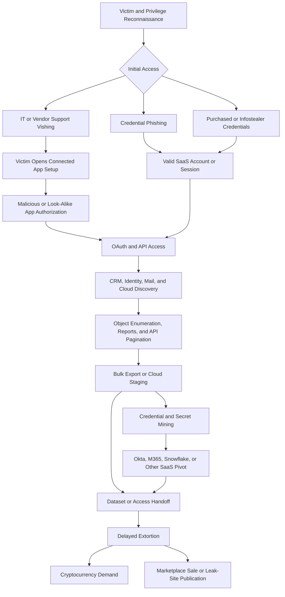

## Executive Summary

ShinyHunters, also styled Shiny Hunters, is best understood as a financially motivated cybercriminal brand, marketplace identity, and changing collaboration network rather than one stable intrusion set. The name became prominent in 2020 through the sale and publication of large stolen databases. Later operators reused the brand in extortion communications, leak-site activity, and claims involving cloud-hosted data.

The strongest current hunting model is behavior-first. Operators obtain valid cloud access through voice phishing, credential phishing, previously stolen credentials, or malicious connected-application authorization. They then use legitimate SaaS interfaces and APIs to enumerate data, perform bulk exports, search records for reusable credentials or secrets, pivot into other services, and monetize the theft through extortion, sale, or publication.

Google Threat Intelligence Group tracks the Salesforce-focused access activity as `UNC6040` and the later extortion activity affecting some of the same victims as `UNC6240`. The extortion actor claimed ShinyHunters affiliation, but GTIG does not establish that the clusters are identical. `UNC5537`, the 2024 Snowflake data-theft cluster, and `UNC6395`, the 2025 Salesloft Drift OAuth-token cluster, are useful behavioral comparisons but are separately tracked. Scattered Spider or `UNC3944`, LAPSUS$, and the Scattered LAPSUS$ Hunters alliance label must also remain distinct unless incident evidence supports a relationship.

The most durable detections connect an unexpected authorization or valid-account login to high-volume API activity, sensitive-object discovery, data export, cross-SaaS access, and delayed extortion. A VPN address, threat-actor claim, connected-app name, or stolen dataset does not independently establish attribution.

> [!IMPORTANT]
> Treat ShinyHunters as a fluid criminal brand. Record the access cluster, theft activity, extortion identity, and marketplace claim separately, then attribute only to the highest level supported by the complete evidence chain.

## Scope and Method

This report prioritizes Google Threat Intelligence Group and Mandiant, Salesforce Security, Snowflake, the US Department of Justice, Microsoft Threat Intelligence, MITRE ATT&CK, and Palo Alto Networks Unit 42. Contemporary reporting is used for early campaigns when primary technical details are unavailable. Research was current through September 17, 2026.

User-provided text, public telemetry, schemas, indicators, and actor claims are treated as untrusted until corroborated. No query execution, optimization gain, or detection coverage is claimed. Table names, columns, licensing, retention, and connector availability must be validated in the target tenant before implementation.

The report separates historical ShinyHunters-branded conduct from `UNC6040` access operations, `UNC6240` extortion, `UNC5537` Snowflake theft, `UNC6395` Salesloft Drift compromise, Scattered Spider, LAPSUS$, and Scattered LAPSUS$ Hunters. Similar tradecraft or a public alliance claim is not sufficient to collapse these identities.

## Actor and Cluster Profile

| Attribute | Assessment |
|---|---|
| Actor type | Financially motivated cybercriminal brand and shifting collaboration network |
| Public emergence | 2020, through advertising and publication of stolen databases |
| Primary objectives | Data theft, dataset sale, extortion, access resale, credential theft, and cryptocurrency payment |
| Common targets | Large organizations holding valuable customer, employee, identity, CRM, support, retail, telecom, technology, travel, financial, or cloud-hosted data |
| Historical access | Credential-phishing pages and unauthorized access to corporate systems |
| Current access model | Voice phishing, malicious connected-app authorization, valid cloud credentials, historical infostealer credentials, and token abuse in adjacent campaigns |
| Current execution model | Legitimate SaaS consoles, OAuth grants, APIs, reports, database clients, and bulk-export functions rather than required endpoint malware |
| Monetization | Private extortion, cryptocurrency demands, marketplace sale, proof samples, and leak-site publication |
| Attribution confidence | High for the public brand and court-supported historical activity; variable for continuity between later access, extortion, and alliance operators |

### Attribution Boundary Guide

| Cluster or Label | Defensible Interpretation |
|---|---|
| ShinyHunters or Shiny Hunters | Public criminal brand associated with database theft, sale, leaks, and extortion; membership and operational continuity have changed over time |
| Bling Libra | Unit 42 tracking name associated with ShinyHunters-linked extortion activity; not proof that every ShinyHunters claim came from one crew |
| UNC6040 | GTIG access cluster using Salesforce-focused voice phishing, connected-app authorization, rapid data theft, and some cross-SaaS movement |
| UNC6240 | Separately tracked extortion activity contacting some UNC6040 victims months later and claiming ShinyHunters affiliation; partnership or handoff is plausible but identity equivalence is unproven |
| UNC5537 | Snowflake-focused cluster using historical infostealer credentials; public ShinyHunters claims overlap some victims, but Mandiant does not define UNC5537 as ShinyHunters |
| UNC6395 | Separate 2025 cluster that abused compromised Salesloft Drift OAuth tokens to access Salesforce and connected data |
| Scattered Spider, UNC3944, or Octo Tempest | Separate social-engineering and extortion cluster with help-desk, identity, cloud, SIM-swap, and ransomware capabilities |
| LAPSUS$ or DEV-0537 | Separate data-theft and extortion group; similar social engineering, cloud identity abuse, and public pressure do not establish identity |
| Scattered LAPSUS$ Hunters | Alliance or conglomerate branding publicly associated with ShinyHunters or Bling Libra, Scattered Spider or Muddled Libra, and LAPSUS$; membership is fluid and partly self-asserted |
| RaidForums or BreachForums identities | Forums and accounts used to advertise or publish data; administrator, seller, intrusion-crew, and extortion roles must not be assumed equivalent |

## Campaign Timeline and Targeting

| Date | Evidence-Backed Development |
|---|---|
| 2019 to 2020 | US court records describe a conspiracy using credential-phishing pages, unauthorized corporate access, theft of customer and proprietary data, and criminal-marketplace sales |
| May 2020 | The ShinyHunters name emerges publicly with data attributed to Tokopedia, followed by databases attributed to Unacademy, Mathway, Wattpad, Dave, and other organizations; many record totals originated from actor claims |
| August 2021 | A dataset advertised as approximately 70 million AT&T records is disputed by AT&T at the time; AT&T later confirms in 2024 that a dark-web dataset affects approximately 7.6 million current and 65.4 million former customers, without proving the original intrusion method or continuous custody |
| 2022 | Neopets confirms a data incident publicly attributed to ShinyHunters; suspected member Sébastien Raoult is arrested in Morocco |
| 2023 | Raoult is extradited to the United States and pleads guilty to conspiracy to commit wire fraud and aggravated identity theft |
| January 2024 | Raoult receives a three-year sentence and a restitution order, establishing participation by at least one person in ShinyHunters-branded conduct |
| April to June 2024 | `UNC5537` compromises Snowflake customer tenants using previously stolen credentials. ShinyHunters claims prominent victims, but the cluster-to-brand equivalence remains unproven |
| March 2025 onward | Salesforce warns that callers impersonating IT support are persuading users to authorize malicious connected applications, including modified Data Loader branding |
| Mid-2025 | `UNC6040` rapidly steals Salesforce data and sometimes pivots to Okta and Microsoft 365. Months later, `UNC6240` contacts some victims and claims ShinyHunters affiliation |
| August 2025 | `UNC6395` abuses compromised Salesloft Drift OAuth tokens in a separate Salesforce-focused campaign and searches stolen data for credentials and secrets |
| October 2025 | Unit 42 documents Scattered LAPSUS$ Hunters leak-site and alliance branding associated with Bling Libra, Muddled Libra, and LAPSUS$ labels |
| Through September 2026 | Reviewed authoritative reporting does not justify collapsing historical ShinyHunters, `UNC6040`, `UNC6240`, `UNC5537`, `UNC6395`, Scattered Spider, and LAPSUS$ into one actor |

Victim selection favors organizations whose SaaS tenants hold large, monetizable datasets or credentials that enable further access. Elevated Salesforce users, support personnel, identity administrators, developers, finance staff, and employees able to authorize connected applications are high-value social-engineering targets.

## Infection and Attack Flow

### Stage 1: Reconnaissance and Social Engineering

Operators identify users with access to valuable Salesforce objects, reports, customer records, support cases, identity systems, or other connected SaaS services. In the `UNC6040` flow, callers impersonate internal IT staff or vendor support. They direct the victim to Salesforce connected-app setup and provide a connection code for a malicious or modified application.

Historical ShinyHunters conduct also used phishing pages that imitated legitimate services to steal credentials. In adjacent Snowflake activity, the access path was different: `UNC5537` used credentials previously captured by infostealer malware, often against accounts without multifactor authentication or network restrictions.

### Stage 2: Valid-Account and OAuth Access

The victim's approval can grant API access under the user's authorized Salesforce visibility. No Salesforce vulnerability or endpoint malware is required. The actor can use access and refresh tokens, legitimate clients, and normal platform APIs, making the activity appear similar to approved integrations.

An unexpected application, broad OAuth scopes, a first-seen client, a new network or autonomous system number, or a human account suddenly behaving like an integration becomes significant when correlated with subsequent collection.

### Stage 3: Discovery and Collection

Operators enumerate CRM objects, record counts, reports, files, users, cases, contacts, leads, opportunities, and other high-value records. Legitimate REST API, Bulk API, report export, SOQL, and Data Loader functions can support fast extraction. Repeated pagination, broad object coverage, unusual query rates, or a large export shortly after authorization are durable hunting signals.

In the separate `UNC5537` Snowflake campaign, the actor used SnowSight, SnowSQL, FROSTBITE, DBeaver, SQL enumeration, temporary stages, and `COPY INTO` or `GET` operations. These behaviors are valuable differential-diagnosis patterns but must not be presented as confirmed ShinyHunters tooling.

### Stage 4: Secret Mining and Cross-SaaS Pivoting

CRM, support, email, and document data can contain passwords, API keys, cloud credentials, single sign-on details, VPN information, Snowflake credentials, and login URLs. `UNC6040` has used credentials obtained through voice phishing or credential harvesting against Okta and Microsoft 365. The same identity, source IP, ASN, session characteristics, or tight time window across services can expose the pivot.

The separate `UNC6395` campaign systematically searched Salesforce data for credential markers after abusing Salesloft Drift OAuth tokens. This demonstrates the risk of secrets stored in business records but is not evidence that `UNC6395` is ShinyHunters.

### Stage 5: Exfiltration, Handoff, and Extortion

Data leaves through trusted SaaS APIs, bulk-result downloads, reports, database clients, or cloud services. The access operator, data thief, extortion negotiator, seller, and leak-site operator may be different people. GTIG observed months-long delays between some `UNC6040` compromises and `UNC6240` extortion, consistent with a possible partnership or handoff.

Monetization can include a private cryptocurrency demand, proof-of-data sample, countdown, marketplace listing, or public leak. Delayed extortion may occur after normal cloud-log retention has expired, so preserving authorization, API, report, identity, and network evidence is essential.

## Commonly Observed Tools and Capabilities

| Tool or Capability | Role and Observed Use |
|---|---|
| Salesforce Data Loader or modified connected app | `UNC6040`-associated OAuth authorization and bulk CRM access; familiar branding lowers user suspicion |
| Salesforce REST API and Bulk API | Legitimate interfaces used for discovery, pagination, and high-volume extraction |
| Salesforce reports and SOQL | Object discovery, record counting, filtering, and export |
| Okta and Microsoft 365 | Cross-SaaS targets observed after `UNC6040` credential acquisition |
| Mullvad VPN | Source obfuscation observed in `UNC6040` activity; shared infrastructure and not actor-unique |
| Credential-harvesting pages | Court-supported historical ShinyHunters method for stealing access to corporate services |
| SnowSight and SnowSQL | Legitimate Snowflake clients used by `UNC5537`; behavioral comparison only |
| FROSTBITE or `rapeflake` | Snowflake reconnaissance utility associated with `UNC5537`; not a ShinyHunters-specific tool |
| DBeaver Ultimate | Legitimate database client observed in `UNC5537` sessions; suspicious only with anomalous context |
| RaidForums, BreachForums, Telegram, and leak sites | Advertising, negotiation, pressure, data sale, and publication; account ownership can change |
| Cryptocurrency | Extortion and monetization channel; wallet addresses require incident-specific corroboration |
| Voice calls and support pretexts | Human-layer access technique that can bypass endpoint controls and conventional email detection |

RMM tools, adversary-in-the-middle kits, SIM swaps, `AADInternals`, ransomware, and hypervisor encryption are documented in adjacent Scattered Spider reporting. Do not assign those capabilities to ShinyHunters without incident-specific evidence.

## MITRE ATT&CK Map for Hunting

| Technique | ID | Confidence | Evidence Pattern to Hunt |
|---|---|---|---|
| Impersonation | T1656 | High | Callers pose as internal IT, Salesforce, or vendor support to direct victim actions |
| Spearphishing Voice | T1566.004 | High | `UNC6040` uses telephone-based social engineering to obtain authorization or credentials |
| Spearphishing Voice for Information | T1598.004 | High | Calls solicit credentials, MFA material, or connected-app approval information |
| Acquire Infrastructure: Domains | T1583.001 | Medium | Court records describe look-alike phishing sites in historical ShinyHunters conduct |
| Valid Accounts: Cloud Accounts | T1078.004 | High | Stolen credentials and victim-authorized OAuth access are used against SaaS tenants |
| Account Manipulation: Additional Cloud Roles | T1098.003 | Medium | Apply when logs show a malicious permission, role, or app grant that preserves cloud access |
| Steal Application Access Token | T1528 | Medium | Apply to stolen or replayed OAuth-token incidents, not automatically to each consent event |
| Data from Information Repositories | T1213 | High | CRM, support, mail, document, and repository data are collected |
| Data from Cloud Storage | T1530 | Medium | Cloud-hosted datasets or files are accessed where telemetry demonstrates the behavior |
| Automated Collection | T1119 | High | Scripted object enumeration, API pagination, report extraction, or database querying |
| Data Staged | T1074 | Medium | Exports or temporary cloud stages prepare data for transfer; explicit in `UNC5537` |
| Exfiltration Over Web Service | T1567 | High | Legitimate SaaS APIs and cloud services carry stolen data |
| Automated Exfiltration | T1020 | Medium-High | Repeated API pagination, bulk jobs, and scripted downloads automate extraction |
| Proxy | T1090 | High | Commercial VPN, Tor, and VPS infrastructure obscure source access |
| Indicator Removal | T1070 | Low for ShinyHunters | Query-job deletion was reported for separate `UNC6395` activity and should remain a differential |
| Financial Theft | T1657 | Medium | Dataset sale and extortion support financial motivation where payment or monetization is evidenced |

Do not map ransomware, SIM swapping, domain federation, Golden SAML, RMM deployment, or hypervisor encryption to ShinyHunters solely because those techniques occur in Scattered Spider reporting or alliance claims.

## Durable Indicators of Attack

| Attack Phase | Durable Behavioral Indicator | Hunting Value |
|---|---|---|
| Targeting | Phone or collaboration contact impersonates internal IT or vendor support and focuses on a user with SaaS or API privileges | Strong precursor when tied to an unexpected authorization, password reset, or login |
| Authorization | User opens connected-app setup without an approved change and authorizes an unknown or look-alike application | Captures the central `UNC6040` access path without relying on an app name |
| Identity | OAuth or valid-account success originates from a new application, client, ASN, country, VPN, Tor exit, unmanaged device, or noncorporate network | Identifies abnormal access while requiring baseline and travel context |
| Collection | App approval is followed within minutes by Bulk API results, repeated pagination, broad object enumeration, or a large report export | Links authorization directly to data theft behavior |
| Scope discovery | Queries count or retrieve accounts, opportunities, users, cases, contacts, leads, attachments, or other high-value objects | Separates broad reconnaissance from routine user access |
| Cross-SaaS pivot | The same identity or public IP appears in Salesforce and then Okta, Entra ID, Exchange Online, SharePoint, or Microsoft Graph | Exposes progression beyond the initially compromised service |
| Secret mining | CRM or support content is searched for access keys, passwords, secrets, tokens, VPN, SSO, Snowflake, or login URLs | Detects preparation for secondary compromise where query text is logged |
| Persistence | Long-lived refresh token, newly approved app, relaxed IP policy, new API permission, role change, or added authentication method follows access | Finds durable cloud access that survives a password change |
| Evasion | Trusted APIs, VPN or Tor rotation, deleted jobs, or delayed extortion reduce obvious endpoint evidence | Encourages identity, API, and long-retention evidence collection |
| Monetization | Proof sample, cryptocurrency demand, deadline, marketplace listing, or leak-site publication follows confirmed extraction | Connects incident evidence to extortion without treating branding as attribution proof |

## Volatile Indicators and Investigation Pivots

No durable, public, ShinyHunters-specific network or file indicator set was identified in the reviewed primary sources. The principal Salesforce attack flow uses legitimate services, valid identities, OAuth applications, and shared VPN infrastructure. The following values are historical investigation pivots or differential indicators, not block entries and not proof of ShinyHunters activity.

| Type | Indicator | Context | Handling |
|---|---|---|---|
| Legitimate URL path | `login.salesforce.com/setup/connect` | Salesforce reports that victims were directed to connected-app setup | Confirmed workflow artifact; not malicious by itself |
| Client identifier | `rapeflake` | FROSTBITE identifier in Snowflake logs | `UNC5537` differential only |
| Client identifier | `DBeaver_DBeaverUltimate` | DBeaver access in unexpected Snowflake session context | Legitimate software and `UNC5537` differential only |
| IP address | `45.27.26.205` | Mandiant example FROSTBITE Snowflake session | Historical `UNC5537` pivot only; confirm ownership and observation time |
| IP address | `37.19.210.21` | Mandiant example DBeaver Snowflake session | Historical `UNC5537` and shared-VPN pivot only |
| ASN | `AS200019` | ALEXHOST SRL VPS infrastructure used during `UNC5537` exfiltration | Infrastructure enrichment only and not actor-unique |

GTIG maintains `UNC6040` indicators in an authenticated VirusTotal collection, but exact values were not reproducible from the accessible publication and are not invented here. `UNC6395` indicators are excluded because GTIG tracks that campaign separately. Actor-controlled domains, wallet addresses, accounts, and leak-site locations should be added only from preserved incident evidence or an accessible primary indicator feed.

## Observable Signals by Attack Phase

| Phase | Observable Signals | Defender XDR and Sentinel Sources |
|---|---|---|
| Social engineering | User-reported support call, new help-desk ticket, unexpected MFA reset, support-login grant, or vendor impersonation | Help-desk and telephony logs, case-management data, `CloudAppEvents`, `AuditLogs`, and user reports |
| Connected-app authorization | New app approval, broad scopes, refresh-token issuance, first-seen client, or unapproved app configuration | Salesforce `SetupAuditTrail`, connected-app records, token lifecycle, `CloudAppEvents`, and `AuditLogs` where integrated |
| Salesforce access | New source IP, ASN, geography, user agent, device, or noninteractive behavior for a human account | Salesforce `LoginHistory`, `LoginEvent`, `ApiEvent`, `AADSignInEventsBeta`, `SigninLogs`, and network enrichment |
| Discovery | Broad object queries, record counts, unusual SOQL, repeated `queryMore`, or access to sensitive reports and list views | Salesforce `ApiEvent`, `ReportEvent`, `ListViewEvent`, `UniqueQuery`, and custom connector logs |
| Collection | Bulk API jobs, large result downloads, high record counts, report exports, or file access | Salesforce `BulkApiResultEvent`, `ReportEvent`, file events, `CloudAppEvents`, proxy, and DLP telemetry |
| Cross-SaaS pivot | Same identity, source IP, ASN, token pattern, or session context appears in Salesforce, Okta, Entra ID, or Microsoft 365 | `SigninLogs`, `AADNonInteractiveUserSignInLogs`, `IdentityLogonEvents`, Okta logs, `OfficeActivity`, and Salesforce logs |
| Microsoft 365 collection | Graph access, mailbox or user enumeration, SharePoint or OneDrive downloads, and mailbox-rule changes | `AuditLogs`, service-principal sign-ins, `OfficeActivity`, `CloudAppEvents`, Graph activity, and alert evidence |
| Secret mining | Searches or exports contain credential markers, cloud keys, SSO data, VPN details, or login URLs | Salesforce query telemetry, DLP, SaaS audit logs, and incident-specific content review |
| Exfiltration | API response volume, bulk-result download, cloud staging, or high-volume transfer to a rare client or source network | SaaS event monitoring, proxy, firewall, CASB, DLP, `CloudAppEvents`, and network logs |
| Extortion | Proof sample, cryptocurrency demand, countdown, forum advertisement, or leak publication | Email and message preservation, legal or case-management records, threat intelligence, and incident evidence |

Salesforce telemetry availability depends on product edition and Event Monitoring or Shield licensing. Normalize vendor or custom connector fields before writing production KQL.

## Priority Hunting Hypotheses

| ID | Hypothesis | Correlation Logic | Candidate Predicates and Telemetry | Priority | False Positives and Data Gaps |
|---|---|---|---|---|---|
| H1 | An unapproved connected app enables immediate CRM theft | Human user authorizes a first-seen or unapproved app, followed within ten minutes by API, Bulk API, report, or file extraction for the same user and app | App creation or consent, OAuth scopes, user ID, client ID, token issuance, `ApiEvent`, `BulkApiResultEvent`, `ReportEvent`, record count, and bytes | Critical | Approved onboarding, migrations, and emergency integrations require change context |
| H2 | A socially engineered user grants broad OAuth access | Successful authorization follows a help-desk interaction, support call, MFA reset, or support-login grant and originates from a noncorporate, VPN, Tor, or first-seen network | Ticket or call time, app approval, broad API or refresh scopes, source IP, ASN, device, geography, and user report | Critical | Telephony and ticket systems may not feed the SIEM; legitimate vendor support can resemble the chain |
| H3 | A human account begins behaving like a bulk integration | A nonintegration Salesforce account uses a first-seen client or user agent for high-rate query, pagination, count, report, or export operations in ten minutes | User type, historical API baseline, client, user agent, `query`, `queryMore`, object count, report ID, job count, and record volume | High | Analysts, legal discovery, data-quality work, and administrative scripts require role baselines |
| H4 | An unusual network context accompanies broad OAuth permissions | OAuth succeeds for an unfamiliar app with API or refresh access from a new ASN, country, VPN, Tor exit, unmanaged device, or impossible-travel context | Login and OAuth events, approved-app inventory, scope set, ASN, geo, device compliance, risk state, and 30-day baseline | Critical | Travel, vendor infrastructure changes, and approved remote integrations can trigger anomalies |
| H5 | Salesforce compromise leads to an identity or Microsoft 365 pivot | Salesforce authorization or extraction is followed within 60 minutes by Okta or Entra sign-in from the same IP, ASN, normalized identity, or session characteristic | Salesforce user mapping, UPN, source IP, ASN, `SigninLogs`, Okta logs, app name, Graph access, and time delta | Critical | Corporate NAT, shared VPNs, identity-mapping gaps, and asynchronous automation can weaken joins |
| H6 | Compromised identity performs high-volume Microsoft 365 collection | A risky or first-seen sign-in is followed by Graph enumeration, mail or user access, and high-volume SharePoint or OneDrive downloads | Sign-in risk, service principal, Graph operations, `OfficeActivity`, download count, bytes, site, mailbox, and device | Critical | Backup, eDiscovery, migration, compliance, and search tools need allowlists and service identity context |
| H7 | Permission changes prepare or preserve SaaS extraction | Connected-app creation or change occurs near grants such as API access, connected-app management, view-all, modify-all, or a new authentication method | `SetupAuditTrail`, `PermissionSetEvent`, app policy, actor, target user, role, MFA method, source network, and change ticket | Critical | Approved administrative work and deployment pipelines require ownership and change records |
| H8 | A stolen or authorized token moves outside its integration baseline | OAuth token or connected-app client is used from an ASN, geography, user agent, device, or time pattern absent from its prior 30-day behavior | Client ID, token identifier where available, source network, geo, user agent, device, integration owner, and baseline | High | SaaS vendor egress changes, failover, and globally distributed integrations can shift baselines |
| H9 | CRM or support records are mined for reusable secrets | Queries or reports search for credential markers, followed by authentication to AWS, Snowflake, VPN, SSO, source control, or another SaaS service | Query text where available, sensitive object or field, markers such as access-key prefixes or secret terms, sign-in logs, and source IP | Critical | Query text may be unavailable; security scans and legitimate support searches can produce matches |
| H10 | Help-desk activity precedes account takeover and export | Password or MFA reset, support grant, or user-reported call precedes app authorization, anomalous login, or bulk export by one hour | Ticket, caller or agent, reset audit, authentication-method change, app consent, export event, user, and source network | Critical | Incomplete help-desk integration and delayed ticket creation can obscure sequence |
| H11 | One source coordinates access across privileged users | The same source IP, ASN, device fingerprint, or unfamiliar app touches several privileged users or receives multiple authorizations in a short window | Distinct user count, privilege level, app or client ID, source IP, ASN, device, consent count, and 30-minute window | High | Shared enterprise egress, managed service providers, and sanctioned app rollouts can look similar |
| H12 | Data theft is followed by delayed extortion | Confirmed authorization or extraction is followed days or months later by a proof sample, cryptocurrency demand, marketplace post, or leak publication tied to the stolen dataset | Incident timeline, object and record scope, sample matching, message headers, wallet, account, forum evidence, and retained audit data | High | Long retention is required; branding and samples may be copied or fabricated |
| H13 | Historical infrastructure appears with current theft behavior | A historical IP, client identifier, ASN, domain, or account appears within 24 hours of suspicious authorization, bulk extraction, cross-SaaS access, or extortion evidence | Threat-intelligence match joined to OAuth, sign-in, API, export, and case data | High | Shared or reassigned infrastructure creates false positives; never alert on the indicator alone |

## Query-Building Blocks

| Building Block | Detection Intent | Candidate Predicates |
|---|---|---|
| Authorization-to-export sequence | Detect rapid abuse after malicious app approval | User ID, client ID, app approval time, token scope, first API event, Bulk API job, report export, record count, and ten-minute window |
| Human-to-automation shift | Detect a user account acting like an extraction integration | Account type, first-seen client, query rate, pagination, report count, result size, and historical baseline |
| Cross-SaaS pivot | Connect Salesforce theft to Okta, Entra ID, or Microsoft 365 access | Normalized UPN, Salesforce user ID, source IP, ASN, user agent, device, app identity, and 60-minute window |
| Help-desk-to-cloud sequence | Detect social engineering that precedes account or app abuse | Ticket or call, password or MFA reset, support grant, consent, sign-in, export, and one-hour window |
| Sensitive-object access | Identify broad or unusual access to monetizable data | Object and field sensitivity, report ID, query text, distinct objects, records, bytes, and user baseline |
| Secret-search sequence | Detect credential mining followed by secondary access | Query markers, sensitive records, cloud or VPN sign-in, source IP, identity, and one-to-24-hour window |
| Token location anomaly | Detect token replay or use outside an integration's profile | Client ID, token identifier, ASN, geography, device, user agent, integration owner, and 30-day baseline |
| Multi-user app campaign | Detect coordinated app authorization or access | Same app, client, source IP, ASN, or device across distinct privileged users in 30 minutes |
| Extraction-to-extortion timeline | Preserve the relationship between theft and later monetization | Dataset fingerprint, affected objects, sample records, message artifacts, wallet, forum identity, and long-retention case data |
| IoC plus behavior | Use volatile intelligence as corroboration | Historical indicator joined to authorization, API extraction, cross-SaaS pivot, or extortion evidence |

Useful correlation entities include normalized user principal name, Salesforce user ID, connected-app or client ID, service principal, source IP, ASN, session or token identifier, report ID, object name, help-desk ticket, device ID, user agent, and incident case. Candidate windows range from ten minutes for authorization-to-export chains to several months for theft-to-extortion correlation. Each window requires tenant-specific testing.

## Detection Engineering Guidance

* Alert on correlated identity and data-access behavior rather than actor branding, VPN use, app names, or breach claims alone
* Deny connected-app access by default and maintain an owner, approved scopes, expected networks, clients, and service identities for each integration
* Distinguish human users from integration accounts and baseline their API rates, reports, objects, record counts, locations, and user agents separately
* Correlate app authorization, access-token and refresh-token events, API activity, report exports, file access, and downstream sign-ins
* Retain Salesforce, identity, API, proxy, DLP, help-desk, and case evidence long enough to investigate delayed extortion
* Monitor CRM and support data as a credential exposure surface and remove passwords, tokens, keys, and reusable secrets from business records
* Require phishing-resistant MFA, managed devices, trusted-network controls, least privilege, and high-assurance sessions for sensitive exports
* Detect first-seen clients and source networks, but require collection or permission evidence before escalation
* Preserve `UNC5537` and `UNC6395` logic as separate analytic variants instead of labeling their indicators as ShinyHunters
* Validate expected results, false-positive rates, identity normalization, time windows, licensing, connector gaps, and log retention before production use

An example evidence score for prototyping is: unexpected support contact `+2`, new connected-app authorization `+3`, broad OAuth scopes `+2`, first-seen network or client `+1`, high-volume collection `+4`, credential-marker search `+3`, cross-SaaS pivot `+4`, and verified extortion evidence `+3`. This score is a design aid and requires tenant-specific validation.

## Triage and Containment Guidance

| Phase | Recommended Actions |
|---|---|
| Confirm | Reconstruct the call, message, help-desk ticket, connected-app approval, scopes, creator, authorizing user, token issuance, login history, API events, reports, Bulk API jobs, files, and source networks |
| Preserve | Export connected-app definitions, token history, queries, result metadata, report and object access, identity logs, help-desk evidence, messages, and network telemetry before revocation |
| Validate contact | Confirm the alleged IT or vendor interaction through known contact information and an independent channel |
| Contain access | Revoke the connected app and associated access and refresh tokens; disabling only the user may leave programmatic access active |
| Identity response | Restrict affected accounts, reset credentials, remove unauthorized authentication methods, invalidate sessions, and review role or permission changes |
| Scope | Search Salesforce, Okta, Entra ID, Microsoft 365, Snowflake, AWS, source control, VPN, and other SaaS platforms for the same identity, IP, ASN, token, client, user agent, and time window |
| Secret response | Treat credentials and secrets present in stolen CRM, support, email, or integrated application data as exposed and rotate them from clean administrative systems |
| Data assessment | Identify every object, report, file, query, record, and integration accessed, including unsuccessful or partially completed jobs |
| Extortion response | Preserve messages, headers, samples, wallet addresses, accounts, deadlines, and leak-site evidence; do not treat attacker branding as attribution proof |
| Coordination | Engage legal, privacy, communications, insurers, SaaS vendors, affected partners, and law enforcement through the incident process |
| Recovery | Enforce app allowlisting, least privilege, short token lifetimes, trusted networks, managed devices, phishing-resistant MFA, and enhanced export monitoring |

## Research Gaps and Confidence Limits

* Public sources do not establish stable membership across the 2020 crew, later forum identities, `UNC6040`, `UNC6240`, or Scattered LAPSUS$ Hunters
* The access broker, data thief, extortion negotiator, marketplace seller, and leak-site operator may be different people
* Many victim names and record counts originate from actor claims rather than complete public incident findings
* The exact initial-access path for several historical databases remains unpublished
* Personal phones, voice calls, and private messaging may be absent from enterprise telemetry
* Salesforce security telemetry depends on product edition, Event Monitoring or Shield entitlement, connector coverage, and retention
* VPN, Tor, VPS, forum, Telegram, and leak-site infrastructure is volatile, shared, and subject to reassignment
* Public evidence does not establish endpoint malware as necessary for the principal Salesforce attack flow
* `UNC5537` and `UNC6395` provide valuable behavioral comparisons but must remain attribution exclusions
* Public reporting does not support a universal equivalence among ShinyHunters, `UNC6040`, `UNC6240`, Scattered Spider, LAPSUS$, and Scattered LAPSUS$ Hunters

## Source References

* [Mandiant: UNC6040 Proactive Hardening Recommendations](https://cloud.google.com/blog/topics/threat-intelligence/unc6040-proactive-hardening-recommendations)
* [Salesforce: Protect Your Salesforce Environment from Social Engineering Threats](https://www.salesforce.com/blog/protect-against-social-engineering/)
* [Mandiant: UNC5537 Targets Snowflake Customer Instances for Data Theft and Extortion](https://cloud.google.com/blog/topics/threat-intelligence/unc5537-snowflake-data-theft-extortion)
* [Snowflake: Detecting and Preventing Unauthorized User Access](https://community.snowflake.com/s/article/Communication-ID-0108977-Additional-Information)
* [Google Threat Intelligence: Data Theft Targets Salesforce Instances via Salesloft Drift](https://cloud.google.com/blog/topics/threat-intelligence/data-theft-salesforce-instances-via-salesloft-drift)
* [Mandiant: Defending Against UNC3944](https://cloud.google.com/blog/topics/threat-intelligence/unc3944-proactive-hardening-recommendations)
* [Microsoft: Octo Tempest Crosses Boundaries to Facilitate Extortion, Encryption, and Destruction](https://www.microsoft.com/en-us/security/blog/2023/10/25/octo-tempest-crosses-boundaries-to-facilitate-extortion-encryption-and-destruction/)
* [MITRE ATT&CK: Scattered Spider G1015](https://attack.mitre.org/groups/G1015/)
* [US Department of Justice: French Computer Hacker Sentenced to Three Years in Prison](https://www.justice.gov/usao-wdwa/pr/french-computer-hacker-sentenced-three-years-prison)
* [WIRED: ShinyHunters Is a Hacking Group on a Data Breach Spree](https://www.wired.com/story/shinyhunters-hacking-group-data-breach-spree/)
* [Unit 42: The Golden Scale, Bling Libra and the Evolving Extortion Economy](https://unit42.paloaltonetworks.com/scattered-lapsus-hunters/)

## Implementation Next Step

Convert hypotheses H1 through H13 into versioned Microsoft Defender XDR and Sentinel hunting queries. First validate Salesforce licensing, event availability, connector field mappings, identity normalization, approved-app inventories, and help-desk integration. Then test expected matches, false-positive rates, retention, cross-SaaS windows, and analyst response paths before promoting any query to a detection rule.