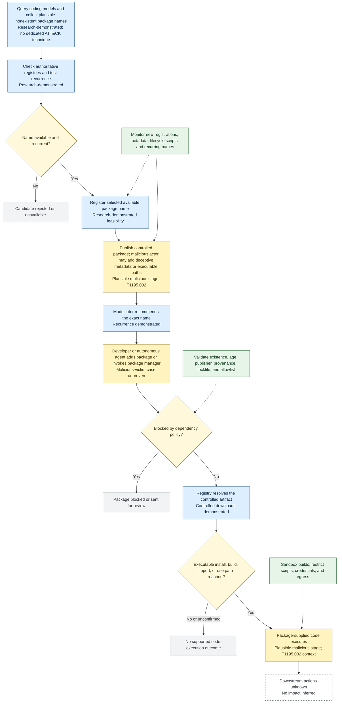

## Executive summary

**Slopsquatting** is a software-supply-chain attack pattern in which an adversary identifies a plausible but nonexistent package name generated by an AI coding system, registers that name in a package registry, and waits for a developer or autonomous coding agent to retrieve the attacker-controlled package. The underlying **package hallucination is a model failure, not by itself an attack or compromise**.

The mechanism predates the term. Vulcan Cyber demonstrated in March 2023 that ChatGPT could invent a package and that registration of the invented name could cause future users to retrieve controlled code ([Vulcan Cyber, 2023-03-28](https://vulcan.io/blog/ai-hallucinations-package-risk/)). In March 2025, Seth Larson described this exploitation pattern as **slopsquatting**, crediting Andrew Nesbitt with the name ([Larson, 2025-03-05](https://sethmlarson.dev/slopsquatting)).

**HalluSquatting**, also written *hallusquatting*, is used in later vendor reporting for substantially the same hallucination-plus-registration mechanism ([ReversingLabs, 2025](https://www.reversinglabs.com/blog/hallucinated-package-names-fuel-new-software-supply-chain-risk); [Trend Micro, 2025](https://www.trendmicro.com/en_us/research/25/e/hallusquatting.html)). Reviewed public usage does not establish a consistent additional prerequisite, narrower scope, or separate lifecycle. The most defensible classification is therefore:

> **HalluSquatting is an alternative label or near-synonym for slopsquatting, not a demonstrated independent attack class.**

Some writers may use HalluSquatting to emphasize the name-squatting step, but that distinction is not standardized or consistent enough to establish a subtype.

The strongest quantitative study evaluated 16 code-generating models using 576,000 Python and JavaScript samples. It reported approximately 2.23 million package references, of which 440,445—**19.7% within that experiment**—were classified as hallucinated, representing 205,474 distinct nonexistent names ([Spracklen et al., first submitted 2024-06-14](https://arxiv.org/abs/2406.10279); [USENIX Security 2025](https://www.usenix.org/conference/usenixsecurity25/presentation/spracklen)). These are controlled experimental measurements, **not exploitation, infection, or production-compromise rates**.

Public evidence establishes package hallucination, recurrence, claimable names, researcher-controlled registrations, and downloads. This review did **not** identify a public primary source conclusively documenting the complete malicious chain: hallucination before registration, adversarial selection because of that hallucination, victim acquisition because of an AI recommendation, malicious execution, and resulting impact.

## Terminology comparison

| Concept | Source of target name | Core mechanism | Attacker requirement | Assessment |
|---|---|---|---|---|
| **Package hallucination** | AI invents or misidentifies a dependency | Nonexistent package appears in generated code, commands, manifests, or documentation | None | Underlying model failure; not itself an attack |
| **Slopsquatting** | Repeatable hallucinated name | Adversary claims the name so later recommendations resolve to attacker-controlled content | Register and publish the package | Common label for exploiting package hallucinations |
| **HalluSquatting** | Same hallucinated-name condition | Hallucination followed by package-name squatting | Substantially the same registration and publication steps | Alternative label or near-synonym; not consistently defined as a subtype |
| **Dependency confusion** | Existing private or internal dependency name | An unintended public package wins or contaminates resolution | Discover the private name and publish it publicly | Distinct initial condition and resolver-based path |
| **Typosquatting** | Misspelling or visual variant of a real package | Victim requests a similar but incorrect name | Register likely typo or look-alike | Distinct cause, although a hallucinated name may resemble a real package |
| **Starjacking** | Misleading association with a popular repository | Package appears connected to an unrelated established project | Supply misleading repository metadata | Credibility amplifier; neither a prerequisite nor an equivalent attack |

## Key research findings

- The security-relevant sequence is **hallucination → registration → retrieval → execution → impact**. Evidence for an earlier stage does not prove subsequent stages.
- Vulcan Cyber’s 2023 demonstration established the core feasibility: a model can recommend a nonexistent package, and registration can make that exact name resolve to controlled content ([Vulcan Cyber, 2023-03-28](https://vulcan.io/blog/ai-hallucinations-package-risk/)).
- The term **slopsquatting** was publicly defined or popularized by Seth Larson in March 2025, with credit to Andrew Nesbitt ([Larson, 2025-03-05](https://sethmlarson.dev/slopsquatting)).
- Reviewed uses of **HalluSquatting** do not consistently distinguish it from slopsquatting. It is best treated as a synonym or near-synonym pending a stable, sourced technical definition ([ReversingLabs, 2025](https://www.reversinglabs.com/blog/hallucinated-package-names-fuel-new-software-supply-chain-risk); [Trend Micro, 2025](https://www.trendmicro.com/en_us/research/25/e/hallusquatting.html)).
- Spracklen et al. produced 576,000 Python and JavaScript samples across 16 models and classified 440,445 of approximately 2.23 million package references—19.7%—as hallucinated, covering 205,474 distinct nonexistent names ([paper PDF](https://arxiv.org/pdf/2406.10279)).
- The study reported aggregate rates of approximately 21.7% for the tested open/open-weight models and 5.2% for the tested commercial models. These values depend on the selected models, versions, prompts, settings, languages, registry snapshots, and classification method; they should not be generalized to all AI coding use ([Spracklen et al.](https://arxiv.org/abs/2406.10279)).
- Approximately 58% of names in the study’s applicable repeatability analysis recurred; approximately 43% of that repeatable set appeared in all ten applicable runs; and approximately 39% of hallucinated names appeared across more than one model. This supports predictability and registration feasibility, not victim-compromise probability ([Spracklen et al.](https://arxiv.org/pdf/2406.10279)).
- Lasso Security registered the researcher-controlled name `huggingface-cli` and observed downloads, establishing that a planted hallucinated name could receive real registry traffic ([Lasso Security, 2024-03-28](https://www.lasso.security/blog/ai-package-hallucinations); [The Register, 2024-03-28](https://www.theregister.com/2024/03/28/ai_bots_hallucinate_software_packages/)).
- Those downloads do not prove human acceptance, package execution, compromise, or harm. Registry counters may include mirrors, scanners, bots, caches, dependency probes, retries, or publicity-driven traffic.
- Direct quantitative evidence is strongest for **Python/PyPI and JavaScript/npm**. Maven, NuGet, RubyGems, crates.io, Go modules, Packagist, container registries, and extension marketplaces may be structurally susceptible, but Python/npm percentages cannot be projected onto them without ecosystem-specific studies.
- A malicious package might execute through npm lifecycle scripts, Python source-build or build-backend behavior, code reached on import, generated example code, tests, application startup, or a secondary downloader. Merely installing a package does not prove any such execution path was reached ([npm scripts](https://docs.npmjs.com/cli/using-npm/scripts); [pip build systems](https://pip.pypa.io/en/stable/reference/build-system/pyproject-toml/)).
- Slopsquatting differs from dependency confusion because it generally starts with a newly invented name, not a known private dependency, and ordinary exact-name public resolution may suffice; dependency confusion depends on namespace or resolver ambiguity involving an existing internal name ([Birsan, 2021-02-09](https://medium.com/@alex.birsan/dependency-confusion-4a5d60fec610)).
- Starjacking could make a hallucinated package appear associated with a popular project, but it is an optional deception method rather than part of slopsquatting’s definition ([Checkmarx, 2022-06-09](https://checkmarx.com/blog/starjacking-making-your-new-open-source-package-popular-in-a-snap/)).
- MITRE ATT&CK has no technique specifically for LLM package hallucination. T1195.002, **Compromise Software Supply Chain**, conditionally describes malicious package distribution, not the hallucination itself ([MITRE ATT&CK T1195.002](https://attack.mitre.org/techniques/T1195/002/)).
- MITRE ATLAS supports tactic-level mappings to AML.TA0002, **Reconnaissance**, and AML.TA0003, **Resource Development**. No verified ATLAS technique precisely represents eliciting hallucinated dependency names or claiming the corresponding package-registry namespace ([MITRE ATLAS AML.TA0002](https://atlas.mitre.org/tactics/AML.TA0002); [MITRE ATLAS AML.TA0003](https://atlas.mitre.org/tactics/AML.TA0003)).
- Provenance and trusted publishing can authenticate a publishing or build path. They do not prove that a newly claimed package name is legitimate or that the package behavior is safe ([PyPI Trusted Publishers](https://docs.pypi.org/trusted-publishers/); [npm provenance](https://docs.npmjs.com/generating-provenance-statements)).

## MITRE ATT&CK mapping

### MITRE mapping result

Summary: Medium confidence; the scenario supports the Initial Access tactic and a conditional T1195.002 technique mapping, while malicious compromise remains unverified.

Tactics:

| ATT&CK ID | Tactic | Confidence | Rationale |
|---|---|---|---|
| TA0001 | Initial Access | Medium | The attacker’s objective would be to obtain initial execution or access by publishing a package under a repeatedly hallucinated name and waiting for a developer or coding agent to install it. Public evidence establishes feasibility and controlled downloads, not completed malicious compromise. |

Techniques:

| ATT&CK ID | Technique | Confidence | Evidence | Notes |
|---|---|---|---|---|
| T1195.002 | Compromise Software Supply Chain | Medium | Research demonstrates recurring AI-generated nonexistent package names, registration of those names, and downloads of researcher-controlled packages. | Applies conditionally when an adversary uses the registered package to distribute malicious install, build, or import behavior. The evidence does not establish an in-the-wild malicious package or completed compromise chain. |

Assumptions And Gaps:

* ATT&CK has no technique specific to LLM package hallucination or slopsquatting.
* Package-name recurrence, registration feasibility, and controlled downloads have been observed; deceptive metadata and malicious install, build, or import behavior remain hypothetical attacker stages in the reviewed evidence.
* No reviewed primary evidence confirms payload execution, credential theft, command and control, persistence, lateral movement, exfiltration, or impact. Those mappings are therefore omitted.

## Attack flow

### Attack flow result

Summary: Evidence-backed Slopsquatting/HalluSquatting flow using MITRE ATT&CK where applicable. Overall confidence is medium because research demonstrates the mechanism and controlled retrieval, but not an end-to-end malicious in-the-wild compromise.

Key evidence boundaries:

- Model querying, nonexistent-name discovery, recurrence measurement, registry availability checks, controlled registration, and controlled downloads have research support.
- Deceptive metadata, malicious install hooks, payload execution, and post-execution activity are plausible attacker stages but were not established as a completed public malicious incident in the reviewed primary evidence.
- A package’s appearance in an AI response after registration does not by itself establish why the model produced it; retrieval augmentation or later corpus exposure may reverse the assumed chronology.
- No compromise impact should be inferred merely from registration or download counts.

## Assessment and gaps

### Mechanics and prerequisites

A viable attack requires all of the following:

1. **A plausible package hallucination.** The model invents a name, confuses import and distribution names, recalls an obsolete or private dependency, crosses package ecosystems, or constructs a conventionally plausible identifier without authoritative validation.
2. **An available namespace.** The exact name is unregistered, permitted by registry rules, and not protected or reserved.
3. **Predictability.** The name recurs often enough—or in sufficiently valuable contexts—to make registration attractive.
4. **Attacker-controlled publication.** The adversary registers the name and publishes an artifact.
5. **A delivery path.** A person copies the generated command, accepts an IDE completion, or permits an agent to edit a manifest or invoke a package manager.
6. **Successful resolution.** The package manager resolves the exact generated name to the controlled artifact.
7. **A reached execution path.** Package code executes during installation, source building, import, tests, application startup, or generated sample use.
8. **Useful privilege or access.** Material impact depends on credentials, network access, source repositories, signing keys, cloud tokens, or other assets being available to the executing context.

Risk increases substantially when an autonomous agent can both **introduce a dependency and run the package manager** without a separate approval boundary.

### Likely attacker workflow

A scalable but only partially demonstrated workflow would be:

1. Query popular coding models using realistic programming tasks.
2. Extract imports, package-manager commands, manifests, Dockerfiles, workflows, and documentation references.
3. Compare extracted names with authoritative registries.
4. Repeat prompts across models, temperatures, languages, and phrasings.
5. Rank available names by recurrence, cross-model appearance, task popularity, and likely victim value.
6. Register high-scoring names.
7. Add credible descriptions, versions, copied documentation, misleading repository links, or provenance-like metadata.
8. Place code in install, build, import, or generated-use paths.
9. Monitor downloads, callbacks, or other telemetry.
10. Replace suspended packages or repeat the process with other names.

Research supports steps 1–6 and controlled retrieval. Steps 7–10 are plausible malicious operations and should not be presented as observed without package, publisher, registry, or victim evidence.

### Affected ecosystems

#### Directly measured

- **Python / PyPI**
- **JavaScript / npm**

The Spracklen et al. figures apply to these ecosystems and the study’s experimental design.

#### Structurally susceptible but not equivalently measured

- Maven Central and other Java repositories
- NuGet
- RubyGems
- crates.io
- Go modules
- Composer/Packagist
- Container registries
- IDE and editor extension marketplaces

Susceptibility varies with namespace rules, publication friction, package-manager behavior, signing and provenance support, lifecycle hooks, organization scopes, source-build behavior, and resolver policy.

### Evidence and incident classification

| Evidence | Supports | Does not support |
|---|---|---|
| Vulcan Cyber 2023 demonstration | Models can invent packages; claiming a name can redirect future resolution | Independent criminal campaign or victim compromise |
| Lasso Security 2024 experiment | Recurrence, researcher-controlled registration, and real download activity | Malicious intent, human installation, execution, or harm |
| Spracklen et al. 2024–2025 | Large-scale hallucination prevalence and recurrence under controlled conditions | Production compromise rate or number of attacker-owned names |
| Malicious package happens to match an AI output | Correlation worth investigating | Proof the attacker selected the name because of a hallucination |
| Victim reports that an AI suggested an occupied package | Potential delivery evidence | Attacker intent, code execution, or impact |
| Model output predates hostile registration, followed by AI-driven acquisition and malicious execution | Strong causal support | Still requires artifact, publisher, victim, and execution validation |

A high-confidence incident would ideally establish that:

- the name was unregistered when first hallucinated;
- the model output preceded hostile registration;
- the registrant targeted that output or an equivalent hallucination corpus;
- the artifact was malicious;
- a victim obtained it because of an AI recommendation;
- executable code ran; and
- resulting effects were documented.

No public primary source satisfying that complete chain was identified in the reviewed material.

### Relationship to adjacent attacks

| Dimension | Slopsquatting/HalluSquatting | Dependency confusion | Typosquatting | Starjacking |
|---|---|---|---|---|
| Target-name source | AI-invented or invalid dependency | Existing private/internal dependency | Variant of a real package | Any package requiring false credibility |
| Victim request | Usually exact AI-supplied name | Intended internal name | Mistyped or visually confused name | Not inherently changed |
| Resolver requirement | Ordinary public resolution may suffice | Public/private precedence or namespace ambiguity | Resolution of the wrong name | Not the core mechanism |
| Attacker input | Model-output sampling | Internal manifests, errors, logs, or leakage | Popular names and typo patterns | Popular repositories and metadata |
| Potential overlap | Core pattern | AI might reveal or invent a private-looking name | Hallucination may resemble a real package | May decorate a hallucinated package |
| Distinguishing cause | Trust in unsupported AI output | Resolver chooses an unintended public component | Human spelling or visual error | Misleading popularity/source association |

### Detection opportunities

#### Dependency introduction

Flag or require review for:

- Dependencies that were absent from the authoritative registry when the AI session or pull request began.
- Packages first published after a development or agent session started.
- New imports without a corresponding approved dependency.
- Very recent packages with one maintainer, one release, or limited history.
- Copied descriptions, unrelated repository URLs, or source/distribution mismatch.
- New dependencies containing lifecycle, build, or installation hooks.
- AI-generated code and a new manifest entry introduced together.
- Unpinned versions, missing lockfiles, or unexplained lockfile drift.
- Resolution outside approved registries, scopes, or controlled mirrors.

Package age is only a signal: new legitimate projects create false positives, while older packages can be taken over.

#### CI and build environments

Monitor for:

- Package-manager child processes and shell execution during installation.
- Unexpected source builds.
- Outbound connections during dependency installation.
- Access to cloud metadata services.
- Reads of CI tokens, registry credentials, SSH material, signing keys, browser profiles, or credential stores.
- Source modifications outside expected dependency directories.
- Shell-profile or persistence changes.
- Unexpected executable creation or secondary downloads.

#### Package registries

Useful registry-side signals include:

- New names matching recurrent hallucination corpora.
- Names appearing across multiple models.
- Bulk registration of plausible developer-oriented names.
- Copied metadata or unrelated repository links.
- First releases containing lifecycle or build hooks.
- Source/distribution discrepancies.
- Publisher clusters, shared infrastructure, or synchronized publication.

A hallucination-corpus match must remain a triage signal, not an automatic malicious verdict: a legitimate developer may independently choose the same plausible name.

### Defensive checklist

#### Developers and reviewers

- [ ] Verify every AI-suggested dependency in the authoritative registry.
- [ ] Confirm the exact ecosystem, distribution name, import name, and version.
- [ ] Review publication date, release history, maintainers, publisher identity, source repository, and provenance.
- [ ] Inspect installation and build hooks in the distributed artifact—not only the linked repository.
- [ ] Prefer previously approved organizational dependencies.
- [ ] Require human review for every new top-level dependency.
- [ ] Pin exact versions and commit lockfiles.
- [ ] Use package hashes where supported; pip documents hash-checking mode for secure installs ([pip secure installs](https://pip.pypa.io/en/stable/topics/secure-installs/)).
- [ ] Treat generated shell and package-manager commands as untrusted.
- [ ] Record when a dependency was introduced or suggested by an AI tool.
- [ ] Do not give coding agents production credentials or unnecessarily broad local access.

#### CI/CD and engineering organizations

- [ ] Route dependency resolution through controlled mirrors or proxies.
- [ ] Enforce approved-package, publisher, or organization-scope policies.
- [ ] Alert on new manifest and lockfile entries.
- [ ] Compare publication timestamps with PR, commit, and agent-session timestamps.
- [ ] Install dependencies in ephemeral, isolated workers.
- [ ] Keep credentials and signing material out of dependency-installation stages.
- [ ] Restrict build egress where practical.
- [ ] Disable or constrain lifecycle scripts where compatible, such as npm’s `ignore-scripts` control ([npm configuration](https://docs.npmjs.com/cli/using-npm/config#ignore-scripts)).
- [ ] Prefer binary artifacts where appropriate to reduce source-build execution, while still validating artifact trust ([pip `--only-binary`](https://pip.pypa.io/en/stable/cli/pip_install/#cmdoption-only-binary)).
- [ ] Generate and compare SBOMs.
- [ ] Require provenance or attestations for sensitive pipelines.
- [ ] Prevent autonomous agents from merging dependency changes or invoking installers without approval.
- [ ] Preserve prompts, agent actions, manifest edits, resolutions, and build logs for causal reconstruction.

#### Package registries

- [ ] Require or strongly encourage publisher MFA.
- [ ] Support OIDC-based trusted publishing and short-lived credentials.
- [ ] Prominently show first-publication dates, publisher identity, ownership changes, and provenance.
- [ ] Analyze first releases for install hooks, obfuscation, source/artifact mismatch, and copied metadata.
- [ ] Add friction or review for suspicious bulk name registrations.
- [ ] Provide an abuse-reporting category for hallucinated-name capture.
- [ ] Preserve registration and artifact records after suspension for forensic analysis.
- [ ] Correlate registrations with high-frequency hallucination corpora without automatically classifying matches as malicious.
- [ ] Avoid reserving every hallucinated name: corpora are enormous, unstable, model-dependent, and may overlap legitimate future projects.

PyPI Trusted Publishing, npm Trusted Publishers, PyPI attestations, PEP 740, and npm provenance can reduce long-lived credential risk and establish artifact origin ([PyPI Trusted Publishers](https://docs.pypi.org/trusted-publishers/); [PyPI attestations](https://docs.pypi.org/attestations/); [PEP 740](https://peps.python.org/pep-0740/); [npm Trusted Publishers](https://docs.npmjs.com/trusted-publishers)). They do not establish that package behavior is benign.

#### AI coding-tool and model vendors

- [ ] Ground package recommendations in current authoritative registry data.
- [ ] Validate the exact name, ecosystem, and version before displaying installation commands.
- [ ] Revalidate immediately before execution because registration or ownership may change after generation.
- [ ] Clearly label hypothetical, unavailable, or unverified dependencies.
- [ ] Display registry links, source links, package age, publisher, and provenance.
- [ ] Require confirmation before editing manifests or invoking package managers.
- [ ] Support enterprise dependency and publisher allowlists.
- [ ] Preserve attribution indicating which model output or agent action introduced a dependency.
- [ ] Evaluate models specifically for fabricated imports and packages.
- [ ] Penalize unsupported dependency generation during training and evaluation.
- [ ] Treat model confidence as unrelated to proof of package existence.
- [ ] Run agent-initiated installations in restricted, secret-free sandboxes.
- [ ] Expose dependency actions rather than hiding them inside autonomous execution.
- [ ] Detect names that were absent when proposed but appeared before execution.

Retrieval-augmented generation can reduce unsupported invention but does not eliminate the risk: indexes can be stale, names can be registered between lookup and execution, and retrieval can surface packages that already exist but are malicious.

### Limitations and open questions

- **Terminology is informal.** Neither Slopsquatting nor HalluSquatting is standardized by MITRE, CISA, package registries, or a formal standards organization.
- **HalluSquatting’s chronology is unclear.** This review did not verify a dated use predating 2023’s package-hallucination reporting. Claims that a particular vendor coined the term require archived evidence.
- **Measurements are prompt-dependent.** Results vary with model version, sampling settings, language, task, prompt phrasing, and registry snapshot.
- **Nonexistence can be misclassified.** A name absent from a public registry may be private, local, deleted, renamed, or valid in another ecosystem.
- **Chronology can reverse.** A model may begin recommending a name after it is registered or indexed; that is not evidence that an attacker selected the name because of an earlier hallucination.
- **Attribution is difficult.** An attacker and a model can independently choose the same plausible name.
- **Download counts are ambiguous.** They may include mirrors, scanners, bots, caches, retries, and research-publicity traffic.
- **Installation is not execution.** Execution is not necessarily compromise, and compromise does not necessarily produce measurable impact.
- **Cross-ecosystem generalization is unsupported.** Python/npm findings should not be reused as rates for Maven, NuGet, RubyGems, crates.io, Go, or other ecosystems.
- **Name reservation can cause denial-of-namespace problems.** Reserving generated names may obstruct legitimate future projects.
- **Provenance has limited semantics.** It can authenticate where and how an artifact was produced without establishing that its behavior is safe.
- **Agentic coding increases exposure.** A chatbot displaying a command poses less immediate risk than an agent that can edit manifests, install packages, execute code, and access credentials.
- **Logging is often insufficient.** Without model-output, action, registry, and build timestamps, the causal chain may be impossible to establish.
- **No verified prevalence estimate exists for successful malicious slopsquatting.** Current studies measure hallucination and recurrence—not the population of adversary-controlled names or compromised systems.

## Sources

All resources were accessed or identified as publicly available by **2026-10-06**.

1. Vulcan Cyber, “Can you trust ChatGPT’s package recommendations?” — **2023-03-28** — https://vulcan.io/blog/ai-hallucinations-package-risk/
2. Lasso Security, “AI Package Hallucinations” — **2024-03-28** — https://www.lasso.security/blog/ai-package-hallucinations
3. Thomas Claburn, *The Register*, “AI hallucinates software packages and devs download them” — **2024-03-28** — https://www.theregister.com/2024/03/28/ai_bots_hallucinate_software_packages/
4. Joseph Spracklen et al., “We Have a Package for You! A Comprehensive Analysis of Package Hallucinations by Code Generating LLMs” — **arXiv first submitted 2024-06-14** — https://arxiv.org/abs/2406.10279
5. Spracklen et al., paper PDF — **2024 preprint; published at USENIX Security 2025** — https://arxiv.org/pdf/2406.10279
6. USENIX Security 2025 archival presentation page — **2025** — https://www.usenix.org/conference/usenixsecurity25/presentation/spracklen
7. Seth Michael Larson, “Slopsquatting” — **2025-03-05** — https://sethmlarson.dev/slopsquatting
8. ReversingLabs, “Hallucinated package names fuel new software supply chain risk” — **2025; exact page date not independently established** — https://www.reversinglabs.com/blog/hallucinated-package-names-fuel-new-software-supply-chain-risk
9. Trend Micro Research, “HalluSquatting” — **2025; exact page date not independently established** — https://www.trendmicro.com/en_us/research/25/e/hallusquatting.html
10. Alex Birsan, “Dependency Confusion: How I Hacked Into Apple, Microsoft and Dozens of Other Companies” — **2021-02-09** — https://medium.com/@alex.birsan/dependency-confusion-4a5d60fec610
11. Checkmarx, “StarJacking—Making Your New Open Source Package Popular in a Snap” — **2022-06-09** — https://checkmarx.com/blog/starjacking-making-your-new-open-source-package-popular-in-a-snap/
12. PyPI, “Trusted Publishers” — **living documentation; accessed 2026-10-06** — https://docs.pypi.org/trusted-publishers/
13. PyPI, “Digital Attestations” — **living documentation; accessed 2026-10-06** — https://docs.pypi.org/attestations/
14. Python Packaging Authority, PEP 740, “Index support for digital attestations” — **living standard; accessed 2026-10-06** — https://peps.python.org/pep-0740/
15. PyPI, “JSON API” — **living documentation; accessed 2026-10-06** — https://docs.pypi.org/api/json/
16. pip, “Secure installs” — **living documentation; accessed 2026-10-06** — https://pip.pypa.io/en/stable/topics/secure-installs/
17. pip, `pip install` binary-selection documentation — **accessed 2026-10-06** — https://pip.pypa.io/en/stable/cli/pip_install/#cmdoption-only-binary
18. pip, `pyproject.toml` build-system documentation — **accessed 2026-10-06** — https://pip.pypa.io/en/stable/reference/build-system/pyproject-toml/
19. npm, “Trusted publishers” — **living documentation; accessed 2026-10-06** — https://docs.npmjs.com/trusted-publishers
20. npm, “Generating provenance statements” — **living documentation; accessed 2026-10-06** — https://docs.npmjs.com/generating-provenance-statements
21. npm, “Scripts” — **living documentation; accessed 2026-10-06** — https://docs.npmjs.com/cli/using-npm/scripts
22. npm, `ignore-scripts` configuration — **accessed 2026-10-06** — https://docs.npmjs.com/cli/using-npm/config#ignore-scripts
23. npm, `npm view` — **living documentation; accessed 2026-10-06** — https://docs.npmjs.com/cli/commands/npm-view
24. npm Registry API documentation — **living documentation; accessed 2026-10-06** — https://github.com/npm/registry/blob/main/docs/REGISTRY-API.md
25. CISA, “Defending Against Software Supply Chain Attacks” — **accessed 2026-10-06** — https://www.cisa.gov/resources-tools/resources/defending-against-software-supply-chain-attacks
26. CISA, “Secure by Design” — **living guidance; accessed 2026-10-06** — https://www.cisa.gov/securebydesign
27. MITRE ATT&CK, T1195.002, “Compromise Software Supply Chain” — **living knowledge base; accessed 2026-10-06** — https://attack.mitre.org/techniques/T1195/002/
28. MITRE CWE-1357, “Reliance on Insufficiently Trustworthy Component” — **living knowledge base; accessed 2026-10-06** — https://cwe.mitre.org/data/definitions/1357.html
29. MITRE ATLAS, AML.TA0002, “Reconnaissance” — **living knowledge base; accessed 2026-10-06** — https://atlas.mitre.org/tactics/AML.TA0002
30. MITRE ATLAS, AML.TA0003, “Resource Development” — **living knowledge base; accessed 2026-10-06** — https://atlas.mitre.org/tactics/AML.TA0003