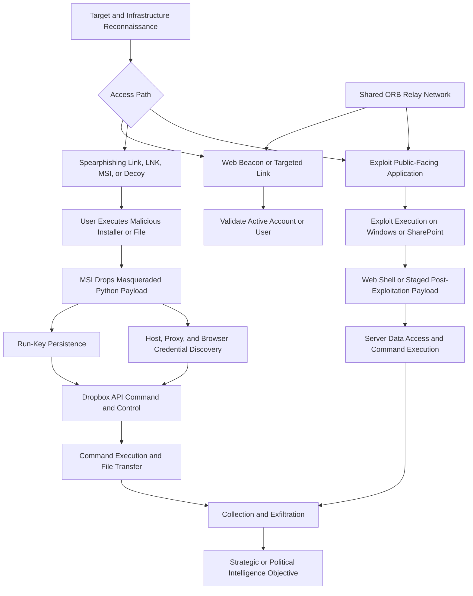

## Executive Summary

Zirconium is Microsoft's historical name for a China-linked espionage cluster
commonly associated with APT31 and Judgment Panda. Microsoft now tracks this
activity as Violet Typhoon. MITRE ATT&CK records the cluster as `G0128` and
associates ZIRCONIUM with APT31 and Violet Typhoon. These names substantially
overlap, but public vendors may divide activity differently and the labels do
not identify a verified organizational unit.

The actor targets people and organizations with strategic political, military,
foreign-policy, research, media, financial, and health information. Documented
victims and targets include government and former government personnel,
political campaign associates, international-affairs organizations, academics,
NGOs, think tanks, higher education, defense-related organizations, media, and
security researchers across the United States, Europe, and East Asia.

The strongest evidence supports espionage, credential theft, account
compromise, reconnaissance, persistent access, and collection of strategically
valuable information. Publicly documented access paths include web-beacon
reconnaissance, spearphishing links, malicious GitHub-hosted MSI packages,
masqueraded Python payloads, exploitation of Windows and internet-facing
SharePoint vulnerabilities, and operational relay box (ORB) infrastructure.
Observed follow-on behaviors include Run-key persistence, browser credential
access, host and proxy discovery, Dropbox API command and control, file
transfer, web-shell deployment, and exfiltration.

> [!IMPORTANT]
> Treat Zirconium, APT31, and Violet Typhoon as overlapping intelligence
> constructs, not universal attribution labels. ORB infrastructure is often
> shared, and Microsoft's 2025 SharePoint reporting distinguishes Violet
> Typhoon from Linen Typhoon and Storm-2603. Shared vulnerabilities,
> infrastructure, or timing do not make those actors equivalent.

## Scope and Method

Research was current through September 25, 2026. The Threat Researcher agent
prioritized Microsoft Threat Intelligence, Microsoft actor-naming data, MITRE
ATT&CK, Check Point Research, Zscaler ThreatLabZ, Mandiant, Google Threat
Analysis Group, and government reporting. The latest actor-specific operation
substantiated in the reviewed primary sources is Microsoft's July 2025
reporting on exploitation of on-premises SharePoint.

User-provided text, public telemetry, schemas, samples, and indicators are
treated as untrusted until corroborated. Indicators are historical
investigation pivots rather than permanent block entries. This report does not
claim query execution, detection coverage, or optimization gains. Validate
tables, columns, retention, and connector coverage in the target Microsoft
Defender XDR or Microsoft Sentinel tenant before implementation.

The report distinguishes actor-level behavior from campaign-specific behavior.
It does not assign ransomware or destructive impact to Violet Typhoon based on
Storm-2603 activity, and it does not treat multi-tenant ORB infrastructure as
exclusive actor infrastructure.

## Actor and Alias Profile

| Attribute | Assessment |
|---|---|
| Assessed origin | China-linked cyberespionage activity |
| Current Microsoft name | Violet Typhoon |
| Historical Microsoft name | Zirconium or ZIRCONIUM |
| ATT&CK record | ZIRCONIUM `G0128` |
| Common industry names | APT31, Judgment Panda, Chameleon, and WebFans |
| Primary motivation | Strategic, political, military, foreign-policy, and technical intelligence collection |
| Common access model | Targeted links, web beacons, malicious installers, hosted payloads, and exploitation of exposed applications |
| Common execution model | MSI execution, Python-compiled payloads, staged exploit code, command shells, and server-side web shells |
| Common infrastructure | Purchased domains, legitimate web services, cloud storage, compromised network devices, VPS relays, and ORB networks |
| Attribution confidence | High for Microsoft and ATT&CK alias relationships; variable for individual campaigns and infrastructure |

### Alias and Boundary Guide

| Name | Defensible Interpretation |
|---|---|
| Violet Typhoon | Microsoft's current name for activity historically tracked as Zirconium |
| Zirconium or ZIRCONIUM | Historical Microsoft name and the primary name of ATT&CK group `G0128` |
| APT31 | Government and industry name for substantially overlapping activity |
| Judgment Panda | Industry name commonly associated with APT31 and Zirconium |
| Chameleon or WebFans | Other names listed in Microsoft's current actor-name mapping |
| Jian | APT31-attributed exploit implementation associated with `CVE-2017-0005`, not an actor alias |
| FLORAHOX or ORB2 | Multi-tenant China-nexus relay infrastructure associated with APT31 activity, not proof of one actor |
| Linen Typhoon or APT27 | Separate Microsoft-tracked actor that also exploited SharePoint vulnerabilities in 2025 |
| Storm-2603 | Separate China-based actor associated by Microsoft with ransomware during the 2025 SharePoint exploitation period |
| Other China-nexus actors | Separate unless a source directly establishes a relationship; shared relays are insufficient |

## Target Profile

### Sectors and Organizations

| Target Category | Strategic Value |
|---|---|
| Government and public sector | Policy, diplomatic, military, and administrative intelligence |
| Political campaigns and associates | Election strategy, personnel, communications, and foreign-policy insight |
| International-affairs organizations | Geopolitical analysis, contacts, and policy development |
| NGOs and think tanks | Regional expertise, advocacy plans, and government relationships |
| Universities and academics | Research, policy expertise, technology, and influential networks |
| Defense, military, and aerospace | Strategic capabilities, research, personnel, and planning |
| Media organizations | Sources, unpublished reporting, and political or regional insight |
| Financial organizations | Economic intelligence and access to strategically relevant communications |
| Health-related organizations | Public-health policy, research, and sensitive organizational information |
| Security and vulnerability researchers | Exploit knowledge, tooling, and trusted access to technical communities |
| Internet-facing organizations | Exploitable services that provide an entry point to strategic networks |

Microsoft reported that the 2020 Zirconium campaign targeted individuals
associated with both major US presidential campaigns indirectly, prominent
international-affairs figures, academics at more than 15 universities, and
accounts associated with 18 international-affairs and policy organizations.
Microsoft's 2025 profile also identifies former government and military
personnel, NGOs, think tanks, higher education, digital and print media,
financial organizations, and health-related sectors in the United States,
Europe, and East Asia.

### Targeted Roles

Operators favor people who can provide political or foreign-policy insight,
access to organizational email, sensitive research, exploit-development
knowledge, privileged systems, or trusted relationships. High-value roles
include current and former government personnel, military staff, campaign
associates, policy experts, academics, journalists, administrators, and
security researchers.

Role-aware targeting matters more than a sector label alone. An academic,
former official, or journalist may be selected for access to a trusted network
or private communications rather than for the organization that employs them.

## Motivation and Objectives

| Objective | Evidence-Based Assessment |
|---|---|
| Strategic intelligence | High-confidence objective across government, military, policy, academic, and civil-society targeting |
| Political intelligence | Supported by targeting of election-associated people and international-affairs organizations |
| Credential and account access | Supported by reconnaissance beacons, browser credential access, and targeted account activity |
| Technical intelligence | Supported by interest in security research, exploit knowledge, and strategic technology |
| Persistent access | Supported by Run-key persistence, server exploitation, web shells, and relay infrastructure |
| Local data collection | Supported by file upload, command-result collection, and local-system data access |
| Ransomware or financial theft | Not established as a general Violet Typhoon objective in reviewed sources |
| Destructive impact | Not established as a general Violet Typhoon objective in reviewed sources |

Microsoft's 2025 SharePoint reporting attributes ransomware-associated activity
to Storm-2603, not Violet Typhoon. Detection content should preserve this
distinction rather than using a shared vulnerability to assign a destructive
objective to Zirconium.

## Campaign Timeline

| Date | Evidence-Backed Development |
|---|---|
| At least 2014 | Check Point assesses that APT31 obtained and reconstructed the Equation Group EpMe exploit later associated with `CVE-2017-0005` |
| 2015 onward | Microsoft's retrospective describes Violet Typhoon espionage against former government and military personnel, NGOs, think tanks, universities, media, finance, and health sectors |
| 2015 to 2017 | The APT31-attributed Jian exploit was used before Microsoft patched `CVE-2017-0005` in March 2017 |
| 2019 | Related activity used LNK delivery, GitHub-hosted payloads, deceptive file extensions, and malicious MSI execution |
| March to September 2020 | Microsoft observed thousands of Zirconium attacks and nearly 150 compromises during election-related targeting |
| August 2020 | Zscaler observed COVID-19 vaccine-themed delivery using attacker-controlled GitHub accounts, malicious MSI packages, and Dropbox-based command and control |
| February 2021 | Check Point published its Jian reconstruction and exploit-lineage analysis |
| 2023 to 2024 | Mandiant documented growing use of shared ORB networks by China-nexus espionage actors and linked APT31 reporting to ORB2 or FLORAHOX |
| July 2025 | Microsoft observed Violet Typhoon, Linen Typhoon, and Storm-2603 exploiting on-premises SharePoint vulnerabilities and kept the clusters analytically separate |
| 2026 research cutoff | Reviewed sources do not substantiate a distinct new 2026 Violet Typhoon campaign |

## Infection and Attack Flow

The flow combines source-supported branches from separate campaigns. It is not
one universal Zirconium intrusion sequence.

### Stage 1: Reconnaissance and Target Validation

Operators select strategically valuable people and organizations, purchase or
prepare infrastructure, and use targeted links or web beacons to determine
whether an account or recipient is active. Microsoft observed beacon-based
reconnaissance in 2020 before or alongside credential and malware targeting.

ORB networks can conceal the true source of reconnaissance and exploitation.
Mandiant describes these networks as changing, often compromised or rented,
and potentially multi-tenant. A relay IP is therefore evidence of an access
path, not exclusive actor ownership.

### Stage 2: Delivery and Initial Access

Documented delivery includes spearphishing links, LNK files, deceptive GitHub
objects, malicious MSI packages, and public-facing exploitation. In the 2020
Zscaler case, vaccine-themed lures pointed to payloads with `.pdf` or `.png`
extensions even though the content supported executable delivery.

The Jian branch used a multistage exploit associated with `CVE-2017-0005` for
local privilege escalation. The 2025 branch exploited exposed on-premises
SharePoint servers. These exploit chains are campaign-specific and should not
be added to every Zirconium incident.

### Stage 3: Execution and Persistence

The 2020 delivery chain used `msiexec.exe` to run malicious installers that
dropped PyInstaller-compiled executables under plausible names such as
`OneDrive.exe` or `siHostx64.exe`. A Run-key value named
`Dropbox Update Setup` provided user-context persistence.

Jian decrypted embedded stages, loaded shellcode and portable executable
content, and exploited the Windows kernel. SharePoint exploitation produced
server-side execution and web-shell activity. The exact post-exploitation
sequence differs by vulnerability and actor branch.

### Stage 4: Discovery, Credential Access, and Command and Control

The Python payload collected hostname, username, processor architecture,
system time, and proxy settings. It accessed browser credential stores and used
Dropbox APIs for bidirectional command exchange, upload, and download. AES
encryption protected command-and-control data in the analyzed implementation.

For SharePoint, defenders should investigate web-shell creation, `w3wp.exe`
child processes, encoded commands, ASP.NET machine-key exposure, and follow-on
network activity. Microsoft observed several actors in the same exploitation
period, so procedure and infrastructure evidence must support attribution.

### Stage 5: Collection and Exfiltration

Documented implants can upload local files and command results through the
command-and-control channel. Strategic collection may include email,
credentials, policy material, research, and locally accessible files. Public
reporting does not establish one fixed collection set for every campaign.

## Tools and Capabilities

| Tool or Capability | Role and Observed Use |
|---|---|
| Jian | APT31-attributed local privilege-escalation exploit associated with `CVE-2017-0005` |
| EpMe | Equation Group exploit that Check Point assesses was reconstructed into Jian; not an APT31-native tool |
| Malicious MSI packages | Delivery and installation wrapper in 2019 and 2020 reporting |
| PyInstaller payloads | Python implants compiled as Windows executables |
| `OneDrive.exe` and `siHostx64.exe` | Masqueraded payload names in the Zscaler campaign |
| `msiexec.exe` | Native installer utility used to execute malicious MSI content |
| Dropbox API | Bidirectional command and control, file upload, and download |
| GitHub | Payload hosting through attacker-controlled accounts and repositories |
| `Dropbox Update Setup` | Registry Run-value name used for persistence |
| FLORAHOX or ORB2 | Shared relay infrastructure used to obscure source traffic; not exclusive to Violet Typhoon |
| SharePoint web shells | Server-side access after exploitation of exposed SharePoint systems |
| `spinstall0.aspx` | Web-shell filename observed during 2025 SharePoint exploitation; not exclusively attributable to Violet Typhoon |

The use of GitHub, Dropbox, a common filename, or an ORB node is supporting
context rather than proof of actor identity. Legitimate services require
process, path, signer, account, timing, and behavioral correlation.

## MITRE ATT&CK Map for Hunting

| Technique | ID | Confidence | Evidence Pattern to Hunt |
|---|---|---|---|
| Acquire Infrastructure: Domains | T1583.001 | High | Domains purchased or prepared for targeted campaigns |
| Acquire Infrastructure: Web Services | T1583.006 | High | GitHub used to host payloads linked from targeted messages |
| Compromise Infrastructure: Network Devices | T1584.008 | Medium | Compromised routers and IoT devices support shared ORB networks; exclusivity is not established |
| Phishing: Spearphishing Link | T1566.002 | High | Targeted links deliver malware or direct victims to hosted payloads |
| Phishing for Information: Spearphishing Link | T1598.003 | High | Web beacons validate active accounts and recipient interaction |
| User Execution: Malicious Link | T1204.001 | High | Victims follow targeted links to malicious content |
| User Execution: Malicious File | T1204.002 | High | Victims execute deceptive MSI or other malicious files |
| Exploit Public-Facing Application | T1190 | Campaign-specific | Internet-facing SharePoint exploitation provides server access |
| Exploitation for Privilege Escalation | T1068 | Campaign-specific | Jian exploits `CVE-2017-0005` for local privilege escalation |
| System Binary Proxy Execution: Msiexec | T1218.007 | High | `msiexec.exe` installs and executes malicious MSI packages |
| Windows Command Shell | T1059.003 | High | Implants and server-side payloads execute commands through a shell |
| Python | T1059.006 | High | Python implants are packaged with PyInstaller |
| Obfuscated Files or Information: Software Packing | T1027.002 | High | Jian uses packed and encrypted stages |
| Deobfuscate or Decode Files or Information | T1140 | High | Exploit and payload stages decrypt embedded content |
| Registry Run Keys and Startup Folder | T1547.001 | High | `Dropbox Update Setup` persists through the current-user Run key |
| Masquerading | T1036 | High | Payloads use legitimate-looking names and misleading extensions |
| Credentials from Web Browsers | T1555.003 | High | Python payload accesses Chrome and Internet Explorer credential stores |
| Query Registry | T1012 | High | Malware reads proxy configuration from Internet Settings registry values |
| System Information Discovery | T1082 | High | Implant gathers host and processor information |
| System Network Configuration Discovery | T1016 | High | Implant enumerates local proxy settings |
| System Owner or User Discovery | T1033 | High | Current username is collected during bot registration |
| System Time Discovery | T1124 | High | Current time is collected with host registration and task results |
| Application Layer Protocol: Web Protocols | T1071.001 | High | HTTPS and web APIs carry commands, results, and files |
| Web Service: Bidirectional Communication | T1102.002 | High | Dropbox provides command retrieval and result upload |
| Encrypted Channel: Symmetric Cryptography | T1573.001 | High | AES encryption protects command-and-control data |
| Ingress Tool Transfer | T1105 | High | Implants retrieve payloads and files from remote infrastructure |
| Data from Local System | T1005 | High | Files and command results are collected from compromised systems |
| Exfiltration Over C2 Channel | T1041 | High | Collected files and results traverse the command channel |
| Exfiltration to Cloud Storage | T1567.002 | High | Dropbox supports file exfiltration in the analyzed payload |
| Proxy: Multi-hop Proxy | T1090.003 | Medium | Multi-hop ORB relays obscure the source of traffic |
| Hide Infrastructure | T1665 | High | ORB infrastructure separates operators from victim-facing nodes |
| Server Software Component: Web Shell | T1505.003 | Campaign-specific | Web shells follow SharePoint exploitation in 2025 reporting |

Do not automatically map ransomware, data destruction, IIS modules, LSASS
dumping, PsExec, WMI lateral movement, scheduled tasks, DLL side-loading, or
Cobalt Strike to Violet Typhoon. Reviewed sources either associate those
behaviors with another actor branch or do not establish them as Zirconium
procedures.

## Durable Indicators of Attack

| Attack Phase | Durable Behavioral Indicator | Hunting Value |
|---|---|---|
| Target validation | Low-volume tracking link or web beacon reaches a strategically valuable recipient before follow-on delivery | Connects reconnaissance to later phishing or account targeting |
| Delivery | GitHub or raw-content object uses a document or image extension but leads to installer or executable behavior | Detects deceptive use of legitimate hosting |
| Execution | Browser or email process is followed by `msiexec.exe` and a child executable in a user-writable directory | Connects lure interaction to payload execution |
| Masquerading | `OneDrive.exe`, `siHostx64.exe`, or another familiar name runs outside its expected signed installation path | More durable than filename matching alone |
| Persistence | Current-user Run key points to a recently created, low-prevalence binary | Links initial execution to recurring access |
| Credential access | A nonbrowser process reads Chrome, Internet Explorer, or Windows credential stores | Aligns with account-compromise objectives |
| Discovery | New payload reads proxy settings and rapidly gathers host, user, architecture, and time data | Identifies bot-registration and environment profiling |
| Command and control | Rare nonbrowser process repeatedly communicates with Dropbox APIs | Distinguishes implant traffic from normal interactive use |
| Exploitation | Internet-facing SharePoint receives suspicious ToolPane-related requests followed by ASPX creation | Connects public-facing exploitation to server persistence |
| Server execution | `w3wp.exe` launches a command interpreter or encoded PowerShell | Strong post-exploitation signal on SharePoint servers |
| Infrastructure concealment | Similar probing recurs from rotating IPs with shared TLS, HTTP, port, ASN, or hosting characteristics | Supports ORB-aware hunting without fixed IP dependence |
| Exfiltration | Local file access or command output is followed by encrypted cloud-storage API upload | Connects collection with data removal |

## Volatile Indicators of Compromise

These historical indicators are investigation and retrospective-scoping pivots.
Confirm observation time, source provenance, current ownership, path, signer,
prevalence, hosting history, and local context before blocking.

### Zscaler 2019 and 2020 Campaign Indicators

| Type | Indicator | Context | Source Date |
|---|---|---|---|
| MD5 | `077ebc3535b38742307ef1c9e3f95222` | Malicious MSI | October 27, 2020 |
| MD5 | `f3896d4a29b4a2ea14ea8a7e2e500ee5` | Malicious MSI analyzed in detail | October 27, 2020 |
| MD5 | `b4112b0700be2343422c759f5dc7bb8b` | Malicious MSI | October 27, 2020 |
| MD5 | `daa7045a5c607fc2ae6fe0804d493cea` | Malicious MSI | October 27, 2020 |
| MD5 | `3347a1409f0236904beaceba2c8c7d56` | Malicious MSI | October 27, 2020 |
| MD5 | `bd26122b29ece6ce5abafb593ff7b096` | Python-compiled payload | October 27, 2020 |
| MD5 | `fc4995e931f0ff717fe6a6189f07af64` | Python-compiled payload | October 27, 2020 |
| MD5 | `817837e0609b5bdade503428dd17514e` | 2019 LNK file | October 27, 2020 |
| Filename | `OneDrive.exe` | Masqueraded Python-compiled payload | October 27, 2020 |
| Filename | `siHostx64.exe` | Masqueraded payload filename | October 27, 2020 |
| Registry value | `Dropbox Update Setup` | Current-user Run-key persistence | October 27, 2020 |
| URL | `https://github.com/yandexmcf1/rnicrosoft/raw/974aaa531eeb301762e486c3a120103f09a3b194/PAPER-COVID-19-Vaccine-Strategy.pdf` | GitHub-hosted malicious MSI with a PDF extension | October 27, 2020 |
| URL | `https://raw.githubusercontent.com/protonshshll/run/master/siHost64.png` | GitHub-hosted payload with a PNG extension | October 27, 2020 |
| GitHub account | `yandexmcf1` | Attacker-controlled hosting account | October 27, 2020 |
| GitHub account | `protonshshll` | Attacker-controlled hosting account | October 27, 2020 |
| API endpoint | `https://api.dropboxapi.com/2/files/job` | Job-retrieval path in analyzed payload | October 27, 2020 |

### Jian Indicators

| Type | Indicator | Context | Source Date |
|---|---|---|---|
| SHA-256 | `AE512F13136774B4AAB79EBCC378927143BE77181E3B256E6F9940CE73696DE4` | Jian sample | February 22, 2021 |
| SHA-256 | `292fe1fc7d350cc7b970da0f308d22089cd36ab552e5659e3cfb0d9690166628` | `Mcl_NtElevation_EpMe_GrSa.dll` sample | February 22, 2021 |
| SHA-256 | `1537cad1d2c5154e142af775ed555d6168d528bbe40b31f451efa92c9e4f02de` | `Mcl_NtElevation_EpMo_GrSa.dll` sample | February 22, 2021 |
| Filename | `Add.dll` | Jian exploit DLL | February 22, 2021 |
| Export | `AddByGod` | Entry function in the Jian loader | February 22, 2021 |
| PDB path | `F:\code\2015\rundll32_getadmin\Add\x64\Release\Add.pdb` | Build path recovered from a Jian sample | February 22, 2021 |

### Attribution-Qualified SharePoint Indicators

Microsoft published these indicators for the broader July 2025 SharePoint
exploitation period. They are not automatically Violet Typhoon IOCs because
the report also identifies Linen Typhoon and Storm-2603, and associates much of
the listed command-and-control infrastructure with Storm-2603.

| Type | Indicator | Context | Source Date |
|---|---|---|---|
| CVE | `CVE-2025-49704` | SharePoint remote-code-execution vulnerability | July 22, 2025 |
| CVE | `CVE-2025-49706` | SharePoint post-authentication remote-code execution | July 22, 2025 |
| CVE | `CVE-2025-53770` | SharePoint ToolShell authentication bypass and remote-code execution | July 22, 2025 |
| CVE | `CVE-2025-53771` | SharePoint ToolShell path traversal | July 22, 2025 |
| Filename | `spinstall0.aspx` | Web-shell filename observed after exploitation | July 22, 2025 |
| Filename | `spinstall.aspx` | Variant web-shell filename | July 22, 2025 |
| SHA-256 | `92bb4ddb98eeaf11fc15bb32e71d0a63256a0ed826a03ba293ce3a8bf057a514` | `spinstall0.aspx` hash | July 22, 2025 |
| Domain | `update.updatemicfosoft.com` | Storm-2603 command-and-control domain | July 22, 2025 |
| IP address | `65.38.121.198` | Storm-2603 post-exploitation infrastructure | July 22, 2025 |
| IP address | `131.226.2.6` | Post-exploitation infrastructure in broader reporting | July 22, 2025 |
| IP address | `134.199.202.205` | SharePoint exploitation source | July 22, 2025 |
| IP address | `104.238.159.149` | SharePoint exploitation source | July 22, 2025 |
| IP address | `188.130.206.168` | SharePoint exploitation source | July 22, 2025 |

GitHub accounts and repositories can be deleted, transferred, or reused.
Dropbox and GitHub are legitimate services. ORB nodes may be shared across
actors or operated through compromised devices. A familiar filename is useful
only when correlated with path, signer, hash, prevalence, ancestry, and network
behavior.

## Observable Signals by Attack Phase

| Phase | Observable Signals | Defender XDR and Sentinel Sources |
|---|---|---|
| Reconnaissance | Tracking links, low-volume web beacons, unusual recipient selection, and repeated account validation | `EmailEvents`, `EmailUrlInfo`, `UrlClickEvents`, proxy, DNS, and collaboration logs |
| Delivery | GitHub raw-content URLs, deceptive extensions, LNK or MSI download, and unusual sender-recipient relationships | `EmailEvents`, `EmailAttachmentInfo`, `EmailUrlInfo`, `DeviceFileEvents`, proxy, and source-control audit logs |
| Execution | `msiexec.exe` launched after browser or email activity; new executable under a user-writable directory | `DeviceProcessEvents`, `DeviceFileEvents`, and `DeviceNetworkEvents` |
| Persistence | New current-user Run value references a low-prevalence executable | `DeviceRegistryEvents`, `DeviceFileEvents`, and `DeviceProcessEvents` |
| Credential access | Nonbrowser process opens browser credential databases or Windows credential material | `DeviceFileEvents`, `DeviceEvents`, `AlertEvidence`, and EDR credential alerts |
| Discovery | Payload reads proxy values and collects host, user, architecture, and time information | `DeviceRegistryEvents`, `DeviceProcessEvents`, and `DeviceEvents` |
| Cloud-service C2 | Rare nonbrowser process communicates repeatedly with Dropbox API endpoints | `DeviceNetworkEvents`, proxy, DNS, firewall, and cloud-app logs |
| Public-facing exploitation | Suspicious SharePoint or IIS request precedes web-shell creation or worker-process child execution | `W3CIISLog`, `DeviceFileEvents`, `DeviceProcessEvents`, `AlertInfo`, and `AlertEvidence` |
| ORB concealment | Rotating relay IPs share infrastructure traits and repeat the same probing behavior | WAF, firewall, EASM, NetFlow, DNS, passive DNS, and TLS telemetry |
| Collection and exfiltration | Local file access and command results precede encrypted upload to a web service | `DeviceFileEvents`, `DeviceProcessEvents`, `DeviceNetworkEvents`, proxy, and DLP logs |

## Priority Hunting and Detection Hypotheses

| ID | Hypothesis | Correlation Logic | Candidate Telemetry | Priority | False Positives and Data Gaps |
|---|---|---|---|---|---|
| H1 | Beacon-first reconnaissance precedes targeted delivery | Tracking URL access is followed within hours or days by a related targeted link, attachment, installer, or sign-in attempt | Email, URL-click, proxy, DNS, collaboration, and identity logs | High | Marketing beacons and surveys are common; personal accounts may be invisible |
| H2 | Code-hosted MSI delivery leads to masqueraded execution | Browser or email process retrieves GitHub content, then `msiexec.exe` launches a new executable from a user-writable path | `DeviceProcessEvents`, `DeviceFileEvents`, `DeviceNetworkEvents`, and `UrlClickEvents` | Critical | Developer testing and enterprise deployment can resemble this chain |
| H3 | Familiar Microsoft-style filename executes outside a trusted location | `OneDrive.exe`, `siHostx64.exe`, or similar name has an unexpected path or signer and initiates rare network traffic | Process, image-load, signer, prevalence, and network telemetry | High | Portable tools and test binaries require ownership and signer context |
| H4 | A nonbrowser process uses Dropbox as bidirectional command and control | Rare process repeatedly polls Dropbox APIs and exchanges small encrypted uploads and downloads | Endpoint network, proxy, DNS, process ancestry, and cloud-app telemetry | High | Sanctioned Dropbox clients and backup tools require baselining; TLS content may be unavailable |
| H5 | Suspicious installer creates `Dropbox Update Setup` persistence | Run-value creation follows MSI execution and references a recent low-prevalence file in a user-writable directory | `DeviceRegistryEvents`, `DeviceProcessEvents`, and `DeviceFileEvents` | High | Legitimate updaters can use similar names; historical registry events may be absent |
| H6 | Browser credential access follows suspicious MSI or Python payload execution | New process reads browser credential stores shortly after installer execution, then makes an external connection | Process, file-access, credential alert, and network telemetry | Critical | Password managers, migration utilities, and support tools can access these files |
| H7 | SharePoint exploitation is followed by web-shell creation | Suspicious ToolPane-related request precedes ASPX creation and `w3wp.exe` child execution | `W3CIISLog`, SharePoint logs, `DeviceFileEvents`, `DeviceProcessEvents`, and alerts | Critical | Authorized deployment can write ASPX files; IIS collection may be incomplete |
| H8 | SharePoint worker launches an encoded command interpreter | `w3wp.exe` starts `cmd.exe` or PowerShell with encoded arguments or SharePoint layout paths | Process events, AMSI, PowerShell logs, IIS logs, and alerts | Critical | Maintenance automation requires command-line and account context |
| H9 | Jian-like loader decrypts and reflectively loads embedded stages | Rare DLL is invoked by `rundll32.exe`, allocates executable memory, and loads embedded PE content | Exploit alerts, memory telemetry, image loads, hashes, and command lines | High | Security testing and exploit research can match; memory visibility varies |
| H10 | ORB-mediated access creates recurring infrastructure patterns without stable IOCs | Exposed service receives similar reconnaissance or exploit traffic from rapidly rotating IPs sharing TLS, HTTP, ASN, port, or timing traits | WAF, firewall, EASM, DNS, NetFlow, TLS, and passive DNS | High | Internet scanners, botnets, CDNs, and research traffic create overlap |

### Hypothesis Validation Criteria

Each hypothesis should produce a falsifiable result. Validation requires a
complete timeline, independent telemetry sources, process or identity context,
and a documented benign alternative. A historical IOC match alone does not
confirm actor activity. Stronger cases combine delivery or exploitation with
execution, persistence, credential access, command and control, or collection.

## Detection Engineering Strategy

### Endpoint and Identity Detection

* Correlate GitHub or raw-content download with `msiexec.exe`, file creation in
  a user-writable directory, and a new external connection
* Alert on familiar Microsoft or security-product filenames only when path,
  signer, prevalence, ancestry, or network behavior is anomalous
* Monitor current-user Run keys for values referencing new or unsigned files,
  including the historical `Dropbox Update Setup` value
* Correlate browser credential-store access with recent installer or
  low-prevalence executable activity
* Monitor Dropbox API access from Python, unsigned binaries, `rundll32.exe`,
  `msiexec.exe`, or other unexpected processes
* Require phishing-resistant multifactor authentication for privileged and
  high-value political, research, policy, and administrative identities
* Correlate reconnaissance links with later sign-in anomalies, OAuth activity,
  or targeted malware delivery

### SharePoint and Internet-Facing Service Detection

* Centralize IIS, SharePoint, endpoint, WAF, firewall, and external
  attack-surface telemetry
* Detect suspicious ToolPane and exploitation requests followed by ASPX writes
  under SharePoint layout directories
* Alert when `w3wp.exe` spawns `cmd.exe`, PowerShell, download utilities, or an
  unexpected script interpreter
* Monitor encoded PowerShell, ASP.NET machine-key access, suspicious IIS file
  creation, and external callbacks from SharePoint servers
* Enable Defender for Endpoint and supported AMSI protections on on-premises
  SharePoint servers
* Track ORB behavior by infrastructure characteristics and repeated request
  patterns rather than relying on a fixed IP list

## Triage, Remediation, and Containment

| Phase | Recommended Actions |
|---|---|
| Confirm | Reconstruct the message, URL, download, MSI execution, created files, registry changes, credential access, network activity, exploit requests, and web-shell timeline |
| Preserve | Capture original messages, files, volatile memory, process trees, registry exports, IIS and SharePoint logs, web shells, network data, and cloud audit records |
| Scope | Search for the same URL, repository, account, hash, filename, Run value, process ancestry, Dropbox endpoint, exploit request, web-shell path, and relay behavior |
| Contain endpoints | Isolate affected devices, suspend compromised identities and sessions, and stop malicious persistence after preserving evidence |
| Contain SharePoint | Isolate affected servers, preserve web shells, patch supported versions, rotate ASP.NET machine keys, restart IIS, and investigate all worker-process children |
| Credential response | Reset passwords from clean devices and revoke sessions, browser tokens, OAuth grants, API credentials, and privileged secrets exposed to affected systems |
| Infrastructure response | Block validated malicious artifacts, restrict unsanctioned cloud-service use, and avoid broad blocking of shared GitHub, Dropbox, or ORB infrastructure |
| Recovery | Rebuild systems where exploit or implant removal cannot be verified, restore trusted configurations, and monitor for recurring access or identity use |

### Preventive Hardening

* Patch internet-facing SharePoint and other exposed applications promptly
* Maintain an inventory of externally reachable systems and unsupported
  software
* Restrict MSI installation and execution from user-writable directories where
  operationally possible
* Apply application control to downloads, temporary directories, and user
  profile paths
* Govern GitHub, Dropbox, and other web services without treating legitimate
  service access as inherently malicious
* Enable EDR block mode, tamper protection, LSA protection, and Credential
  Guard where compatible
* Reduce stored browser credentials and protect high-value sessions
* Segment internet-facing servers from identity, administrative, and sensitive
  data systems
* Retain email, URL, process, file, registry, IIS, network, and identity
  telemetry long enough to reconstruct slow targeting chains

## Research Gaps and Confidence Limits

* Public reporting does not reveal the complete organizational structure behind
  APT31, Zirconium, or Violet Typhoon
* APT31 is an analytic activity-cluster label, not a verified organizational
  identity
* Microsoft's current alias mapping is authoritative for Microsoft taxonomy,
  but other vendors may divide or merge overlapping activity differently
* ORB networks are dynamic and potentially multi-tenant, so relay
  infrastructure cannot independently establish attribution
* The precise delivery and post-exploitation path for every Jian deployment is
  not public
* Microsoft's 2020 election reporting provides strong targeting evidence but
  limited malware-level detail
* GitHub, Dropbox, deceptive filenames, and political lures are not unique to
  this actor
* Microsoft's 2025 SharePoint report separates Violet Typhoon, Linen Typhoon,
  and Storm-2603 despite shared vulnerabilities and timing
* Historical domains, accounts, hashes, IP addresses, and cloud artifacts may
  be expired, reassigned, compromised, or shared
* Reviewed sources do not support ransomware, financial theft, or destructive
  impact as general Violet Typhoon objectives
* No reviewed source substantiates a distinct new 2026 Zirconium or Violet
  Typhoon campaign through the research cutoff

## Source References

* [Microsoft: How Microsoft Names Threat Actors](https://learn.microsoft.com/en-us/defender-xdr/microsoft-threat-actor-naming)
* [Microsoft: Threat Actor Naming JSON](https://raw.githubusercontent.com/microsoft/mstic/master/PublicFeeds/ThreatActorNaming/MicrosoftMapping.json)
* [MITRE ATT&CK: ZIRCONIUM G0128](https://attack.mitre.org/groups/G0128/)
* [Microsoft: New Cyberattacks Targeting U.S. Elections](https://blogs.microsoft.com/on-the-issues/2020/09/10/cyberattacks-us-elections-trump-biden/)
* [Check Point: The Story of Jian](https://research.checkpoint.com/2021/the-story-of-jian/)
* [Zscaler: APT31 Leverages COVID-19 Vaccine Theme and Abuses Legitimate Online Services](https://www.zscaler.com/blogs/security-research/apt-31-leverages-covid-19-vaccine-theme-and-abuses-legitimate-online)
* [Mandiant: China-Nexus Cyber Espionage Actors Use ORB Networks](https://cloud.google.com/blog/topics/threat-intelligence/china-nexus-espionage-orb-networks)
* [Microsoft: Disrupting Active Exploitation of On-Premises SharePoint Vulnerabilities](https://www.microsoft.com/en-us/security/blog/2025/07/22/disrupting-active-exploitation-of-on-premises-sharepoint-vulnerabilities/)
* [Google Threat Analysis Group: How We're Tackling Evolving Online Threats](https://blog.google/threat-analysis-group/how-were-tackling-evolving-online-threats)
* [US Department of Justice: Two Chinese Hackers Charged with Global Computer Intrusions](https://www.justice.gov/opa/pr/two-chinese-hackers-associated-ministry-state-security-charged-global-computer-intrusions)
